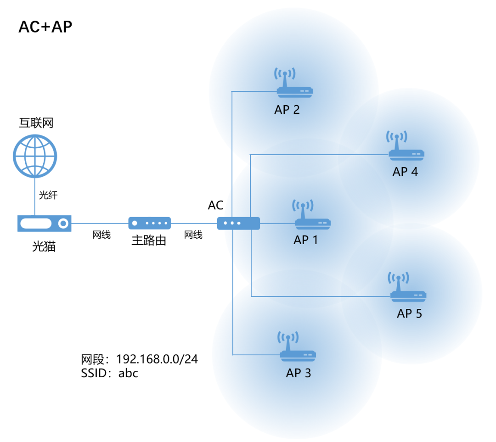

# 什么是瘦AP、胖AP、AP+AC、Mesh？

一、无线路由器
-------

无线路由器，也就是我们俗称的Wi-Fi路由器。

它的工作模式众多，大体可分为路由模式和AP模式。AP模式又可以细分为AP模式（套娃），中继模式，桥接模式及客户端模式。

基于这些基本的工作模式，多个路由器之间可以形成AP+AC，以及Mesh这两种组网方式，达到无缝覆盖，自动漫游的效果。  

**二、路由模式**
----------

绝大多数无线路由器都工作在这种模式之下，同时使用了路由器的无线接入功能和路由功能。

**最常见的用法是，路由器WAN口连接入户光猫，并设置PPPoE拨号上网并提供各种路由及安全防护功能。**

 对应地，路由器的无线接入功能则负责发射Wi-Fi信号组成无线局域网WLAN，进行全屋无线信号覆盖。接入WLAN和连接有线LAN口的多个设备位于同一个局域网内，拥有相同的网段，可以直接进行内网通信。

此外，还**可以把路由器用WAN口和上级路由器的LAN口连接起来，形成二级路由，就可以配置两个网段的内网，以及两个不同的Wi-Fi名称（配成一样的也行）**。

这种组网【无法实现两个路由器之间的无缝漫游】，一个Wi-Fi信号减弱并切换到另一个过程伴随IP地址的变化，网络中断感觉明显。

**三、AP模式**
----------

**AP就是指接入点（Access Point）**。（顾名思义，工作在这种模式下的路由器只有接入功能，并没有用到路由功能，因此就不提路由二字了，直接叫做接入点）。

接入点没有路由功能，并不代表路由功能就不存在，只是由另一台路由器来承担了而已。也就是说，AP模式下的路由器无法独立完成上网重任，需要跟另外一台路由器协作，多用于覆盖的扩展。

**AP模式有3个子模式：【AP模式（套娃）】、【中继模式】、【桥接模式】。** 

### **3.1  AP模式**

**启用AP模式的路由器通过网线和上级路由器连接，仅有接入功能作为无线覆盖扩展（用作主力覆盖也可以），路由和DHCP等功能由上级路由器完成**。因此接入AP的手机或者电脑和上级路由器处于同一网段，可直接互通。

**AP的无线网络名称（SSID）和密码可以独立设置，跟上级路由器的相同或者不同都行**。**如果Wi-Fi名称的设置不同，两个设备之间肯定是没法无缝漫游的**，只能是一个信号太弱断开之后再连另一个，或者手动连接。

就算把这些AP设置为相同的SSID，看似家里只有一个Wi-Fi信号，但实际上AP和主路由的无线信号缺乏交互，配置和管理比较麻烦，也是无法实现无缝漫游的。

**这种组网下的AP功能完善，每个节点都要分别配置，相互独立工作，因此叫做“胖AP（Fat AP）”。** 

**胖AP们虎踞龙盘，没有统一的管理，各自的覆盖之间也无法漫游，在家里数量少了还能凑合用，在商场，机场这些超大空间，需要的AP数量极其庞大，就只能另请高明了。** 

### **3.2 AP+AC组网**

既然**胖AP不好管理，我们可以把它再进行拆分，只保留最基本的接入功能，将配置管理功能独立出来，组建为一个全新的设备：接入控制器（Access Controller，AC），普遍简称作AC**。

**AC负责管理所有的AP，只要在AC上进行统一配置，就可以自动同步到所有的AP节点，并且所有AP的工作状态都可以在AC上进行实时监控，维护起来也非常方便。** 这种状态的AP只需要好好干活就行，其他啥都不用管，当然也就没啥花花肠子了，因此叫做“瘦AP（Fit AP）”。更重要的是，**通过让AP们支持802.11k/v/r协议，就可以实现AP间的无缝漫游了**。

①802.11k：无线资源测量协议，可帮助终端快速搜索附近可作为漫游目标的AP。

②802.11v：无线网络管理协议，用来解决AP之间的负荷均衡，以及终端节电等功能。

③802.11r：快速漫游协议，用于加速手机或者电脑在漫游时的认证流程。

上述漫游协议需要路由器和手机同时支持才能正常工作。

在各厂家的实际AP产品中，大多支持802.11k/v协议，对于家庭网络已经足够用了。

这个方案简直完美啊，还有没有改进空间呢？

我们考虑下，**大量的AP要跟AC连接，除了要提前铺设大量的网线之外，还要准备对应的电源给AP供电，这工作量就大了去了。网线本身也是电线么，AP的功耗一般也不高，网线能不能在传数据的同时也把供电的活给干了呢？**

还真可以。**这种供电方式有专门的协议，叫做PoE（Power over Ethernet，以太网供电），需要交换机等连接设备和AP双方都支持才能正常供电。** 

这样一来，**我们在AC的后面再接上一个PoE交换机，再把所有等AP换成可以支持PoE的型号，就可以实现PoE供电了，省去了多处拉电源线的烦恼，顿时感觉网络清爽了许多**。

然而有人可能要说了，我家就2个房间再加1个客厅，一共3个AP就够了，结果不但要搭上接入主路由器，AC，再来个PoE交换机，不但成本高，连弱电箱都没空间放了！

确实如此，**AC+AP方案主要用于大面积的商业场所，再不济也是别墅这种多层楼且房间多的情况，对于普通住宅有些杀鸡焉用宰牛刀的意思，确实不大合适。** 

**不过商家也针对性地开发了精简的方案，把路由器，AC和PoE交换机合而为一，称之为“路由/AC/PoE一体机”，跟普通的家用交换机大小仿佛，成本也大幅降低**。

与此同时，上述方案也将AP也集成在传统的86型网线插座面板内，完全隐藏于无形，却达成了Wi-Fi无缝覆盖，信号强劲的最佳状态。

**AC+AP的优点显著，但也有缺点。那就是所有的AP都需要使用网线和AC连接，这就要求在装修时就考虑好Wi-Fi组网，并布好网线。如果没有网线可达，就必须考虑其他方案了。** 

### **3.3  中继模式**

跟AP模式不同，在**中继模式下的路由器和上级路由器之间并没有网线连接，只是单纯地接收上级路由器的无线信号，进行放大后再发出去，不做任何处理。** 

因此中继模式下AP信号的Wi-Fi名称和密码都跟上级路由是一样的，所有的设备也都位于同一网段。对于用户来说，接入中继AP和主路由的效果是完全一样的，中继AP仅相当于一个扩展覆盖的管道，一切的处理都由主路由进行。

### **3.4  桥接模式**

**桥接模式**和中继模式比较类似，**也是在没有网线的情况下，通过无线来连接两个路由器**。**两者的差异在于：中继模式工作于物理层，不能做任何设置，而桥接模式则工作于数据链路层，可以配置独立的SSID。** 

虽说SSID可以不同（也可以配成相同的），但处于桥接模式下的路由器和主路由器的网段是相同的，设备连接之后可以互相访问。

**工作中继或者桥接模式的路由器，必须在主路由的覆盖范围内才能放大信号来进行上网。如果在主路由的信号很差的位置，放大之后虽然手机看到的Wi-Fi信号是满格的，但是网速依然很慢甚至可能很不稳定。** 

并且，**主路由是不知道下级中继或者桥接节点的存在的，它们之间也不存在管理和交互的关系，没法进行漫游，只能等待信号过差断开之后手机再重新连接另一个节点。** 

**有没有方法能综合AC+AP这样的有线组网，以及中继或者桥接这样的无线组网，并能智能管理这个网络，实现简化配置，无缝漫游的效果呢？**

这就要用到Mesh组网技术了。

**四、 Mesh组网**
-------------

**Mesh又叫多跳网络，由多个地位相同的节点通过有线或者无线的方式相互连接，组成多条路径，最终连接到跟互联网相连网关。这样的网络存在一个控制节点来对所有节点进行管理和配置数据下发。** 

下图是一个实际组网的案例，由主路由作为网关和控制节点，其余节点通过有线或者无线连到主路由，或者通过无线来相互连接。这样一来，弱覆盖的区域不论有没有网线，网络都可以灵活地按需扩展。

路由器之间的有线连接叫做“有线回程”，对应地，无线连接就叫做“无线回程”。

**Mesh组网非常适合于家庭Wi-Fi覆盖使用。** 

虽说这些路由器的型号不同，但只要都支持Mesh组网就可以配合使用，不像AC+AP那样还要搭上个AC和PoE交换机，还有网线的限制。最主要的是，普通的家用路由器已经普遍支持了最新的Wi-Fi协议，价格还低。

**目前各个厂家对于Mesh组网的实现各不相同，起的名字自然也不同。一般情况下，不同厂家的路由器之间是不能组Mesh的，这可能会限制路由器的购买选择。** 

**为了解决不同厂家的路由器的互联互通问题，Wi-Fi联盟推出了EasyMesh技术，可以让不同厂家的路由器之间也支持Mesh组网。** 

但是厂家都各有自己的算盘，本来用互不兼容的Mesh技术就可以圈住用户了，支持了这EasyMesh让用户选别家的产品，这明显对自己不利啊。因此EasyMesh目前的支持率并不高。

**为了更好地支持Mesh组网，让用户获得更高的网速，厂家就专门拿出一个5GHz频段来做路由器之间的无线回程，这样路由器就需要同时支持一个2.4GHz和两个5GHz频段，因此叫做“三频路由器”。** 

最后，问题来了，家用组网到底Mesh和AC+AP哪个方案好？意见如下：

①首先，无论是Mesh组网还是AC+AP，都可以达到全屋覆盖和无线漫游的效果。Mesh组网在全部使用有线回程的情况下，基本上等同于AC+AP。

②Mesh组网更为灵活，可用无线回程，也可用有线回程，还可以混合使用，而AC+AP则只能使用有线连接，需要提前规划布线。

③另外，AC+AP方案中的AC可以置于弱电箱，AP使用面板式也不占空间，所有设备没有任何的网线和电源线外露，非常清爽美观。而Mesh方案则需拖着拉网线和电源线，美观性上要差得多。

④最后，AC+AP需要购置至少一台路由/AC/PoE一体机和两台AP才有意义，如果要支持千兆网口和Wi-Fi6，这些设备都不便宜；而Mesh组网则亲民多了，两台路由的价格远低于AC+AP。

在选择组网方案时，可以根据上述两方案的特点综合考虑。

## 原文链接

[什么是瘦AP、胖AP、AP+AC、Mesh？-CSDN博客](https://blog.csdn.net/xiaochenXIHUA/article/details/120951122)