# 18张图详解ARP协议所有细节（附流程），果断收藏-腾讯云开发者社区-腾讯云

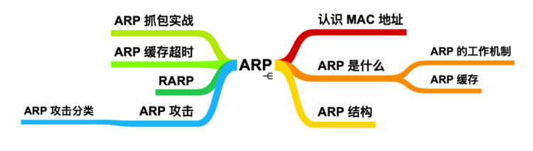

只要确定了 IP 地址后，就能够向这个 IP 地址所在的主机发送数据报。但是再往深了想，IP 地址只是标识网络层的地址，那么在网络层下方数据链路层是不是也有一个地址能够告诉对方主机自己的地址呢？是的，这个地址就是MAC 地址。

### **认识 MAC 地址**

MAC 地址的全称是 Media Access Control Address，译为媒体访问控制地址，它是网络上以太网或网络适配器的唯一标识符。MAC 地址能够区分不同的网络接口，并用于多种网络技术，尤其是大多数 IEEE 802 网络。 MAC 地址也称为物理地址，硬件地址和老化地址。 MAC 地址主要用于识别数据链路中互联的节点，如下图所示：

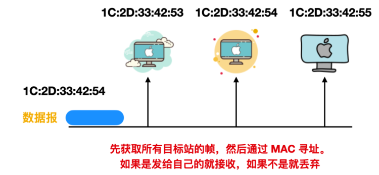

MAC 地址长 48 bit，在使用网卡(NIC) 的情况下，MAC 地址一般都会烧入 ROM 中。因此，任何一个网卡的 MAC 地址都是唯一的。

MAC 地址的结构如下：

MAC 地址中的 3 - 24 位表示厂商识别码，每个 NIC 厂商都有特定唯一的识别数字。25 - 48 位是厂商内部为识别每个网卡而用。因此，可以保证全世界不会有相同 MAC 地址的网卡。MAC 地址也有例外情况，即 MAC 地址也会有重复的时候，但是问题不大，只要两个 MAC 地址是属于不同的数据链路层就不会出现问题。

#### **组成及转发原理**

MAC地址表记录设备学习到的其他设备的MAC地址与接口的对应关系，以及接口所属VLAN等信息。

MAC地址表用于指导报文进行单播转发，设备在转发报文时，根据报文的目的MAC地址查询MAC地址表：

如果MAC地址表中包含与报文目的MAC地址对应的表项，则直接通过该表项中的出接口转发该报文；

如果MAC地址表中没有包含报文目的MAC地址对应的表项时，设备将采取广播方式在所属VLAN内除接收接口外的所有接口转发该报文。

#### **学习及老化**

一般情况下，MAC地址表是设备根据收到的数据帧里的源MAC地址自动学习而建立的。

如果MAC地址表中不存在该MAC地址表项，设备则将这个新MAC地址以及该MAC地址对应的Port和VLAN ID作为一个新的表项加入到MAC地址表中。

如果MAC地址表中已经存在该MAC地址表项，设备将通过重置该表项的老化时间，对该表项进行更新。

设备只有在收到数据帧时，才会触发MAC地址的学习和刷新。

设备所有接口默认加入VLAN1，如果不做修改所有MAC地址表项的VLANID都是VLAN1。

设备对于BPDU MAC（形如：0180-c200-xxxx）不会进行MAC地址学习。

为适应网络的变化，MAC表需要不断更新。MAC表中自动生成的表项（即动态表项）并非永远有效，每一条表项都有一个生存周期，到达生存周期仍得不到更新的表项将被删除，这个生存周期被称作老化时间，默认300S。如果在到达生存周期前记录被更新，则该表项的老化时间重新计算。

#### **MAC地址表项**

由接口通过报文中的源MAC地址学习获得，表项可老化。

在系统复位、接口板热插拔或接口板复位后，动态表项会丢失。

通过查看动态MAC地址表项，可以判断两台相连设备之间是否有数据转发。

通过查看指定动态MAC地址表项的个数，可以获取接口下通信的用户数。

#### **静态表项**

由用户手工配置，并下发到各接口板，表项不可老化。

在系统复位、接口板热插拔或接口板复位后，保存的表项不会丢失。

接口和MAC地址静态绑定后，其他接口收到源MAC是该MAC地址的报文将会被丢弃。

一条静态MAC地址表项，只能绑定一个出接口。

一个接口和MAC地址静态绑定后，不会影响该接口动态MAC地址表项的学习。

通过绑定静态MAC地址表项，可以保证合法用户的使用，防止其他用户使用该MAC进行攻击。

#### **黑洞表项**

由用户手工配置，并下发到各接口板，表项不可老化。

在系统复位、接口板热插拔或接口板复位后，保存的表项不会丢失。

配置黑洞MAC地址后，源MAC地址或目的MAC地址是该MAC的报文将会被丢弃。

通过配置黑洞MAC地址表项，可以过滤掉非法用户。

### **ARP 是什么**

ARP 协议的全称是 Address Resolution Protocol(地址解析协议)，它是一个通过用于实现从 IP 地址到 MAC 地址的映射，即询问目标 IP 对应的 MAC 地址 的一种协议。ARP 协议在 IPv4 中极其重要。

*   注意： ARP 只用于 IPv4 协议中，IPv6 协议使用的是 Neighbor Discovery Protocol，译为邻居发现协议，它被纳入 ICMPv6 中。
*   简而言之，ARP 就是一种解决地址问题的协议，它以 IP 地址为线索，定位下一个应该接收数据分包的主机 MAC 地址。如果目标主机不在同一个链路上，那么会查找下一跳路由器的 MAC 地址。

### **ARP 的工作机制**

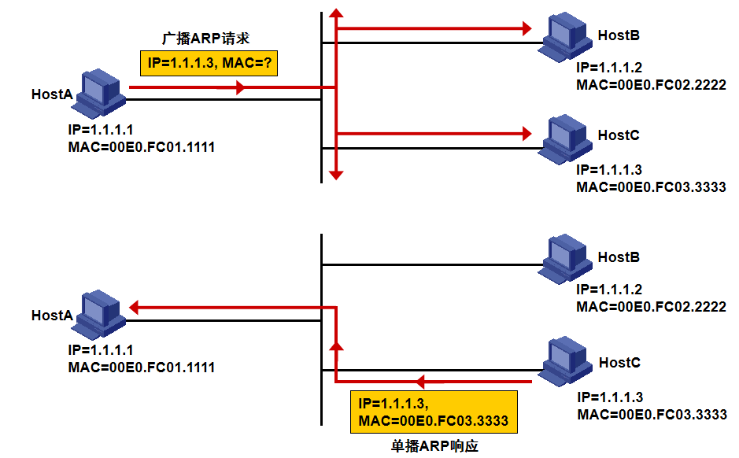

IP地址将物理地址对上层隐藏起来，使Internet表现出统一的地址格式，但是在实际通讯时，IP地址不能被物理网络所识别物理网络所使用的依然是物理地址。因此必须实现IP地址对物理地址的映射。

对于以太网而言，当IP数据包通过以太网发送时，以太网链路并不识别32位的IP地址，它们是以48位的MAC地址表示该以太网节点。因此，必须在IP地址与MAC地址之间简历映射关系（MAP），而建立这种映射的过程咱们称之为地址解析（Resoloution）。

如上图中，假设HostA和HostB在同一个网段，HostA要向HostB发送IP包，其地址解析过程如下：

1.HostA首先查看自己的ARP表项，确定其中是否包含HostB的IP地址对应ARP表项。如果找到了对应的表项，则HostA直接理由ARP表项中的MAC地址对IP数据包封装成帧，并将帧发送给HostB。

2.如果HostA在ARP表中找不到对应的表项，则暂时缓存该数据包，然后以广播方式发送一个ARP请求。ARP请求报文中的发送端IP地址和发送端MAC地址为HostA的IP地址和MAC地址，目标IP地址HostB的IP地址，目标MAC地址为全0的MAC地址。

3.由于ARP请求报文以广播方式发送，该网段上的所有主机都可以接收到该请求。HostB比较自己的IP地址和ARP请求报文中的目标IP地址，由于两者相同，HostB将ARP请求报文中的发送端（HostA）IP地址和MAC地址存入自己的ARP表中，并以单播方式HostA发送ARP响应，其中包含了自己的MAC地址。其他主机发送请求的IP地址并非自己，于是都不做应答。

4.HostA收到ARP响应报文后，将HostB的MAC地址加入到自己的ARP表中，同时将IP数据包用此MAC地址为目的地址封装成帧并发送给HostB。

#### **如果是不同链路怎么办呢？**

这就要使用到 代理 ARP 了，通常 ARP 会被路由器隔离，但是采用代理 ARP (ARP Proxy) 的路由器可以将 ARP 请求转发给临近的网段。使多个网段中的节点像是在同一网段内通信。

### **ARP 缓存**

现在知道了发送一次 IP 分组前通过发送一次 ARP 请求就能够确定 MAC 地址。那么是不是每发送一次都得经过广播 -> 封装 ARP 响应 -> 返回给主机这一系列流程呢？

想想看，浏览器是如何做的呢？ 浏览器内置了缓存能够缓存最近经常使用的地址，那么 ARP 也是一样的。ARP 高效运行的关键就是维护每个主机和路由器上的 ARP 缓存(或表)。

这个缓存维护着每个 IP 到 MAC 地址的映射关系。通过把第一次 ARP 获取到的 MAC 地址作为 IP 对 MAC 的映射关系到一个 ARP 缓存表中，下一次再向这个地址发送数据报时就不再需要重新发送 ARP 请求了，而是直接使用这个缓存表中的 MAC 地址进行数据报的发送。每发送一次 ARP 请求，缓存表中对应的映射关系都会被清除。

通过 ARP 缓存，降低了网络流量的使用，在一定程度上防止了 ARP 的大量广播。

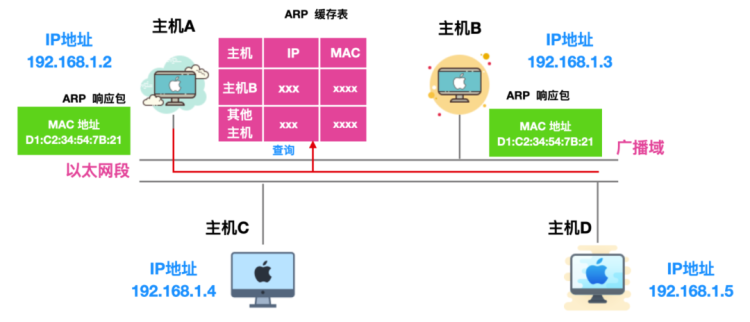

一般来说，发送过一次 ARP 请求后，再次发送相同请求的几率比较大，因此使用 ARP 缓存能够减少 ARP 包的发送，除此之外，不仅仅 ARP 请求的发送方能够缓存 ARP 接收方的 MAC 地址，接收方也能够缓存 ARP 请求方的 IP 和 MAC 地址，如下图所示：

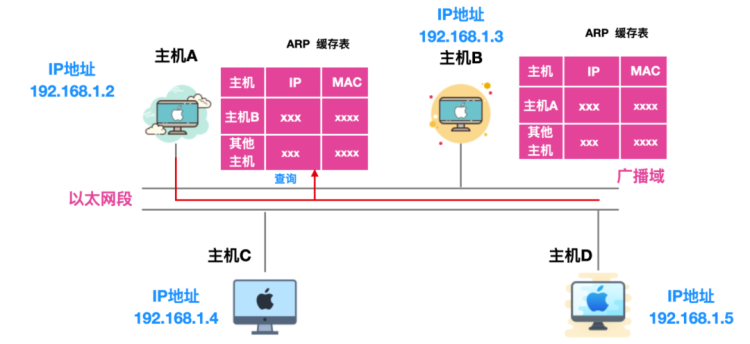

不过，MAC 地址的缓存有一定期限，超过这个期限后，缓存的内容会被清除。

可以在 Linux 或者 Windows 中使用 arp 命令查看 ARP 缓存。选项 -a 用于显示两个系统缓存中所有的缓存项。在 Linux 中使用 arp 查询缓存；

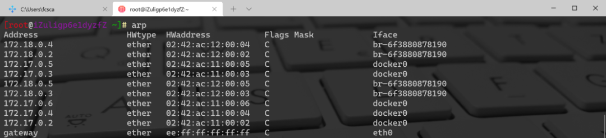

主要包含五项

*   主机名 \-\-\- 对应一个 IP 地址
*   硬件地址类型
*   硬件地址
*   标志
*   本地网络接口

标志主要分为三类: C 、M 或 P，C 表示的是由 ARP 协议动态学习。M 类可以通过 arp -s 增加一条。P 类表示的是 发布，对于任何 P 类项目，主机对输入的 ARP 请求都返回一个 ARP 响应。这个选项用于配置代理 ARP。比如在 Windows 中进行 ARP 缓存查询；

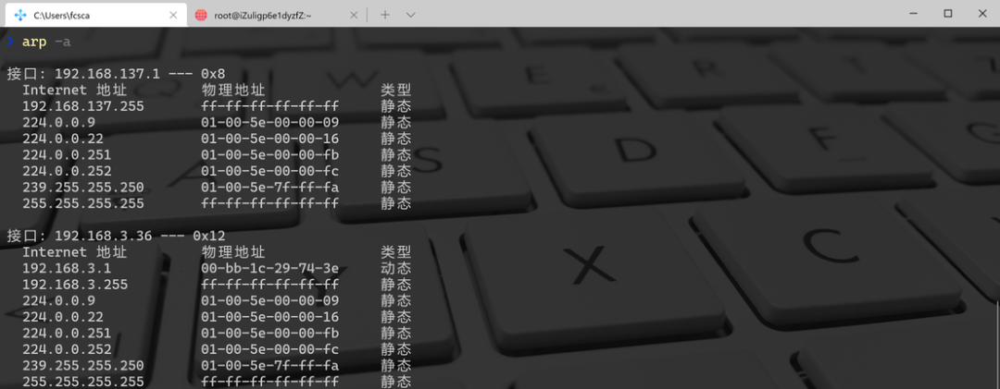

Windows 中的 ARP 程序显示了 IPv4 的地址，它的接口是十六进制数，Windows 版本还指出地址是手动输入还是 ARP 动态学习的。在上面的例子中，既有静态的也有动态的。48 位的 MAC 地址被显示为 6 个十六进制数，在 Linux 中使用 : 号，在 Windows 中使用 - 进行分隔。

### **ARP 结构**

上面说到，ARP 对想要知道 MAC 地址的目标主机会首先发送 ARP 请求，那么这个请求中都携带哪些信息呢？下面是在以太网中转换一个 IPv4 的地址常用的 ARP 请求或响应的报文格式。

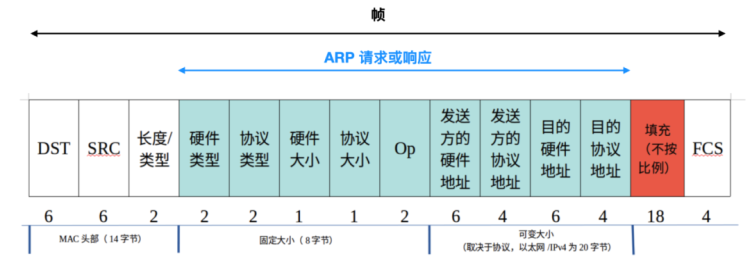

前面 14 个字节构成标准以太网的首部，前两个字段 DST 和 SRC 分别表示 以太网的目的地址 和 以太网的源地址，以太网的目的地址如果是 ff:ff:ff:ff:ff:ff 全部为 1 表示广播地址，在同一广播域中的所有以太网接口可以接收这些帧。后面紧跟着的是 ARP 请求的长度/类型，ARP 请求 和 ARP 应答这个值为 0x0806。

*   硬件类型表示硬件地址的类型，硬件地址常见的有 MAC 物理或者以太网地址，对于以太网来说，此值为 1。
*   协议类型 指出映射的协议地址类型，对于 IPv4 地址，这个值是 0x0800。
*   硬件大小和 协议大小 分别指出硬件地址和协议地址的字节数。对于以太网中使用 IPv4 的 ARP 请求或应答，它们的值分别是 6 和 4。
*   Op 字段指出如果是 ARP 请求，Op = 1，ARP 应答 ，Op = 2，RARP 请求 Op = 3，RARP 应答，Op = 4。
*   紧跟在 Op 之后的是 发送方硬件地址(MAC 地址)，发送方的协议地址(IPv4 地址)，目的硬件地址 和 目的协议地址。

### **ARP 抓包实战**

分别演示在 Mac 和 Linux 下的 ARP 报文的截获； 在 Mac 环境下，这边使用的是 WireShark 进行抓包，可以从官网下载，地址如下： https://www.wireshark.org/download.html

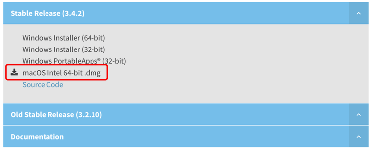

下载完成后阅读安装说明的手册，阅读后会发现需要安装两个插件，根据提示安装即可，然后打开 WireShark ，开始报文拦截，下面是截获的 ARP 数据包：

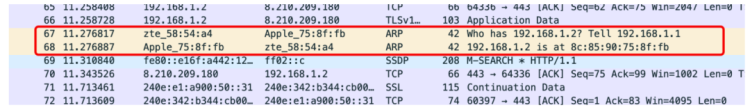

这款软件很好的一个地方是对不同的数据包会有不同的颜色标识，这点非常好。然后查看 ARP 请求：

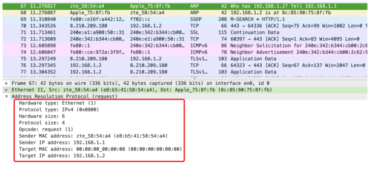

可以看到，这就是一个完整的 ARP 请求包，使用的硬件类型是以太网，协议类型是 IPv4 ，默认值是 0x0800，然后硬件大小是 6 个字节，协议大小占用 2 个字节，Op 的全称是 Opcode ，Op = 1 表示这是一个 ARP 请求，然后是发送方的硬件地址和协议地址，接收方的硬件地址和协议地址。 咱们可以看到ARP 响应如下：

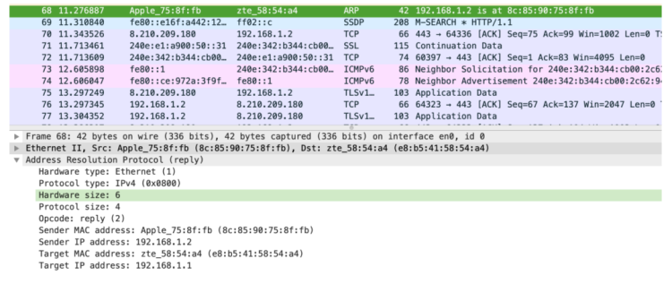

可以看到 Op = 2，表示这是 ARP 响应。 在 Linux 环境下，可以使用 tcpdump 截获 ARP 数据包，如果 tcpdump not found 的话，可以使用 yum install -y tcpdump 安装。 使用 tcpdump -i ens33 可以打印出在 ens33 地址下的数据包，下面是截取的 ARP 数据包。

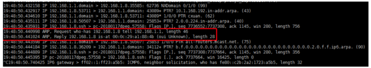

### **ARP 缓存超时**

1.ARP缓存

*   ARP高效运行的关键是维护每个主机和路由器上的ARP缓存(或表)
*   该缓存使用地址解析为每个接口维护从网络层地址到硬件地址的最新映射
*   IPv4地址映射到硬件地址时，它对应于高速缓存中的一个条目，其正常到期时间是条目创建开始后的20分钟

2.ARP缓存超时

*   超时通常与ARP缓存中的每个条目相关(我们在后面将会看到,arp命令允许管理员设置缓存条目永远不超时)
*   在大多数实现中,完整条目的超时为20分钟,而不完整条目的超时为3分钟
*   这些实现通常在每次使用一个条目后为它重新启动20分钟的超时。\[RFCl122\] 是描述主机需求的RFC,它规定每个条目即使在使用也应启动超时,但很多实现并不这样做,它们在每次使用条目后重新启动超时

### **RARP**

与 ARP 相对的，RARP(Reverse Address Resolution Protocol) 是将 ARP 反过来，从 MAC 地址定位 IP 地址的一种协议，将打印机[服务器](https://cloud.tencent.com/act/pro/promotion-cvm?from_column=20065&from=20065)等小型嵌入式设备接入网络时会使用到。

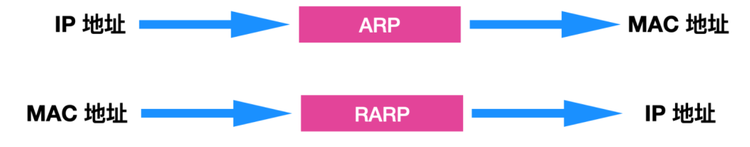

平常设置 IP 地址一般会有两种方式，手动设置 和 DHCP 动态获取：

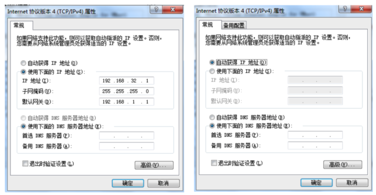

但是对于嵌入式设备来说，它没有任何输入接口，也无法通过 DHCP 获取动态地址。 在这种情况下，就要使用到 RARP 了，需要准备一个 RARP 服务器，在这个服务器上注册设备的 MAC 地址和 IP 地址，然后将设备接入网络，设备会发出一条 IP 和 MAC 地址的查询请求给服务器，服务器会告诉设备其 IP 地址和 MAC 地址。

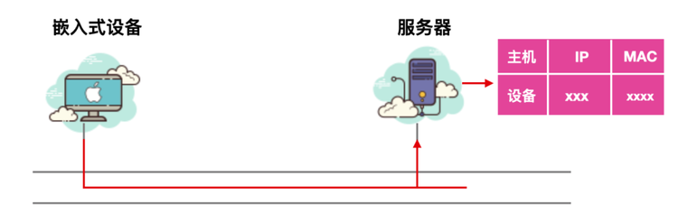

主机只知道自己的硬件地址时，可以通过RARP解析自己的IP地址，RARP常用于无盘工作站启动前获取自身的IP地址。

在刚刚启动时，无盘工作站只知道自己网卡的MAC地址，需要获得自己的IP地址，于是向网络中广播RARP请求。RARP服务器接收广播请求后发送应答报文，无盘工作站随即获得IP地址。

RARP服务器要响应请求，首先必须知道物理地址与IP地址的对应关系。为此，在RARP服务器维护着一个本网段的“物理地址-IP地址”映射表。当某无盘工作站发出RARP请求后，网上所有主机均收到该请求，但只有RARP服务器处理请求并根据请求这物理地址响应请求。无盘工作站发出的RARP请求中携带其物理地址，服务器根据次硬件地址查找其IP地址。由于服务器此时已经知道无盘工作站的物理地址，因此不在采用广播方式，而是直接向无盘工作站发送单播应答。

对应于ARP、RARP请求以广播方式发送，ARP、RARP应答一般以单播方式发送，以节省网络资源。

### **ARP 攻击**

ARP 是一种非常不安全的协议，目前已经有很多涉及 ARP 的攻击，最主要的就是使用代理 ARP 功能假扮主机，对 ARP 请求作出应答，通过伪造 ARP 数据包来窃取合法用户的通信数据，造成影响网络传输速率和盗取用户隐私信息等严重危害。

#### **ARP 攻击分类**

ARP 主要攻击方式分为下面这几种

*   ARP 泛洪攻击：通过向网关发送大量 ARP 报文，导致网关无法正常响应。首先发送大量的 ARP 请求报文，然后又发送大量虚假的 ARP 响应报文，从而造成网关部分的 CPU 利用率上升难以响应正常服务请求，而且网关还会被错误的 ARP 缓存表充满导致无法更新维护正常 ARP 缓存表，消耗网络带宽资源。
*   ARP 欺骗主机攻击：ARP 欺骗主机的攻击也是 ARP 众多攻击类型中很常见的一种。攻击者通过 ARP 欺骗使得局域网内被攻击主机发送给网关的流量信息实际上都发送给攻击者。主机刷新自己的 ARP 使得在自己的ARP 缓存表中对应的 MAC 为攻击者的 MAC，这样一来其他用户要通过网关发送出去的数据流就会发往主机这里，这样就会造成用户的数据外泄。
*   欺骗网关的攻击: 欺骗网关就是把别的主机发送给网关的数据通过欺骗网关的形式使得这些数据通过网关发送给攻击者。这种攻击目标选择的不是个人主机而是局域网的网关，这样就会攻击者源源不断的获取局域网内其他用户韵数据．造成数据的泄露，同时用户电脑中病毒的概率也会提升。
*   中间人攻击: 中间人攻击是同时欺骗局域网内的主机和网关，局域网中用户的数据和网关的数据会发给同一个攻击者，这样，用户与网关的数据就会泄露。
*   IP地址冲突攻击: 通过对局域网中的物理主机进行扫描，扫描出局域网中的物理主机的 MAC 地址，然后根据物理主机的 MAC 进行攻击，导致局域网内的主机产生 IP 地址冲突，影响用户的网络正常使用。

#### **ARP攻击发现**

首先诊断是否为ARP病毒攻击

1.当发现上网明显变慢，或者突然掉线时，我们可以用arp -a命令来检查ARP表：(点击“开始”按钮-选择“运行”-输入“cmd”点击"确定"按钮，在窗口中输入“arp -a”命令)如果发现网关的MAC地址发生了改变，或者发现有很多IP指向同一个物理地址，那么肯定就是ARP欺骗所致。这时可以通过”arp -d“清除arp列表，重新访问。

2.利用ARP防火墙类软件(如：360ARP防火墙、AntiARPSniffer等)。

#### **如何判断交换机是否受到ARP攻击以及处理方式**

一、如果网络受到了ARP攻击，可能会出现如下现象：1、用户掉线、频繁断网、上网慢、业务中断或无法上网。2、设备CPU占用率较高、设备托管、下挂设备掉线、设备主备状态震荡、设备端口指示灯红色快闪。3、Ping有时延、丢包或不通。

局域网内的机器遭到ARP病毒欺骗攻击，如果找到源头的机器，将其病毒或木马杀掉，局域网内机器就会恢复正常，那么如何才能快速定位到攻击的源头机器呢?

1、用arp -a命令。当发现上网明显变慢，或者突然掉线时，我们可以用arp -a命令来检查ARP表。如果发现网关的MAC地址发生了改变，或者发现有很多IP地址指向同一个MAC地址，那么肯定就是ARP攻击所致。

2、利用彩影ARP防火墙软件查看。如果网卡是处于混杂模式或者ARP请求包发送的速度大或者ARP请求包总量非常大，判断这台机器有可能就是“元凶”。定位好机器后，再做病毒信息收集工作。

3、通过路由器的“系统历史记录”查看。由于ARP攻击的木马程序发作的时候会发出大量的数据包导致局域网通讯阻塞以及其自身处理能力的限制，用户会感觉上网速度越来越慢。当ARP攻击的木马程序停止运行时，用户会恢复从路由器上网，切换过程中用户会再断一次线。这个消息代表了用户的MAC地址发生了变化，在ARP攻击木马开始运行的时候，局域网所有主机的MAC地址更新为病毒主机的MAC地址(即所有信息的MAC New地址都一致为病毒主机的MAC地址)，同时在路由器的“用户统计”中看到所有用户的MAC地址信息都一样。

如果是在路由器的“系统历史记录”中看到大量MAC Old地址都一致，则说明局域网内曾经出现过ARP攻击(ARP攻击的木马程序停止运行时,主机在路由器上恢复其真实的MAC地址)。

#### **ARP 攻击方式：** 

1.  简单的诈骗攻击

这是对比多见的攻击，经过发送伪造的ARP包来诈骗路由和方针主机，让方针主机认为这是一个合法的主机，便完成了诈骗，这种诈骗多发生在同一网段内，因为路由不会把本网段的包向外转发，当然完成不一样网段的攻击也有办法，便要经过ICMP协议来告诉路由器从头挑选路由。

1.  根据ARP的DOS

这是新呈现的一种攻击办法，D.O.S又称拒绝服务攻击，当大量的衔接请求被发送到一台主机时，因为主机的处理才能有限，不能为正常用户提供服务，便呈现拒绝服务。这个过程中假如运用ARP来躲藏自己，在被攻击主机的日志上就不会呈现真实的IP攻击，也不会影响到本机。

1.  MAC Flooding

这是一个对比风险的攻击，能够溢出交流机的ARP表，使全部网络不能正常通讯。

1.  交流环境的嗅探

在开始的小型局域网中咱们运用HUB来进行互连，这是一种广播的办法，每个包都会经过网内的每台主机，经过运用软件，就能够嗅谈到全部局域网的数据。现在的网络多是交流环境，网络内数据的传输被锁定的特定方针。既已断定的方针通讯主机，在ARP诈骗的根底之上，能够把自己的主机伪形成一个中心转发站来监听两台主机之间的通讯。

#### **ARP 攻击的防护**

1.  ARP 高速缓存超时设置

在ARP高速缓存中的表项一般都要设置超时值，缩短这个这个超时值能够有用的避免ARP表的溢出。

1.  IP+MAC访问操控 -----推荐使用

单纯依托IP或MAC来树立信赖联系是不安全，抱负的安全联系树立在IP+MAC的根底上，这也是咱们校园网上网有必要绑定IP和MAC的因素之一。

1.  静态ARP缓存表

每台主机都有一个暂时寄存IP-MAC的对应表ARP攻击就经过更改这个缓存来到达诈骗的意图，运用静态的ARP来绑定正确的MAC是一个有用的办法，在命令行下运用arp -a能够检查当时的ARP缓存表。

1.  自动查询

在某个正常的时间，做一个IP和MAC对应的[数据库](https://cloud.tencent.com/solution/database?from_column=20065&from=20065)，以后定时检查当时的IP和MAC对应联系是否正常，定时检查交流机的流量列表，检查丢包率。

ARP本省不能形成多大的损害，一旦被联系使用，其风险性就不可估量，因为ARP自身的疑问，使得防备ARP的攻击很棘手，经常检查当时的网络状况，监控流量对一个站长来说是个很好的风气

### **总结**

ARP 是 TCP/IP 实现中的一个基本协议，它通常在应用程序或用户没有察觉到的情况下运行。ARP 可以用于映射 IP 地址为 MAC 地址。

**---END---**

本文参与 [腾讯云自媒体同步曝光计划](https://cloud.tencent.com/developer/support-plan)，分享自微信公众号。

原始发表：2022-02-15，如有侵权请联系 [cloudcommunity@tencent.com](mailto:cloudcommunity@tencent.com) 删除

## 原文链接

[18张图详解ARP协议所有细节（附流程），果断收藏-腾讯云开发者社区-腾讯云 (tencent.com)](https://cloud.tencent.com/developer/article/1948193)