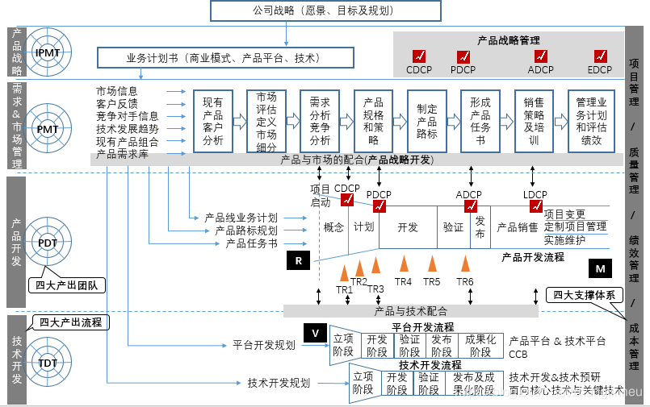

# IPD——从战略到执行的全面研发管理体系

这篇文章是一本非常好书籍《产品研发管理》的读书笔记，书籍作者是周辉（曾任华为项目管理部总经理、亿阳信通COO、青牛软件CEO），是关于IPD集成研发管理的一本佳作，本人拜读多次，看到书中满满的精华，每次都有新的收获。为了使瞬间的感悟得以保留，特记录笔记备查。

这本书非常好的一点，是在每一章开头都会有【本章精华】的提炼，短短的几条，就已经受益匪浅，有同读此书的朋友，这些内容万不可错过。

这篇笔记来自于书中第1章第3节关于【如何实现集成产品开发管理模式】中的内容，用“四四四”模型给予研发管理体系一个高视角的全貌展示。模型包含的信息量非常大，先做个简要解读，具体在后续逐步展开。

#### IPD——从战略到执行的全面研发管理体系

IPD是Integrated Product Developmen，中文叫集成产品，从下面的继承研发管理“四四四”模型可以看出，IPD对企业研发行为进行**从战略到执行**的全覆盖管理，从头到脚进行了完整的管理。

实践中可以把这个体系当成一个大工具箱，在企业研发的不同阶段，进行合适的裁剪变更，适合企业当前需要，同时体系化的框架也为未来发展预留了升级的空间。

以上的研发管理的“四四四”模型，概括起来包含3大主要要素，即：四大产出团队，四大产出流程，四大支撑体系。

**四大产出流程分别对应四个子体系：战略管理体系、市场管理体系、市场管理体系和技术管理体系。**其实，对于研发生产制造一体化的企业，还有一个供应链管理体系，研发论证期间供应问题就需要和其他几个方面一样提升日程。

四大产出流程的主负责分别对应四大产出团队。

#### 四大产出团队

*   IPMT（Integrated Product Management Team，集成产品管理团队）：代表了公司的决策层，是一个高层管理者组成的跨部门团队，代表公司负责制定产品发展规划、对产品开发项目进行投资决策、培育市场管理和产品开发流程，并挑选合适的人选来保证整个过程的有效落实。 
*   PMT（Portfolio Management Team，组合管理团队）：是市场管理的执行者，是一个由各职能部门代表组成的跨部门团队。PMT依据公司事先制定的市场管理流程，通过收集和分析市场信息和客户需求，结合企业的内部能力来制定具体的市场策略、产品规划，并对产品市场表现和市场需求变化进行跟踪。
*   PDT（Product Development Team，产品开发团队）：是产品开发的具体实施团队，也是一个由各职能部门代表组成的跨部门团队，在项目开始时成立、产品上市或项目取消时解散。产品开发团队对客户需求进行汇总和分析、并通过分解反映在具体的设计当中。产品开发团队对产品的市场成功和财务成功负责。 
*   TDT（Technology Development Team，技术开发团队）：是产品/技术平台开发、公共组件CCB开发、技术探索预研的实施团队，同样也是由各职能部门代表组成的跨部门团队。

四大产出团队的共同特征就是跨部门，由各组织单元懂行人员组成相应团队，体现专业的人做专业的事儿，避免拍脑袋决策，和没有根据的拍着胸脯乱承诺。

**IPMT和PMT之间，像是大脑和手脚的关系，IPMT的工作主要体现在指导和决策层面，PMT的工作体现在规划层面，PMT的规划需要经过IPMT的评审决策才能进入产品/技术开发环节。**

**PDT与TDT看起来一字之差，实际上也是有区别的。PDT主要是针对某个具体产品开发和实施，而TDT则是针对产品平台和技术进行开发、预研和实施。**产品平台在开发之初，并不考虑某个客户或者某个特定市场的客户需求，而是针对这些需求进行扩展和提升，从设计的一开始就考虑到一系列可能的客户需求和可能的市场需求，然后根据这些需求设计一个基础平台。基础平台并不具有任何实用意义，但是它可以通过接驳不同的功能组件，满足不同的客户具体需求或者市场具体需求，达到快速出高质量产品的目的。

此外，还有ITMT（Integrated Technology Management Team，集成技术管理团队）和TMT（Technology Management Team，技术管理团队，有些地方也成为TPMT即技术组合管理团队），在图形上没有体现。业务和产品需要接驳公司战略，技术同样需要进行战略管理，ITMT就是负责技术战略，TMT负责技术规划，同样都是跨部门团队。

#### 四大产出流程

*   产品战略：决定干什么不干什么，先干哪个后干哪个，哪个多干点儿哪个少干点儿，多少的度如何界定，干到什么程度，达成目标的高层策略（产品路标）。
*   需求和市场管理：接受市场和客户反馈，进行产品战略规划、跟踪和修正。
*   产品和技术开发：都从规环节获得任务书，按照要求进行相应的产品和技术开发。虽然接收了任务书，并不代表一定会最终把产品/技术做出来，接受的任务书还是一个候选的产品/技术概念，在流程中需要经过一系列的决策评审，决策评审不通过，产品/技术任务甚至可能被取消。

#### 四大支撑体系

*   项目管理：相关的知识体系有PMP、CMMI、敏捷，简单对应一下吧。
*   质量管理：IPD的质量，是一种“大质量观”。质量不单指项目质量，也不单单是产品/服务、供应链等方面的质量，质量管理应该渗透到日常工作的方方面面。质量体系应该形成流程、标准、市场反馈的闭环，质量应为成为一种企业文化，将质量管理融入每个人的日常工作，通过文化使质量从被动检查变成主动保证。同时，通过自身对市场质量要求理解进行的正向质量管理，以及通过用户参与的逆向质量管理（使用户满意得以落地），两者结合使质量闭环完整落地。
*   绩效管理：包括组织绩效和个人绩效。
*   成本管理：财务层面，不可或缺。

#### 流程中的评审：目的、实施主体？

*   决策评审：CDCP（概念决策评审）、PDCP（计划决策评审）、ADCP（）、LDCP（）。决策评审由IPMT负责。
*   技术评审：TR1（需求及概念评审）、TR2（设计规格评审）、TR3（单元概要设计评审）、TR4（模块样机评审）、TR4A（原型整机及试制评审），TR5（技术定型评审）、TR6（产品及生产定型评审）。一般由技术评审委员会负责技术评审点的评审，评审结果作为决策评审的组成部分。

#### 集成产品开发的版本形态

与产品体系相关，通过产品/技术平台、平台产品、细分领域/客户定制产品，自下而上层层支撑。产品/技术平台版本形态为V版本，平台产品版本形态为R版本，细分领域/客户定制产品版本形态为V版本。这里简单介绍，不详细展开。

#### IPD过时了吗

IPD是个庞大的体系，生搬硬套肯定会有不适用的感觉。IPD是在特定的历史阶段，在企业面对问题时，对历史理论和实践的继承和发展，本身不是指那一套具体的流程，而是一种解决问题的思维方式，和在思想指导下的方法论，思想永远都有借鉴价值，或对或错，或好或坏，实践不适合可以借鉴方法，方法不适合可以借鉴框架，框架不适合可以借鉴思想。

## 原文链接

[IPD——从战略到执行的全面研发管理体系_周辉产品管理 四四四模型-CSDN博客](https://blog.csdn.net/zhanglinneu/article/details/110662364)