# IPD（集成产品开发）管理之道

### 什么是IPD

IPD，是集成产品开发（Integrated Product Development）的缩写，它是集成了众多管理模型和理论、众多企业最佳管理实践的一整套体系，可以帮助企业快速响应市场变化、缩短产品上市时间、减少资源浪费、提高生产力，最终取得商业成功。

IPD的思想最早来源于美国PRTM公司出版的《产品及生命周期优化法》一书中，该书详细描述了IPD模式所包含的各个方面。但IPD在中国的普及，源于IBM和华为的推行使用。

### IPD的矩阵式团队协作模式设计

IPD作为一套先进的产品研发管理模式，其成功的基础是功能部门和各团队之间的密切配合。IPD的团队包括以下四个类型：

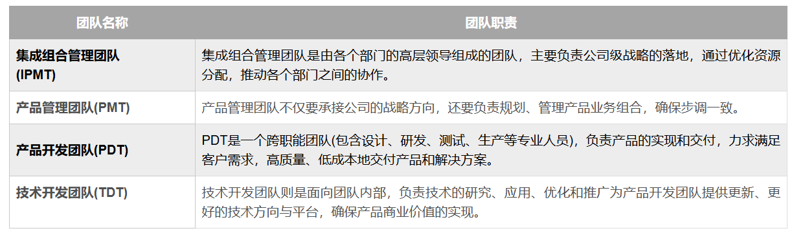

### IPD可以帮企业做什么

IPD是一个可以帮企业实现从市场机会到商业成功的流程闭环。

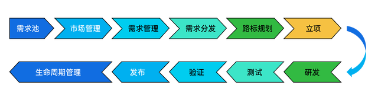

#### IPD能够让企业做正确的事

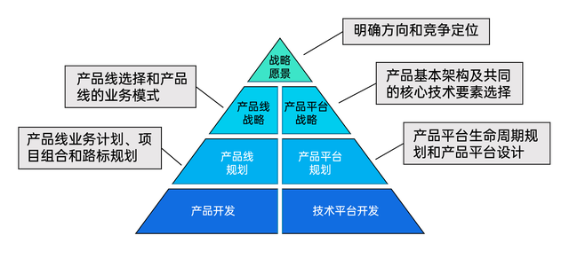

首先通过产品战略管理流程，制定好企业层面的战略愿景，明确发展方向和竞争定位；再制定各产品线或产品平台的战略，明确产品线的业务模式和产品基本架构等；然后通过市场管理所获得的信息验证战略目标的可实施性和可落地性。

##### 市场管理流程

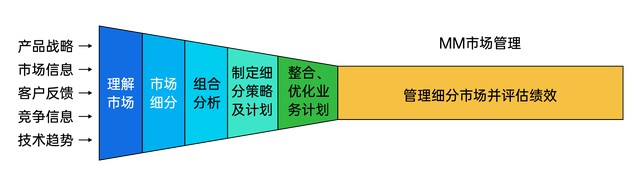

市场管理通俗来讲，也就是市场调研。开发一个产品，就要“以客户为中心”，所以需要通过市场调研了解客户需求、寻找潜在的机会和目标、市场的竞争环境等等，从而制定产品系列的业务计划，评估投入产出比和商业价值，确认产品开发的计划。

##### 需求管理流程

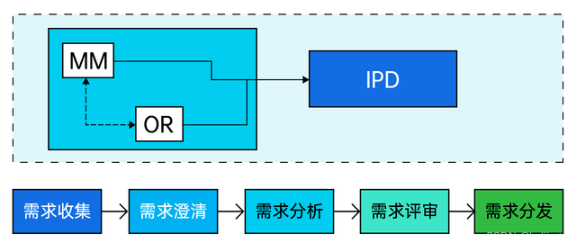

市场调研所获得的信息，通过分析形成了产品需求，对这些需求全流程的追踪、管理就叫需求管理。需求管理包含对产品内外部需求的收集、澄清和筛选，从不同维度对需求进行分类、排序、拆分，评审需求的合理性、完整性及可实现性，评审通过的需求可以分发到对应的产品、路标中。

**IPD中的市场管理和需求管理流程，确保产品以市场、以客户为中心，帮助企业做正确的事。**

#### IPD能够让企业正确地做事

IPD集成产品研发管理流程（Integrated Product Development），俗称小IPD流程。在这个流程中，跨部门组织的管理存在着两个关键的评审点，**一个是由IPMT（集成组合管理团队）负责的决策评审点，目在于帮助高层决策整个项目是否继续；另一个是由ITMIT（集成技术管理团队）负责的技术评审点，目的在于为IPMT提供技术层面的帮助，从而协助IPMT做出正确的决策。**

要想正确地做事，就要明确以下六个阶段应该做哪些工作，同时做好决策评审和技术评审：

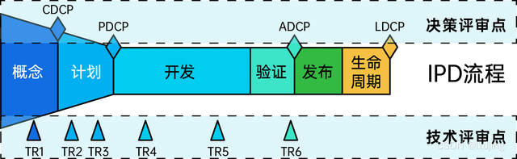

##### 概念阶段（What：解决“产品是什么”的问题）

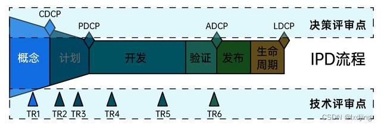

通过组建产品开发团队、决定产品资源分配比例等，明确“做什么样的产品”“产品的投入产出比”“资源分配”等问题。

比如要想研发一款APP，就要明确这个APP的定位是什么，有哪些个性化功能，需要投入多少人力、物力资源，以及这些资源在各个阶段的占比。

###### TR1-产品需求和概念评审

在概念阶段中，会通过TR1技术评审点，对**需求及业务方案**进行评审。

###### 概念决策评审（CDCP）

在概念阶段后期会有概念决策评审，PDT(产品开发团队)会向IPMT（集成组合管理团队）报告产品的初始情况，由IPMT决策项目是否继续投入资源。

##### 计划阶段（How：解决“产品怎么做”的问题）

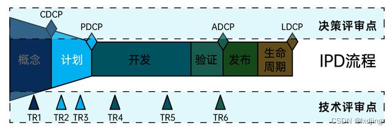

在这个阶段，要制定出产品的**研发计划和实现方案**。比如用什么技术实现这个APP，接下来的一个月要实现什么功能，能否做一个MVP投放到市场等。

在计划阶段，还要重点关注2个技术评审点和1个决策评审点：

###### TR2-需求分解和规格评审

重点关注**从产品设计需求到产品设计规格的完整性。**

###### TR3-总体方案评审

**确保设计规格已经完全、正确的在概要设计中体现。TR3通过标志着项目计划被确认，可以交由PDCP进行决策。**

###### 计划决策评审（PDCP）

技术评审通过后，**IPMT（集成组合管理团队）开始评审产品是否能够推向市场并产生收益。**

##### 开发阶段：干就完了

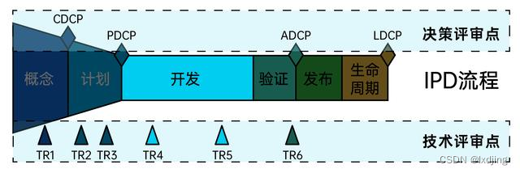

开发阶段就是实现产品的过程。如果前面几个流程的地基打得牢，那开发阶段也能够顺利进行。

开发阶段是不需要决策评审点的，因为大的决策在前面阶段已经完成了，开发阶段只要通过TR4和TR5技术评审点来保证技术上不出现问题就可以了。

###### TR4-模块/系统评审、TR5-样机评审

**主要针对模块或系统的功能开发进行评审和测试，降低技术风险。**

##### 验证阶段

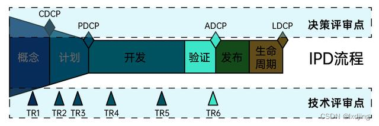

是指研发工作完成了内部测试，以及项目相关方或客户的验收。在这个阶段，还会进行技术评审和决策评审：

###### TR6-小批量评审

关注小批量生产，确认功能点能否通过评审。

###### 可获得性决策评审（ADCP）

**这时产品正式公开发布、推向市场前的最终决策评审，验证在计划阶段制定的内容是否已经实现，产品是否已经准备好发布。ADCP通过，意味着产品可大批量上市。**

##### 发布阶段

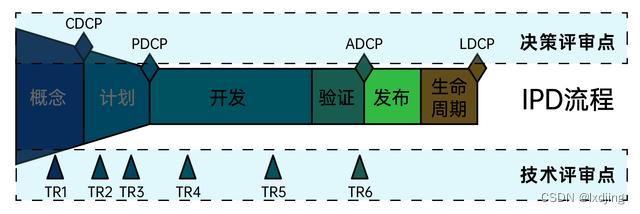

在完成验证后，产品的发布也是一个重要节点，意味着产品正式进入市场。一般公司会通过发布新闻稿、推送动态或发送邮件的方式，和客户进行同步。

##### 生命周期阶段

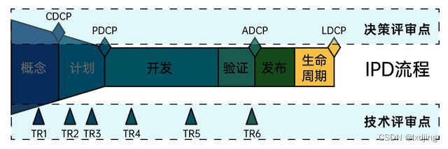

人有生老病死，产品自然也有从上市到消亡的过程。如果我们在这个过程中及时发现问题、调整产品方向，就能有效延长产品生命周期。

###### 生命周期终止决策评审（LDCP）

在这一阶段，会有一个生命周期结束决策评审点：由IPMT（集成组合管理团队）关注该产品的退市是否与公司或产品线战略一致，是否会对现有以及潜在客户的满意度造成影响等，从而决策是否同意产品的退市。

有了体系化的产品研发流程，接下来的IPD产品研发流程可以把产品需求正确地开发出来，使得产品开发的过程规范、高效、质量有保障。从需求梳理到上线，端到端的IPD集成产品研发管理流程可以保证企业正确地做事。

###### 决策评审和技术评审有什么用

在整体的IPD流程中，IPMT可通过不同阶段的决策评审，审视不同阶段的产品方向是否合适，是否需要调整或终止。

而技术评审是对技术或产品的设计、实施、效果等方面的评估活动，确保技术产品的质量、性能、可靠性和安全性，避免将上一阶段的风险带到下一阶段。技术评审无法决定项目应继续还是终止。

上面列出的决策评审和技术评审，其实并非银弹。不同的团队可以根据实际情况，增加相应的评审点，调整相应的评审范围，比如华为会在PDCP（计划决策评审）和ADCP（可获得性决策评审）之间，增加EDCP（早期发货决策评审）评审点。决策点越少，说明授权越充分，但也不能过少，不然会控制不住风险。

## 原文链接

[IPD（集成产品开发）管理之道_ipd tr1-CSDN博客](https://blog.csdn.net/lxdjing/article/details/134837560?spm=1001.2014.3001.5506)