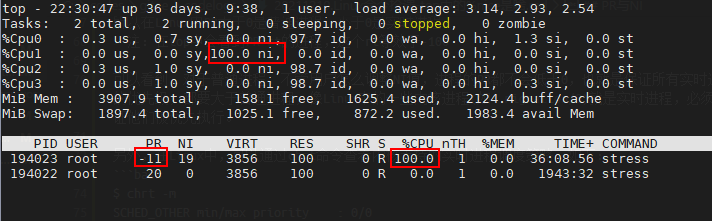

Linux命令拾遗-top中的%nice是啥 

在各种查看CPU使用率的工具中(如top)，一般都有us%、sy%、ni%等，us%与sy%含义是比较容易理解的，一个是用户态CPU使用率，一个是内核态CPU使用率。
但ni%就比较晦涩难懂了，它代表被调整过nice值的进程占用的CPU使用率，很难理解对不对，来看看下面的例子。


## 调整进程nice值

首先，我们使用stress命令起2个进程，对CPU制造一些压力，如下：

```bash
# 起2个吃CPU的后台进程
$ stress -c 2 &

# 查看两个stress进程，进程号为194022、194022
$ pstree -Tp $$
bash(193921)─┬─pstree(194101)
             └─stress(194017)─┬─stress(194022)
                              └─stress(194023)
```

由于我机器是多核的，操作系统会将两个stress进程调度到两个核上，为了达到效果，我们将这2个进程绑定到1号核上运行，如下：

```bash
# 绑定2个stress进程到CPU的1号核上
$ taskset -pc 1 194022
$ taskset -pc 1 194023

# 然后使用top查看，如下图
$ top
```


可以看到，此时%Cpu1是占满的100%，两个stress进程各占50%，这很好理解，两个同样吃CPU进程跑在一个核上，大家各分一半嘛！

这里需要注意一下进程的PR与NI列，这两个都代表了进程的优先级，PR是内核调度时使用的优先级(priority)，默认20，值越大优先级越低，而NI是开放给用户调整的优先级(nice)，默认0，nice值越大，则进程会表现得越谦让(nice)，先让别的进程获得CPU，表现为优先级越低。

如下，我们通过renice命令调整194023进程的nice值为5，以降低它的优先级：

```bash
$ renice -n 5 -p 194023
$ top
```


可以发现，现在%Cpu1的us是75.7，ni是24.3，没被调整nice的进程194022的%CPU是75.1，而调整了的进程194023的%CPU是24.6，同时NI列从0变成了5，PR列从20变成了25，可以发现%ni的值24.3几乎等于被调整过nice值进程的CPU使用率，即24.6。

再看看我开头说的ni%的定义，ni%代表`被调整过nice值的进程占用的CPU使用率`，现在感觉这句话是不是再清楚不过了，被调整了nice值的进程，会从us%中分离出来单独显示，这样当一批非常吃CPU的进程被调整nice值后，调整的人就能非常清楚的知道，这些进程现在占用多少CPU了。

如下，再通过renice命令调用194023进程的nice值为19，这是nice值能设置的最大值：

```bash
$ renice -n 19 -p 194023
$ top
```


可以发现194023这个进程CPU使用率更低了，且%Cpu1的ni也更低了，并且NI变成了19，PR变成了39。


## PR与NI

上面可以看到，PR与NI好像满足这样一种等式关系：`PR = 20 + NI`，那么为什么Linux要设计这两套优化级呢？

其实，在进程执行的过程中，就算你调整了进程NI值导致PR变化，PR还是可以再次由CPU调度器根据需要动态调整的，在这种情况下，上面的公式就不成立了。并且，在内核代码里，PR才是CPU调度器真正使用的优化级，而NI只是开放给用户修改的。

另外，NI值是给普通进程使用的，范围是`[-20 ~ 19]`共39个级别，对应PR就是`[0 ~ 39]`。
而PR的取值范围可以是`[-100 ~ 39]`共139个级别，其中`[-100, -1]`是给实时进程用的。
所以在Linux中PR大于0是普通进程，小于0是实时进程。

> 注：在top中会看到 PR = rt 的进程，这个rt等同于-100


可以发现，对于普通进程，不管用户怎么调整NI值，进程的PR都不会低于0，也就是保证所有实时进程的优先级，都要大于普通进程，像Linux中的一些内核进程就是实时进程(如：migration/0)，必须保证他们被优先执行。

如下，在Linux中，可以通过chrt命令查看内核支持的实时进程调度策略：

```bash
$ chrt -m
SCHED_OTHER min/max priority    : 0/0
SCHED_FIFO min/max priority     : 1/99
SCHED_RR min/max priority       : 1/99
SCHED_BATCH min/max priority    : 0/0
SCHED_IDLE min/max priority     : 0/0
SCHED_DEADLINE min/max priority : 0/0
```

是的，你会发现SCHED_FIFO/SCHED_RR策略都有`[1,99]`共99个实时优先级(real_time_priority)可用，它和PR的关系是：`PR = -1 - real_time_priority`。

如下，之前通过增大NI值而降低了优先级的194023进程，我再把它修改为实时进程：

```bash
# 设置194023进程为实时进程，调度策略为SCHED_RR，实时优先级为10，PR = -1 -10 = -11
$ sudo chrt --rr --pid 10 194023

# 查看实时优先级
$ chrt -p 194023
pid 194023's current scheduling policy: SCHED_RR
pid 194023's current scheduling priority: 10

# 再看CPU使用率
$ top
```

[](https://img2022.cnblogs.com/blog/2792815/202203/2792815-20220326202117005-227354214.png)
可以看到，194023被调整为实时进程后，把CPU占满了，没有给同核心运行的普通进程194022留下任何CPU时间。

所以实时进程的调度是抢占式的，只要其不结束，低优先级进程完全没有机会使用CPU，而对于普通进程而言，多少会留一点CPU时间给其它低优先级的普通进程使用的。

另外，使用`ps -l`也可以查看进程的PR与NI，如下：

```bash
$ ps -lp 194022 194023
F S   UID     PID    PPID  C PRI  NI ADDR SZ WCHAN  TTY        TIME CMD
1 R     0  194022  194017 97  80   0 -   964 -      ?        1943:32 stress -c 2
1 R     0  194023  194017  2  49   - -   964 -      ?         52:08 stress -c 2
```

看PRI这一列，可以发现，194022在top中是20，在ps中是80，而194023在top中是-11，在ps中是49，它们都相差60。

是的，他们含义是一致的，只是显示的基准值不同而已，top中0以下代表实时进程，而`ps -l`中60以下代表实时进程。


## 参考文章

1. [Linux命令拾遗-top中的%nice是啥 - 扣钉日记 - 博客园 (cnblogs.com)](https://www.cnblogs.com/codelogs/p/16060663.html)