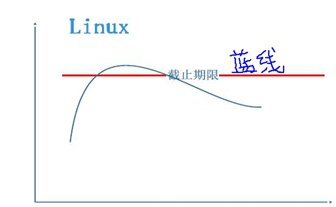

# Linux进程管理


## 进程的生命周期

### 进程与线程

**说到进程，可以用一句话概括：进程是资源封装的单位**

进程封装的资源包括：内存、文件、文件系统、信号、控制台等等。一个进程区别于另外一个进程的标记就是占有的资源完全不一样。

基于以上，那么在任何一个OS中描述进程，我们只需要去描述它的资源即可。通常我们使用一个数据结构PCB（Process Control Block）进程控制块来描述一个进程。在不同的OS中表现是不一样的，对于Linux操作系统，我们使用task_struct描述一个进程。

跟据上图显示，包含的资源有：

- pid表示一个进程的ID资源
- mm_struct表示内存资源
- fs_struct表示文件系统资源
- files_struct表示打开的文件资源
- signal_struct表示信号资源
- ...

*在Linux中各种资源都是有限的：*比如，我们可以使用下面的“fork炸弹”来Linux的pid资源耗尽，让Linux挂掉

```shell
:(){:|:&};:   //会不停创建进程，pid资源耗尽而挂掉，在32bit系统中最多32768个进程pid
```

再比如，除了Linux总的pid是有限的以外，每个用户的pid也是有限的，可以通过ulimit命令查看

```shell
ulimit -a 或者ulimit -u
```


*在Linux资源耗尽漏洞是能被利用的：*Android 2.2之前版本一键root的bug

- adb以root运行
- adb进程调用setuid(shell)权限降级，以上没有判断返回值

此时如果首先将shell用户的pid资源占用完，那么setuid(shell)会失败掉，这时因为没有判断返回值就导致adb降权不成功！


**而线程则是Linux的调度单位**

Linux内核调度器是以线程为单位进行调度和上下文切换的。


### task_struct以及task_struct之间的关系

在Linux里面task_struct的组织并行使用了三个数据结构，典型的以空间换时间思路：

- 链表：Linux中所有的task_struct串在了一个链表上

  

- 树：Linux中的进程都有父子关系，这样通过指针互指形成了树形结构。可以通过`pstree`命令查看

  

- 哈希表：Linux的pid映射到task_struct，这是为了通过pid快速检索进程

  

*通过pstree命令查看到的Linux进程的树形结构如下图：


这棵树在Linux的进程管理里面是非常重要的，因为Linux的父进程类似子进程的“监控器”，父进程可以知道子进程挂掉的原因、释放子进程的遗留资源等等。同时父进程会根据子进程重要性，在监控到子进程死掉之后采取重启等策略。


### 进程状态

一般情况下任何一个操作系统进程都会有三态的转换：就绪<==>运行<==>睡眠。

**但是，在Linux中，进程却有六态的转换：**


- 就绪：只差被CPU执行，通常放在Linux内核CPU runqueue队列中还没有被调度到的线程是这个状态。
- 运行：已经在CPU上运行，正在CPU跑着。
- 深睡眠：等待资源，不可被中断，直到资源到位
- 浅睡眠：等待资源，可以被中断，资源到位或者信号打断
- 停止：一种是收到SIGSTOP信号(ctrl+z)、一种是ptrace调试时当attach上之后就是停止态，当收到SIGCONT信号时转换到就绪态
- 僵死：进程退出，只剩下task_struct结构体标名退出原因

> Tips:Linux的“核内”调度算法（如CFS）就是管理“就绪<==>运行”之间切换，即只涉及单个core的runqueue上线程切换；而“核间”调度算法（如EAS）管不同core之前runqueue上线程的迁移；


**进程Stop状态与作业控制**

作业控制 —— Job Control：

- CTRL+z：发送SIGSTOP信号让进程转到“暂停态”，后续可以继续执行
- fg：继续执行，前台执行
- bg：继续执行，后台执行
- cpulimit：使用作业控制来限制进程cpu利用率，比如`cpulimit -l 20 -p $PID`


### Fork与僵尸

**僵尸**

“僵尸”就是一个挂掉的进程的task_struct结构体，它里面的所有资源都已经被释放掉了，只剩下task_struct这个结构体去告之父进程自己挂掉的原因。这个操作是通过设置`task_struct->exit_code`退出码来完成的。


> Tips:当一个进程变成僵尸时所有资源都被Linux Kernel自动free掉了，除了剩下task_struct这个“空壳” — 僵尸。僵尸态进程，在ps命令显示时，是加“[ ]”的，标识该进程是个已死的僵尸


当一个进程变成僵尸态之后，是无法被各种信号干掉的，唯一干掉僵尸的办法是：

- 父进程通过wait去处理已经退出的子进程
- 直接干掉僵尸进程的父进程


**Fork**

将父进程copy一份给子进程，父子进程返回值不同，父进程返回子进程PID、子进程返回0：


### 内存泄漏的涵义

内存泄漏是指，随着时间的推移，进程消耗的物理内存越来越多、越来越多，内存消耗成发散状态。


*Linux中判断进程内存泄漏的办法：连续多点采样法，然后按照时间轴联线看曲线规律*

- 正常的内存使用 —— 震荡收敛

  

- 异常的内存使用 —— 震荡发散

  


## 进程与线程的创建

### fork、vfork、clone

**fork：**当通过fork创建一个process进程时，Linux内核除了创建一个全新的task_struct以外，还会创建各种资源的struct结构体，比如mm_struct、file_struct、fs_struct等等...

> Tips:需要注意的是：Linux会马上将父进程的资源copy一份给子进程，但只是需要将资源的指针赋值即可，这时父子进程此时仍在指向同一套资源内容。


因此，当我们刚调用完fork后、在还没有其它动作之前，基本就会出现如下逻辑：


**vfork：**在没有MMU的Linux系统中是不支持fork()系统调用的，只有vfork系统调用。（具体原因见下面cow写时拷贝章节）当然在有MMU的Linux系统中也是有vfork这个系统调用的。

vfork与fork最大的区别是，vfork出来的父子进程内存资源mm_struct是共享的：


vfork还有一个特点：当父进程通过vfork创建了子进程，vfork会阻塞住父进程，直到子进程退出、或者子进程调用了exec函数族。


**clone：**这个clone函数是Linux提供的创建线程的系统调用函数，当通过pthread_create函数创建线程时时最终要调用到clone这个函数，里面会带有一系列的标记，将子进程的所有资源都指向父进程，即父子一直共享资源。 这就是线程！！！task_struct不同，但是资源相同！！！


在Linux中，我们是可以直接调用clone这个系统调用、并且可以自己传入一些clone_flags，这样程序员就可以自己创造一个“既非进程关系、又非线程关系”的task_struct关系，我们可以把这种另类的东西叫做“人妖” :)


### cow写时拷贝

写时拷贝技术是Linux系统中非常有识别度的技术之一，用在很多地方，比如fork进程、RCU更新等等。

比如在fork时，本来父子进程指向同一套资源，但当父进程去写mm_struct时，Linux内核就会申请一个空间、将mm_struct这个资源copy一份相同的到新开辟的空间上，然后将新空间指针赋值给父进程、并改写需要去写的mm_struct内容。如果子进程去写mm_struct资源时，就会给子进程分裂出去一块资源，总之COW的原则就是谁写谁分裂。

> Tips:这里需要注意的是，mm_struct是内存资源，其它资源都好说，只有分裂内存资源是比较困难的，必须借助硬件MMU单元进行。**借助MMU硬件单元做内存分裂的概念模型：**
>
> 
>
> 这里COW过程中有MMU修改页表权限、以及写时一次缺页异常的触发过程，只有当有MMU时才会有这种虚实转换。**切记**：当没有MMU时，没有虚实转换、没有缺页异常触发，因此**没有MMU的平台上，Linux内核是不支持fork()**这个系统调用的！！此时创建进程需要使用的系统调用是vfork()


### thread线程的本质

操作系统中关于线程的定义就是：能单独调度（在Linux上即有独立的task_struct），但又相互共享同样资源。在Linux上，我们使用`pthread_create()`这个系统调用API来创建线程，它会带入的参数标记是：

```c
clone_flags=CLONE_VM|CLONE_FS|CLONE_FILES|CLONE_SIGHAND|CLONE_THREAD|...
```

在Linux内核中创建进程和线程，入口是统一的均是do_fork()，但是pthread_create=>clone=>do_fork会传入以上clone_flags参数，标识这些资源需要共享，这就成了创建线程的概念了！

因此，Linux中的线程又叫做轻量级进程，Light Weight Process，缩写是LWP。


### POSIX标准对进程、线程的要求

POSIX标准要求同一个进程内的多个线程应该有同一个的pid，但是Linux对于线程、进程的实现上都是用task_struct去描述，它们有自己独立的pid，这就不符合POSIX标准了。

为了符合POSIX标准，Linux使用了一个小小的欺骗障眼法：在Linux内核中增加了一个TGID，并让同一个进程中的所有线程的TGID都等于线程1的pid1，同时让getpid()这个API返回值就是TGID值。这样无论在哪个线程中调用getpid时，获取到的PID都是TGID，也就是线程1的pid，也就是进程的pid。


这里也涉及到不同命令对于pid的使用，比如：top命令，当我们直接敲`top`时显示的是TGID，而当我们使用`top -H`时显示的是每个线程真正的PID。


### 进程托孤

在Linux中当子进程死掉，父进程会去“收(僵)尸”，但是当父进程先死掉的话呢，那么就需进程托孤，即必须给一个进程找到一个“爸爸”。

在早期版本的Linux内核中，当父进程死掉时，都是直接托孤给init进程。但是新版本的Linux内核中子进程可以被托孤给进程树上把自己声明为“subreaper”的进程。


总之，进程托孤要么托孤给init、要么托孤给subreaper。但是一个充当subreaper的进程需要做好准备，注意需要掉wait去获取子进程状态。自从有了subreaper之后，Linux的层次感就比之前更强了一些。


### 进程睡眠、等待队列

**进程睡眠分类**

- 深度睡眠：等待资源，只能被资源唤醒
- 浅度睡眠：等待资源/信号，能被资源/信号唤醒


**进程睡眠唤醒转换**

- 运行==>睡眠：

  在Linux中，睡眠的task_struct都会被挂在某个waitqueue上，这waitqueue是等待同一个资源的等待队列，只要等待同样资源的进程都能被挂到同一个waitqueue上。挂入waitqueue的动作是进程代码中自己写的，如下几步：

  - 声明等待队列
  - 把current变量（自己的task_struct）加入等待队列
  - 设置自身状态
  - 调用schedule
  - （唤醒后）继续执行...

- 睡眠==>唤醒：

  当资源来到时，整个waitqueue会被唤醒，此时挂在waitqueue上的进程就都被唤醒了。这里所谓唤醒，即使用wake_up/wake_up_interrupt去修改等待队列上各个task_struct的状态`__set_XXX_state(TASK_RUNNING)`。移出等待队列，如下一步即可：

  - 在写资源的代码中准备好资源
  - 在写资源的代码中调用wake_up/wake_up_intteruptible唤醒对应的等待队列


### 进程0、进程1

在Linux中，init进程是pid=1的第一个用户态进程，但是Linux中第一个进程却是进程swapper它的pid=0是idle进程。

**swapper进程**

对于idle进程，它是在Linux Kernel初始化的时候创建的第一个进程。从Kernel进入C语言函数start_kernel()开始，我们可以大概把Linux启动分为三个阶段：

- ① start_kernel阶段：

  该阶段主要是准备内核运行的各种软件环境，比如初始化irq、memory建立页表、VFS、scheduler等等

- ② rest_init阶段：

  该阶段主要是激活调度器，创建kernel_init、kthreadd线程将Kernel从单线程变为多线程，同时这里把自身设置为**idle线程**。idle进程0是优先级最低的，它会把CPU置为“低功耗状态WFI”，并循环检测是否有比自己优先级高的进程，如果有的话，就调用schdule进行切换。Linux这个设计是非常牛的，把跑、不跑全都变成了跑...完全的进程之间去耦合了...

  

- ③ kernel_init阶段

  这个阶段分成2个步骤：

  - kernel_init_freeable：主要是激活smp多核、激活smp多核调度、初始化设备驱动、打开console
  - 然后就开始创建init进程，即 **第一个用户态进程**，并切换到用户态

*如下图就显示了Linux Kernel启动的完整过程：*

**init进程**

init进程是第一个用户态进程，它的父进程是进程0这个swapper进程。


## 进程与线程的优先级与调度

### 调度算法的设计目标

**一个操作系统调度器设计追求的第一个目标：吞吐大/响应快**

- ① 吞吐量大：

  单位时间内做的有用功多，就是吞吐量大，反应到调度算法上，就是让进程切换时消耗尽量小（保存、切换、CacheMiss等等非有用功要少），即花费在非进程运行上的时间要尽量小。吞吐最求的是整个系统要把时间花费在有用的事情上，服务更多用户，是全局视野。

- ② 响应快：

  指的是高优先级需要先处理，延迟低。响应追求的是某个特定的任务延迟低，是局部视野。

其实吞吐和响应是一对儿矛盾，那么调度器就是这对儿矛盾的结合体：


因此：

- 想吞吐高，就需要“抢占少”，极端情况就是一直运行一个进程，基本就是Server的思路。
- 想响应快，就需要“抢占多”，要积极的去抢占，让高优先级的立刻执行，基本就是Desktop的思路。

*基于以上调度器设计矛盾，其实Linux操作系统在编译时是会让选择抢占模型的：*


**一个操作系统调度器设计追求的第二个目标：平衡CPU消耗/IO消耗优先级**

- ① CPU消耗型：

  CPU利用率很高，大部分时间都在CPU上做运算，CPU利用率很高。

- ② IO消耗型：

  消耗CPU很少，绝大多数时间CPU都在等IO完成，CPU利用率很低。

*在现代操作系统里面，越是IO消耗型的优先级需要越高，因为喜欢睡眠等待IO的通常伴随着用户体验，需要能及时响应它。一般它对CPU是强/弱并不敏感，但是对何时能抢到CPU却十分敏感。*


> Tips:ARM公司的CPU的big-Litte架构正是基于以上原理来实现的，将IO消耗型的调度到“小核”上，将CPU消耗型的调度到“大核”上。这样就能用大概4大+4小核架构实现接近8大核的性能，且功耗要低很多。因此，在big-Litte这类架构上，像EAS这种SMP多核调度器的设计就尤为重要了。


### 进程与线程优先级

Linux的调度算法必须结合两个东西：

- 策略
- 优先级

> Tips:注意一个最基本点：Linux内核只提供机制，不提供策略，这是Linux系统设计的原则之一


内核把所有进程/线程的优先级分成0~139之间，值越小优先级越高（0最高）：

- 优先级0~99是RT进程，采用RT策略，两个调度策略：

  SCHED-FIFO：同等优先级，除非自己schedule走，否则一直会占用CPU；不同优先级时，高优先级立即抢占。

  SCHED-RR：同等优先级，按照时间片轮转；不同优先级时，高优先级立即抢占。

- 优先级100~139是Normal进程，一个调度策略：

  基于nice值：-20~19来对应优先级100~139，即nice值越高对应的优先级越低。（越nice优先级越低）


### 设置调度相关的系统调用

进程的调度策略和优先级是可以被程序员设置的，如下给出了各个API和功能描述：


### CFS调度算法（没学会）

**学习CFS调度算法需要注意三点**

- 只是核内调度算法。即：针对同一个core上runqueue队列中task_struct来进行调度
- 只处理TASK_RUNNING状态（就绪/执行）的task_struct。即：只能是挂载runqueue里面的
- 只针对normal线程。即：不能针对RT线程


**Linux核内调度演变**

最初的基本逻辑是：奖惩机制，只针对Normal线程，运行时间越长，nice值会逐渐增加权重，以这样的办法去降低Normal线程的优先级。

在V2.6版本内核又增加了两个补丁：

**①** RT熔断机制：(通过RT运行时长门限，让RT线程能给Normal线程运行的机会)—— 设置RT线程在“长度为period的时间段”内最多只能运行“runtime的时长”

> Tips:这个熔断机制很难被触发，通常是不会被用到的，一旦出现这种情况，大概率意味着RT线程里面遇到什么bug了，可以去调查一下另外，这个熔断机制默认是不开启的，通常以下两个值都是950000

```shell
/proc/sys/kernel/sched_rt_period_us
/proc/sys/kernel/sched_rt_runtime_us
```


**②** 普通进程的调度算法CFS：（改变了最开始的奖惩机制的逻辑）完全公平调度算法，该调度算法的核心数据结构是一颗红黑树（rbtree）。红黑树是左边节点小于右边节点，右边节点又小于最右边节点的二叉树。*对上图进行说明：*

- 其中里面的数字是普通优先级线程的“虚拟”运行时间: `vtime=ptime*1024/weight`，ptime是线程运行的“物理”时间

- weight是权重，它是由nice值直接决定的，一一对应关系：

  

- Linux每次调度选择的是虚拟时间最小的线程执行：

  就是rbtree的最左边节点，当被选择的线程执行时实际物理时间ptime会增加，就会导致vtime变大当vtime超过它右边最少1个节点的时候，它就会被从原来位置拿掉并插入到这些节点的右边这样下次调度还是会选择rbtree上最左边的节点来跑，这样完成调度过程

- 照顾IO型线程：因为IO型容易睡眠，造成实际运行的ptime会比较小，即公式分子分子小，这样计算完vtime会小，它容易在树的左边

- 照顾nice值低的线程：因为nice值低时，查weight表得出的分母大，这样计算完的vtime也会小，它也容易在树的左边

  > Tips:可以使用nice值去启动一个task，比如: `sudo nice -5 ./a.out`使用renice命令用来修改线程nice值，比如: `sudo renice -n -5 -g $PID`，-g是所有线程生效，-p是对某一个单独线程生效


### Normal线程转化为RT线程

一个普通线程，我们可以使用两种办法将之转化为RT线程：

**第一 通过代码**

可以使用如下代码做转换：

```c
struct sched_param the_priority;
the_priority.sched_priority = 50;
pthread_setschedparam(pthread_self(), SCHED_FIFO, &the_priority);
```


**第二 通过chrt工具**

chrt是一个非常好玩儿的工具，可以将一个普通线程修改成一个RT类型的线程.

比如将一个普通进程所有线程都设置成SCHED FIFO类型的：

```shell
sudo chrt -f -a -p $Priority $PID 
```

> Tips：我们可以做一个试验，首先设置RT线程的熔断值，比如1s内运行800ms就熔断（80%），然后开启两个CPU利用100%的普通线程，总体200%当我们把普通线程修改成RT线程的时候，会发现CPU利用率从200%将为160%，但是用户体验却变差了，点鼠标等响应很慢这说明了，CPU利用率高不一定用户体验差，CPU利用率低也不一定用户体验好，需要看线程优先级！！！ 切记！！！


## 工程 — 性能与实时性

### 多核负载均衡

**负载均衡 Load-Balance**

当有多个core/super-thread时，不能将大部分甚至所有的task_struct都集中到某一个core或者某几个core上去运行，而应该平均分配。（这里不包含根据性能要求，调度算法对task_struct进行IO型/CPU型分类去故意分core调度的情况）

Load-Balance感性认识：当一个进程（两个线程）死循环时，

- 当top命令查看时，发现该进程CPU占用率是200%，是因为2个线程被自动瓜分到2个core上去了。
- 当time去执行它时，发现使用时间user+sys≈2*real，是因为当内核统计进程运行时间时是将2个core的时间都统计进去＋在一起了。


**分布式系统**

当Linux运行时，每个core可能将task_struct推到其它core（push），或者从其它core拉task_struct到本core（pull），内核调度模块会不停的做推push/拉pull操作。这是一个典型的分布式系统，core与core之间有分布式握手。


**负载均衡分类**

- RT任务的负载均衡：

  让N个优先级最高的RT任务自动分派到N个core上去同时运行

- Normal任务的负载均衡：

  在一些周期性的时间点上，比如时钟Tick点上，每个核都会查自己和附近的core的负载情况，然后就做push/pull动作；

- Idle时负载均衡：

  在Idle前先查看附近的core是否负载较重，如果是则pull动作；

- Fork/Exec创建任务时负载均衡：

  会找一个负载最轻的core，然后push到该core上去运行；


**设置task_struct的CPU亲和性**

负载均衡是自动做的，但是Linux有2种方法可以去修改task的亲和力（affinity）：

**①** 可以在程序中做修改让某个task_struct固定到某个/某些core上跑。这些设置affinity的API有：

```c
int pthread_attr_setaffinity_np(pthread_attr_t *, size_t, const cpu_set_t *);
int pthread_attr_getaffinity_np(pthread_attr_t *, size_t, cpu_set_t *);
int sched_setaffinity(pid_t pid, unsigned int cpusetsize, cpu_set_t *mask);
int sched_getaffinity(pid_t pid, unsigned int cpusetsize, cpu_set_t *mask);
```

其中：mask是掩码，比如设置成0x0110，即按照比特位对应让task在core1或者core2上跑。

**②** 可以使用工具taskset去设置task affinity：

```c
taskset -a -p 01 19999
taskset -a -p 02 19999
taskset -a -p 03 19999
```

其中：-a是进程中所有线程，-p是core，后面数字是进程PID。


### 中断负载均衡（留个引子，很复杂，没学会）

除了task_struct以外，占用CPU资源的，还有irq和softirq。

在Linux内核中irq（上半部）和softirq（下半部）的区别是：

- irq不能耗费太长时间，通常会将长时间任务放到softirq中去执行
- softirq是可以被irq打断的，但是irq自身是不支持嵌套的

*在top命令中可以很清楚的看到CPU时间分配情况：*


因此，当在某些场景下，比如网卡的流量很大时，通常会发现CPU花费在irq和softirq的时间很长，因为其中会有大量的网卡irq和softirq产生同时softirq需要大量时间去处理TCP/IP等网络协议栈的内容。

在这些场景下，通常就需要考虑做irq的负载均衡了——irq affinity。即，irq/softirq不绑定在某一个core上一直处理，而是平均发派到几个core上处理。*这个irq affinity的设置很类似于task_struct的，我们可以用如下方法：*


最典型的irq affinity设置是网卡的，如下显示了将网卡4个接收发送queue的irq（不同irq号）设置到不同的core上去做处理：


**优化：RPS软中断负载均衡**

现在很多网卡都是multi-queue的，可以按照以上去设置irq affinity，但是也有很多网卡确实很挫的，它只有一个queue，那么就只能有一个core去处理该irq/softirq。而**Linux内核对于irq/softirq的处理是：irq与softirq必须在同一个core上处理。**结合上面网卡情况，在网络包很多时就会造成softirq不停被irq打断，会积累很多待处理的softirq，形成系统性能的瓶颈点。

Google近几年对内核做了很多优化，针对上面情况，推出了一个RPS补丁：虽然有些网卡只有一个queue绑定一个irq，但是可以在irq处理（`irq_exist()`）完触发softirq（`invoke_softirq()`）处理TCP/IP网络协议栈包时，分散到不同的core上去做处理，这就避免了一核有难七核围观的尴尬情况。这个技术被命名为RPS。

- RPS的使能方法是：

```shell
echo fffe > /sys/class/net/eth1/queues/rx-0/rps_cpus    //即将除了core0以外的其它core都加入到参与TCP/IP网络协议栈softriq的处理工作中
```

- RPS的实现机制：

  当一个core上收到irq之后，通过IPI核间中断通知其它core去处理后续的softirq部分。

*通过/proc/softirqs节点可以查看各个core上softirq的情况：*


而查看系统内中断的情况使用`cat /proc/interrupts`。


### cgroups和CPU资源分配

cgroup是Linux系统的重要资源控制feature，能通过在不同控制组cpu/memory/io/scheduler等等内创建不同的组群/子组群+不同组群设置不同策略等操作，去控制加入“不同控制组”的各个task_struct的cpu、memory、io、scheduler等等各种资源使用。

Android在5.0之后的版本就使用了cgroup组群控制去将进程分类，比如前台交互进程、后台非交互进程等等，然后将这些进程加入对应的前台组群、后台组群并设置不同的策略：


说明：以上将前台控制组“权重”设置为1024，后台控制组“权重”设置为52，这样前台能获得更多比例的CPU资源。

除了以上通过“权重”比例去控制CPU资源使用，还可以通过限制task使用的“配额绝对值”去配置等等。比如，当我们用docker run去启动一个容器的时候，通常Linux内核是默认将它加入到一个cgroup控制组的。但是我们也可以直接在启动时指定改docker使用的cpu资源不超过250%：

```
docker run --cpu-quota 25000 --cpu-period 10000 --cpu-shares 30 linuxep/lepv0.1
```


### Linux与实时操作系统

**实时操作系统的概念**

这里的“实时”并不是“即时”，它指的是task的执行截至期限是“可预期”的，即执行延迟是确定的，而不是立即执行。

实时性根据可能导致的“后果”分为：

- 硬实时：

  一旦task执行期限超过“预期的门限值”，其后果将是无法接收的、灾难性的。比如导弹发射系统，必须是硬实时系统。典型的硬实时操作系统RTOS：

  

- 软实时：

  尽量去保证“预期的门限值”，而不能必须确保，一旦出现超过“预期的门限值”的情况，其后果其实并没有什么严重的。Linux就是典型的软实时操作系统：
  
  

**Linux为什么不是硬实时的**

Linux的延迟不具备确定性，这也是Rich OS的共性（富操作系统是指应用场景丰富的支持各中各样应用）。

*Linux的时间大体分成了如下4类时间：*


说明，其中第③和第④的区别是：③关掉了抢占调度，此时该core已经不能进行调度了，只能跑该task而不能被其它task抢占；

> Tips:抢占发生的时机很多，即抢占点很多，比如从系统调用返回啊、从softirq返回当前task啊等等，很难记全。因此可以反向去记忆不可抢占时机，其它时机认为都可抢占，不可抢占时机有：① 中断② 软中断③ task中调用spinlock/preempt-disable等关抢占类操作


*哪些东西会将Linux的硬实时性给堵住：*


说明，一个普通进程在某个core上运行过程中可能会发生的事情：

① 该进程执行syscall系统调用，从用户态陷入内核执行，然后在T1时刻拿来spinlock；

② 然后被一个中断IRQ1打断，开始执行IRQ1的中断、软中断；

③ 在IRQ1的软中断中间，它在T2时刻唤醒了一个实时线程RT task，但是因为抢占关闭，RT task只能等待；

④ 然后在IRQ1的软中断处理结束时洽好又被另外一个中断IRQ2给打断，开始执行IRQ2的中断、软中断；

⑤ 在IRQ2的软中断处理完毕后，T3时刻回到占有spinlock的普通进程继续执行，此时抢占依旧关闭中；

⑥ 当普通进程释放spinlock的T4时刻因为抢占被开启，这时RT task执行抢占，开始被调度运行，普通进程被挂起；

⑦ 当RT task执行完毕后，调度继续执行普通进程，直到syscall系统调用结束；

⑧ 返回用户态继续执行；整个过程从T1拿住spinlock到T4开始执行RT task这段时间是不可预测的，因为不知道会来多少中断、执行的长短是如何的等等。

这个图上面标记的一类、二类、三类区间都会堵住抢占的发生，当普通进程的优先级/nice值等等调整都会导致core runqueue队列发生改变，只要core runqueue发生改变就可能会发生抢占，但是由于一二三类区间的存在导致抢占并不是立刻发生，因此这部分区间处理的“不确定性”就堵住了“Linux的硬实时性”。


### Preempt-RT对Linux实时性改造（没学会）

Linux的实时性改造是Linux Foundation的一个Project，其中的代码并未并入Linux Kernel Mainline，而是处于以patch单独维护的状态中。

**这些RT Patch做的事情基本就是对上一节提到的一二三类区间进行改造：**

- 第一类区间：IRQ改造：中断线程化
- 第二类区间：Soft IRQ改造：软中断线程化
- 第三类区间：Spinlock改造：都修改成Mutex，不再关调度

这样，就将这些不可抢占的区间变换为可抢占的区间，有高优先级任务可以立即抢占，这样就将RT task的执行变得可预期，将Linux变为一个硬实时系统。具体可见[RT补丁的源码](https://git.kernel.org/pub/scm/linux/kernel/git/rt/linux-stable-rt.git)

*当打上RT-Linux补丁之后，对于Linux Kernel的调度器抢占模型的修改变为：*

另外需要注意的是：RT-Linux补丁打上之后在写代码方面会遇到很多很多坑，调度变成实时的也不代表Linux就变成实时的，比如有无数的内存管理的坑。例如，内存管理中用户态内存的写时分配、PageFault触发，此时就不是实时的，这些都是在写code时是需要注意的点。

因此，对于Linux的实时性改造，既可以用RT-Linux补丁将Linux内核改造成实时的，也可以并行再跑一个RT操作系统做成双系统，让它们分别泡在不同的core上。

**RT-Linux的性能**目前RT-Linux的patch打上之后，Linux实时性能可以做到100us的量级，还做不到vxworks那种us量级。当然了，可预期的是，相应的Linux调度的吞吐会下降


## 参考文章

1. [【概述】-Linux内核三驾马车之-进程管理 (acean.vip)](https://blog.acean.vip/post/linux-kernel/gai-shu-linuxnei-he-san-jia-ma-che-zhi-jin-cheng-guan-li)