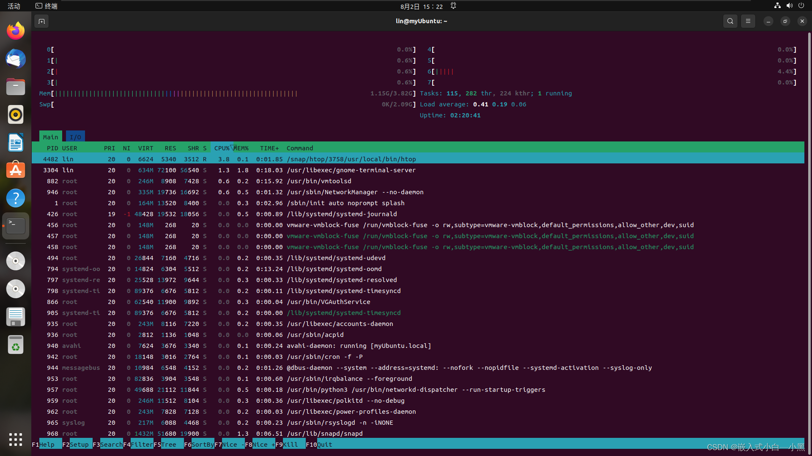

# 进程管理详解：从基本操作到动态监控网络状态（ps、top、kill、killall、pstree、htop、systemctl、netstat、ss）


### 1. 进程ID（PID）

每个进程在系统中都有一个唯一的进程ID（PID），用于标识该进程。PID是一个非负整数，可以通过`getpid()`函数获取当前进程的PID。


### 2\. 显示系统执行的进程

#### 2.1 `ps`命令

`ps`命令用于显示当前系统中正在执行的进程。常用的参数有：

*   `-e`：显示所有进程，包括其他用户的进程。
    
*   `-f`：显示进程的详细信息，包括进程的PID、父进程的PID、进程状态等。
    
*   `-u <username>`：显示指定用户的进程。
    

**示例代码：** 

```shell
$ ps -ef 
```

**示例输出：** 

```shell
UID        PID  PPID  C STIME TTY          TIME CMD
root         1     0  0 08:00 ?        00:00:01 /sbin/init
root         2     0  0 08:00 ?        00:00:00 [kthreadd]
root         3     2  0 08:00 ?        00:00:00 [ksoftirqd/0]
root         5     2  0 08:00 ?        00:00:00 [kworker/0:0H]
root         7     2  0 08:00 ?        00:00:00 [rcu_sched]
root         8     2  0 08:00 ?        00:00:00 [rcu_bh]
```

在上面的输出中，每一列的含义如下：

*   `UID`：进程的用户ID，表示进程属于哪个用户。
*   `PID`：进程的ID，是唯一标识一个进程的数字。
*   `PPID`：父进程的ID，表示该进程是由哪个进程创建的。
*   `C`：进程的CPU使用率，表示进程在CPU上占用的时间片。
*   `STIME`：进程的启动时间，表示进程开始运行的时间。
*   `TTY`：进程所在的终端，表示该进程与哪个终端设备关联。
*   `TIME`：进程的运行时间，表示该进程已经运行了多长时间。
*   `CMD`：进程的命令行，表示进程是通过哪个命令启动的。


#### 2.2 `top`命令

`top`命令用于实时监控系统的进程和系统资源使用情况。它以交互方式显示进程列表，并按照CPU使用率或内存使用率进行排序。

**示例代码：** 

```shell
$ top
```

**示例输出：** 

```shell
PID USER      PR  NI    VIRT    RES    SHR S  %CPU %MEM     TIME+ COMMAND
  1 root      20   0  168584   9856   6516 S   0.0  0.1   0:03.96 systemd
  2 root      20   0       0      0      0 S   0.0  0.0   0:00.00 kthreadd
  3 root      20   0       0      0      0 S   0.0  0.0   0:00.00 ksoftirqd/0
  5 root       0 -20       0      0      0 S   0.0  0.0   0:00.00 kworker/0:0H
  7 root      20   0       0      0      0 S   0.0  0.0   0:00.00 rcu_sched
```

在上面的输出中，每一列的含义如下：

*   `PID`：进程的ID，是唯一标识一个进程的数字。
*   `USER`：进程的所属用户，表示进程属于哪个用户。
*   `PR`：进程的优先级，数值越小优先级越高。
*   `NI`：进程的优先级调整值，负数表示较高优先级，正数表示较低优先级。
*   `VIRT`：进程使用的虚拟内存大小，包括进程的代码、数据和堆栈等。
*   `RES`：进程使用的物理内存大小，表示进程实际占用的物理内存。
*   `SHR`：进程使用的共享内存大小，表示进程与其他进程共享的内存。
*   `S`：进程的状态，包括R（运行）、S（睡眠）、D（不可中断的睡眠）、Z（僵尸）等。
*   `%CPU`：进程使用的CPU占比，表示进程在当前时间片内使用CPU的时间比例。
*   `%MEM`：进程使用的内存占比，表示进程占用系统总内存的比例。
*   `TIME+`：进程的累计CPU使用时间，表示进程已经使用CPU的总时间。
*   `COMMAND`：进程的命令行，表示进程是通过哪个命令启动的。


### 3\. 终止进程

#### 3.1 `kill`命令

`kill`命令用于终止指定进程。它向指定进程发送一个信号，可以是终止进程的信号（默认为`SIGTERM`）或其他自定义信号。

示例代码：

```shell
$ kill <PID>
```


#### 3.2 `killall`命令

`killall`命令用于终止指定进程名对应的所有进程。它与`kill`命令不同的是，不需要指定进程的PID，只需指定进程名即可。

示例代码：

```shell
$ killall <process_name>
```

### 4\. 查看进程树

#### 4.1 `pstree`命令

`pstree`命令用于以树状结构显示进程及其子进程。它可以帮助我们更直观地理解进程之间的关系。

**示例代码：** 

```shell
$ pstree [OPTIONS] [PID]
```

`pstree`命令的参数说明如下：

*   `OPTIONS`：可选参数，用于指定输出格式和其他选项。
    *   `-a`：显示进程的命令行参数。
    *   `-c`：显示进程的完整命令行。
    *   `-h`：高亮显示当前进程。
    *   `-l`：使用长格式输出。
    *   `-n`：以数字排序进程。
    *   `-p`：显示进程的PID。
    *   `-u`：显示进程的所属用户。
*   `PID`：可选参数，用于指定要显示的进程的PID。如果不指定PID，则默认显示当前进程及其子进程的关系。


#### 4.2 `htop`命令

`htop`是一个交互式的进程查看器，它提供了比`top`更加强大和直观的功能。`htop`可以实时监控系统的进程、系统资源和系统状态，并以直观的方式展示给用户。下面是`htop`命令的基本用法：

```shell
$ htop [OPTIONS]
```

`htop`命令的参数说明如下：

*   `OPTIONS`：可选参数，用于指定输出格式和其他选项。
    *   `-d, --delay=DELAY`：设置刷新间隔的延迟时间（单位：秒）。
    *   `-u, --user=USERNAME`：只显示指定用户的进程。
    *   `-p, --pid=PID`：只显示指定PID的进程。
    *   `-s, --sort-key=COLUMN`：按指定的列进行排序，可选的列包括PID、USER、CPU、MEM等。
    *   `-t, --tree`：以树状图的形式显示进程关系。
    *   `-h, --help`：显示帮助信息。  
        
        

示例用法：

1.  启动`htop`并显示系统进程：

```shell
htop
```

2.  只显示指定用户的进程：

```
htop -u username
```

3.  只显示指定PID的进程：

```shell
htop -p 1234
```

4.  按CPU使用率进行排序：

```shell
htop -s cpu 
```

5.  以树状图的形式显示进程关系：

```shell
htop -t
```


### 5\. 服务管理

#### 5.1 `systemctl`命令

`systemctl`命令是用于管理systemd系统和服务的命令行工具。systemd是现代Linux系统中常用的系统和服务管理器，`systemctl`命令可以帮助我们启动、停止、重启、管理和监控系统服务。下面是`systemctl`命令的基本用法：

```shell
systemctl [OPTIONS] [COMMAND] [UNIT]
```

```shell
$ systemctl start <service_name>
$ systemctl stop <service_name>
$ systemctl restart <service_name>
$ systemctl status <service_name>` 
```

`systemctl`命令的参数说明如下：

*   `OPTIONS`：可选参数，用于指定额外的选项。
    *   `-a, --all`：显示所有的单位（服务）。
    *   `-p, --property=NAME`：显示指定属性的值。
    *   `-H, --host=HOST`：在远程主机上执行命令。
*   `COMMAND`：必选参数，用于指定要执行的命令。
    *   `start`：启动指定的单位。
    *   `stop`：停止指定的单位。
    *   `restart`：重启指定的单位。
    *   `reload`：重新加载指定的单位。
    *   `enable`：设置指定的单位在系统启动时自动启动。
    *   `disable`：设置指定的单位在系统启动时不自动启动。
    *   `status`：显示指定的单位的状态。
    *   `list-units`：列出所有的单位。
    *   `list-unit-files`：列出所有的单位文件。
*   `UNIT`：可选参数，用于指定要操作的单位（服务）。

**示例用法：** 

1.  启动一个单位（服务）：

```shell
systemctl start unit.service
```

2.  设置一个单位（服务）在系统启动时自动启动：

```shell
systemctl enable unit.service
```


### 6\. 动态监控进程

#### 6.1 `top`命令监控进程

假设我们使用`top`命令查看系统的进程列表和性能指标

**示例输出**

```shell
top - 09:30:00 up 1 day, 2:30,  2 users,  load average: 0.10, 0.15, 0.12
Tasks: 201 total,   1 running, 200 sleeping,   0 stopped,   0 zombie
%Cpu(s):  3.5 us,  1.2 sy,  0.0 ni, 95.2 id,  0.0 wa,  0.0 hi,  0.1 si,  0.0 st
MiB Mem :   7842.3 total,   1911.4 free,   4779.6 used,   1151.3 buff/cache
MiB Swap:   2048.0 total,   2048.0 free,      0.0 used.   2580.7 avail Mem 

  PID USER      PR  NI    VIRT    RES    SHR S  %CPU  %MEM     TIME+ COMMAND
  1234 root      20   0  100.0m  10.0m   5.0m R   1.0   0.1   0:01.00 process1
  5678 user1     20   0   50.0m   5.0m   2.5m S   0.5   0.1   0:00.50 process2
  9101 user2     20   0   25.0m   2.5m   1.2m S   0.2   0.0   0:00.20 process3
```

在这个示例中，我们可以看到以下信息：

*   当前时间为09:30:00，系统已经运行了1天2小时30分钟，有2个用户登录。
*   系统的平均负载为0.10、0.15和0.12，表示过去1分钟、5分钟和15分钟的平均负载。
*   总进程数为201，其中有1个正在运行的进程，200个睡眠中的进程，没有停止的进程和僵尸进程。
*   CPU使用率为3.5%用户空间、1.2%系统空间、0.0%nice值、95.2%空闲、0.0%等待I/O、0.0%硬中断、0.1%软中断。
*   内存使用情况为7842.3 MiB总内存，1911.4 MiB空闲内存，4779.6 MiB已使用内存，1151.3 MiB缓存和缓冲区使用情况。
*   交换空间使用情况为2048.0 MiB总交换空间，2048.0 MiB空闲交换空间，没有使用的交换空间，2580.7 MiB可用内存。

在进程列表中，我们可以看到三个进程的详细信息，包括进程ID、所属用户、CPU使用率、内存使用率、虚拟内存大小、物理内存大小、进程状态、启动时间、累计CPU占用时间和进程命令行。


#### 6.2 交互操作

*   `k`：杀死选中的进程。
*   `r`：改变选中进程的优先级。
*   `1`：切换CPU核心的显示。
*   `f`：显示或隐藏列字段。
*   `o`：根据指定的列字段进行排序。
*   `s`：改变刷新时间间隔。
*   `q`：退出`top`命令。

您可以按下对应的键来执行相应的操作。例如，按下`k`键，然后输入要杀死的进程的PID，即可杀死该进程。按下`o`键，然后输入要排序的列字段，即可按照指定的字段对进程列表进行排序。


### 7\. 监控网络状态

#### 7.1 `netstat`命令

`netstat`命令用于显示网络连接、路由表和网络接口等信息。它可以帮助我们监控系统的网络状态和性能。  
下面是`netstat -anp`命令输出的示例：

```shell
Active Internet connections (servers and established)
Proto Recv-Q Send-Q Local Address           Foreign Address         State       PID/Program name    
tcp        0      0 0.0.0.0:22              0.0.0.0:*               LISTEN      1234/sshd           
tcp        0      0 192.168.0.100:12345     10.0.0.1:54321         ESTABLISHED 5678/myapp          
udp        0      0 0.0.0.0:53              0.0.0.0:*                           9101/dnsmasq
```

在这个示例中，我们可以看到以下信息：

*   当前有活动的Internet连接，包括正在监听的服务器和已建立的连接。
*   第一列显示连接的协议类型，例如tcp或udp。
*   第二列显示接收队列中的字节数（Recv-Q）和发送队列中的字节数（Send-Q）。
*   第三列显示本地地址和端口。
*   第四列显示远程地址和端口。
*   第五列显示连接的状态，例如LISTEN（监听）或ESTABLISHED（已建立）。
*   最后一列显示与连接相关的进程的PID和程序名称。


#### 7.2 `ss`命令

`ss`命令是一个强大的工具，用于显示当前系统的套接字（socket）统计信息。它可以提供比`netstat`更详细和更快速的套接字信息。下面是`ss`命令的一些常用选项和示例：

*   `ss -t`：显示TCP套接字统计信息。
*   `ss -u`：显示UDP套接字统计信息。
*   `ss -l`：显示所有监听套接字的统计信息。
*   `ss -p`：显示与套接字关联的进程信息。
*   `ss -n`：以数字格式显示IP地址和端口号。
*   `ss -a`：显示所有套接字（包括监听和非监听套接字）的统计信息。
*   `ss -o`：显示计时器信息。

以下是`ss`命令的输出示例：

```shell
State      Recv-Q Send-Q        Local Address:Port          Peer Address:Port              
ESTAB      0      0             192.168.0.100:12345         10.0.0.1:54321                
LISTEN     0      10            0.0.0.0:22                   0.0.0.0:*
```

在这个示例中，我们可以看到以下信息：

*   第一列显示套接字的状态，例如ESTAB（已建立）或LISTEN（监听）。
*   第二列显示接收队列中的字节数（Recv-Q）和发送队列中的字节数（Send-Q）。
*   第三列显示本地地址和端口。
*   第四列显示远程地址和端口。

`ss`命令还可以与其他选项和过滤器一起使用，以提供更具体的套接字信息。


## 参考文章

1. [【Linux操作系统】进程管理详解：从基本操作到动态监控网络状态（ps、top、kill、killall、pstree、htop、systemctl、netstat、ss）_systemctl kill-CSDN博客](https://blog.csdn.net/Goforyouqp/article/details/132061970)