# 一文看懂POE供电原理

现在越来越多的人，开始接触和了解使用POE监控供电系统，于是乎，在网上找了一些关于POE供电的基本原理资料，与大家共同分享。

标准的五类网线有四对双绞线但是在10M BASE-T和100M BASE-T中只用到其中的两对。IEEE80 2.3af允许两种用法：

1、应用空闲脚供电时4、5脚连接为正极，7、8脚连接为负极。

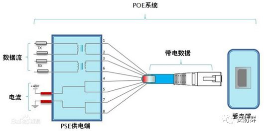

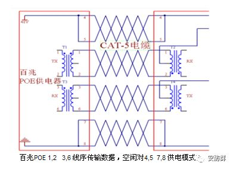

2、利用信号线（1,2,3,6）同时传递数据信号和48V的电源

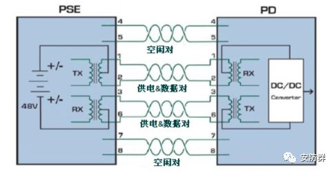

应用数据脚供电时，将DC电源加在传输变压器的中点，在这种方式下线对1、2和线对3、6可以为任意极性。传输数据所用的芯线上同时传输直流电,其输电采用与以太网数据信号不同的频率，不影响数据的传输。

POE标准设计不允许同时应用以上两种情况。电源提供设备PSE只能提供一种用法，但是电源应用设备PD必须能够同时适应两种情况。该标准规定供电电源通常是48V、13W的。PD设备提供48V到低电压的转换是较容易的,但同时应有1500V的绝缘安全电压。

说完了百兆系统，再看看1000M BASE-T POE 供电系统。

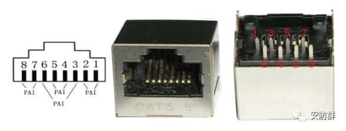

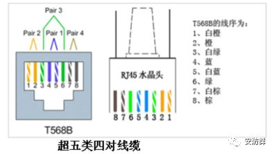

1000M BASE-T POE 供电系统 4个线序对均传输数据，故无空闲对， 均采用数据对供电。

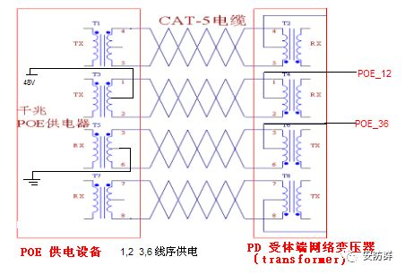

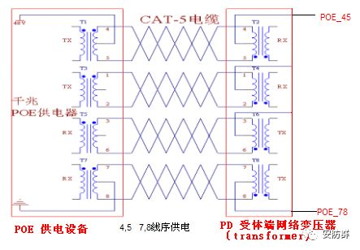

看下图，1脚和2脚、3脚和6脚通过网络变压器进行电压、信号的分频、分离出来的电压连接到桥式整流进行整流供电。

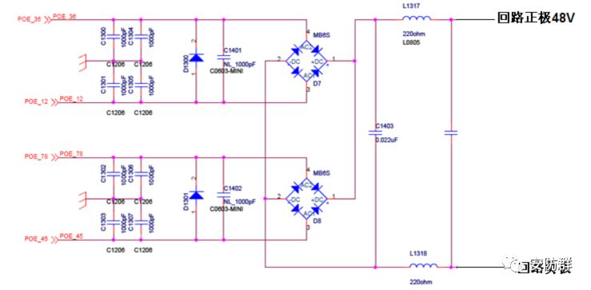

以上讨论的是POE adapter 供电模式，典型的POE adapter 如下图

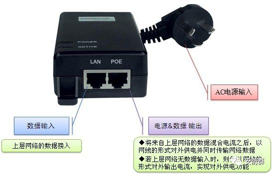

另一种是通过POE供电交换机供电

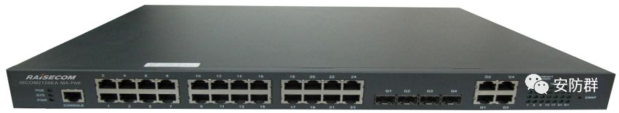

POE 交换机供电示意图

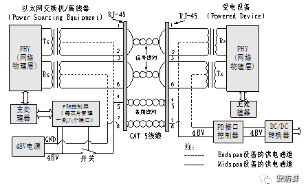

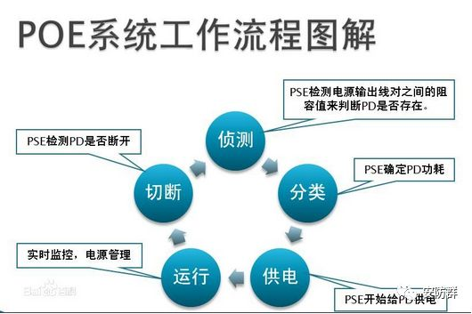

POE供电系统的协商供电原理

当在一个网络中布置PSE供电端设备时，POE以太网供电工作过程如下所示。

1\. 检测：一开始，PSE设备在端口输出很小的电压,直到其检测到线缆终端的连接为一个支持IEEE802.3af标准的受电端设备。

2.PD端设备分类：当检测到受电端设备PD之后，PSE设备可能会为PD设备进行分类，并且评估此PD设备所需的功率损耗。

3\. 开始供电：在一个可配置时间(一般小于15μs)的启动期内，PSE设备开始从低电压向PD设备供电，直至提供48V的直流电源。

4.供电：为PD设备提供稳定可靠48V的直流电,满足PD设备不越过15.4W的功率消耗。

5.断电：若PD设备从网络上断开时，PSE就会快速地(一般在300～400ms之内)停止为PD设备供电，并重复检测过程以检测线缆的终端是否连接PD设备。

## 原文链接

[一文看懂POE供电原理-CSDN博客](https://blog.csdn.net/hktkfly6/article/details/89929074)