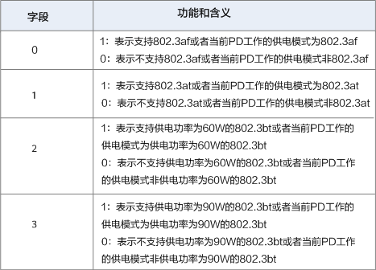

# 什么是Power over Ethernet（PoE）

一、为什么需要PoE?
---------

随着网络中IP电话、网络视频监控以及无线以太网设备的日益广泛，通过以太网本身提供电力支持的要求也越来越迫切。多数情况下，终端设备需要直流供电，而终端设备通常安装在距离地面比较高的天花板或室外，附近很难有合适的电源插座，即使有插座，终端设备需要的交直流转换器也难有位置安置。另外，在很多大型的局域网应用中，管理员同时需要管理多个终端设备，这些设备需要统一的供电和统一的管理，由于供电位置的限制，给供电管理带来极大的不便，以太网供电PoE则正好解决了这个问题。

**PoE是一种有线以太网供电技术，使用于数据传输的网线同时具备直流供电的能力**，有效解决IP电话、无线AP、便携设备充电器、刷卡机、摄像头、数据采集等终端的集中式电源供电。PoE供电具有可靠、连接简捷、标准统一的优势：

*   可靠：一台PoE设备可以同时为多个终端设备供电，实现电源集中供电的同时，还可以进行电源备份。
*   连接简捷：终端设备不需外接电源，只需要一根网线。
*   标准：符合国际标准，使用全球统一的RJ45电源接口，可保证与不同厂商的设备对接。

二、PoE角色
----------

如下图所示，PoE供电系统包括如下两个设备角色：

*   **供电设备PSE（Power-sourcing Equipment）：通过以太网给受电设备供电的PoE设备，提供检测、分析、智能功率管理等功能**，例如：PoE交换机。
*   **受电设备PD（Powered Device）**：如无线AP、便携设备充电器、刷卡机、摄像头等受电方设备。按照是否符合IEEE标准，**PD分为标准PD和非标准PD。**

## 三、PoE供电模式

**按照IEEE标准的定义，PSE设备分为MidSpan（PoE功能模块在设备外）和Endpoint（PoE功能模块集成到设备内）两种类型。**

**Endpoint类型的PSE设备依据使用的供电线对不同分为Alternative A（1/2和3/6线对）和Alternative B（4/5和7/8线对）两种供电模式。**

**Alternative A供电模式通过1/2和3/6线对供电。PSE通过1/2和3/6线对给PD供电，1/2链接形成负极，3/6链接形成正极。10BASE-T、100BASE-TX接口使用1/2和3/6线对传输数据。1000BASE-T接口使用全部的4对线对传输数据。由于DC直流电和数据频率互不干扰，所以可以在同一对线同时传输电流和数据。**

**Alternative B供电模式通过4/5和7/8线对供电。PSE通过4/5和7/8线对给PD供电，4/5链接形成正极，7/8链接形成负极。10BASE-T、100BASE-TX接口使用1/2和3/6线对传输数据，4/5和7/8线对供电。1000BASE-T接口使用全部的4对线对传输数据。由于DC直流电和数据频率互不干扰，所以可以在同一对线同时传输电流和数据。**

**IEEE标准不允许同时应用以上两种供电模式。供电设备PSE只能提供一种用法，但是受电设备PD必须能够同时适应两种情况。该标准规定供电电源通常是48V、13W的。PD设备提供48V到低电压的转换是较容易的,但同时应有1500V的绝缘安全电压。**

### 10M和100M供电

标准的五类网线有四对双绞线但是在10M BASE-T和100M BASE-T中只用到其中的两对，即1，2，3，6。

**1、应用空闲脚供电时4、5脚连接为正极，7、8脚连接为负极。**

**2、利用信号线（1,2,3,6）同时传递数据信号和48V的电源**

**应用数据脚供电时，将DC电源加在传输变压器的中点，在这种方式下线对1、2和线对3、6可以为任意极性。传输数据所用的芯线上同时传输直流电,其输电采用与以太网数据信号不同的频率，不影响数据的传输。**

### 1000M供电

说完了百兆系统，再看看1000M BASE-T POE 供电系统。

**1000M BASE-T POE 供电系统 4个线序对均传输数据，故无空闲对， 均采用数据对供电，可以使用1，2，3，6供电，也可以使用4，5，7，8供电。**

看下图，1脚和2脚、3脚和6脚通过网络变压器进行电压、信号的分频、分离出来的电压连接到桥式整流进行整流供电。

以上讨论的是POE adapter 供电模式，典型的POE adapter 如下图

另一种是通过POE供电交换机供电

POE 交换机供电示意图

## 四、PoE供电协商流程

PSE设备上电，PD设备通过网络连接到PSE设备后，PSE与PD就开始进行供电协商：

1.  **检测PD**：PSE在端口周期性输出电流受限的小电压，用以检测PD设备的存在。如果检测到特定阻值的电阻，说明线缆终端连接着支持IEEE 802.3af标准或IEEE 802.3at标准的受电端设备（电阻值在19kΩ～26.5kΩ的特定电阻，通常的小电压为2.7V～10.1V，检测周期为2秒）。
2.  **供电能力协商即PD设备分类过程**：PSE对PD进行分类，并协商供电功率。供电能力协商不仅可以通过解析PSE与PD发送的电阻实现的，还可以通过**链路层发现协议LLDP**（Link Layer Discovery Protocol）协议发现和通告供电能力进行协商。
3.  **开始供电**：在启动期内(一般小于15μs)，PSE设备开始从低电压向PD设备供电，直至提供48V的直流电压。
4.  **正常供电**：电压达到48V之后，PSE为PD设备提供稳定可靠48V的直流电，PD设备功率消耗不超过PSE最大输出功率。
5.  **断电**：供电过程中，PSE会不断监测PD电流输入，当PD电流消耗下降到最低值以下，或电流激增，例如拔下设备或遇到PD设备功率消耗过载、短路、超过PSE的供电负荷等，PSE会断开电源，并重复检测过程。

## 五、通过LLDP协议进行供电能力协商

IEEE 802.3定义了可选的TLV(Type Length Value)：Power via MDI（Media Dependent Interface） TLV。LLDP报文封装Power via MDI TLV，进行MDI供电能力的发现和通告。当PSE检测到PD后，PSE和PD即周期性地向对方发送LLDP报文，这个报文里包含了定义的TLV字段。将本端信息发送给对方，对方记录下报文中包含的信息，达到信息交互的作用。

**但IEEE 802.3定义的Power via MDI TLV格式仅能协商IEEE 802.3af和IEEE 802.3at两种标准的供电参数，不能协商IEEE 802.3bt标准的供电参数，当相连的PD设备使用IEEE 802.3bt标准供电时，标准Power via MDI TLV将无法协商供电。某些公司为能够支持协商IEEE 802.3bt标准的供电参数，自定义了一种[Power via MDI TLV。**

### IEEE 802.3定义的Power via MDI TLV报文

由2字节的TLV报文头和12字节的TLV信息字段组成，报文格式如下图所示：

IEEE 802.3定义的TLV报文格式，Power via MDI和Extended Power via MDI各字段含义如下图所示。

Power via MDI各字段含义：

Extended Power via MDI各字段含义：

### 某公司自定义的Power via MDI TLV

由2字节的TLV报文头和4字节的TLV信息字段组成，报文格式如下图所示：

TLV报文中各字段含义如下：

*   TLV Type：TLV的类型，占1个字节。取值为1，表示PD支持的供电模式；取值为2，表示PD当前工作的供电模式。
*   TLV Length：TLV的长度，占1个字节。取值为4，表示TLV信息字段值占4个字节。
*   TLV Value：TLV的值，占4个字节，共32位。第0位、1位、2位、3位的含义如下图所示，第4～31位预留。

自定义TLV Value字段含义：

六、PoE供电标准有哪些？
-----------

前面我们提及了IEEE标准委员会为解决不同厂家供电和受电设备之间的适配性问题，会先后发布了三个PoE标准：**IEEE 802.3af标准、IEEE 802.3at标准、IEEE 802.3bt标准**。那么这三个标准有什么不同呢？

2003年6月，IEEE 802.3工作组制定了IEEE 802.3af标准，作为以太网标准的延伸，对网络供电的电源、传输和接收都做了细致的规定。例如：IEEE 802.3af标准规定PSE设备需要在每个端口上提供最高15.4W的直流电源。

由于电缆中的一些功率耗散，因此受电设备仅有12.95W可用。2009年10月，为对应大功率终端的需求，诞生了IEEE 802.3at标准，IEEE 802.3at标准在兼容802.3af标准的基础上，提供最高25.5W的功率，满足新的需求。

2018年9月，为进一步提升PoE供电功率以及对标准进行优化，IEEE标准委员会的发布了IEEE 802.3bt标准。IEEE 802.3bt标准进一步提升了供电能力，类型3可提供高达51 W的供电功率，类型4可提供高达71.3W的供电功率。此外，还包括对2.5GBASE-T、5GBASE-T和10GBASE-T的支持，扩大了高性能无线接入点和监控摄像头等应用程序的使用。

一般将IEEE 802.3af标准对应的供电技术称为PoE供电，将IEEE 802.3at标准对应的供电技术称为PoE+供电，将IEEE 802.3bt标准对应的供电技术称为PoE++供电，也称为4PPoE。三种供电技术对应的参数如下图所示。

## 参考文章

1. [什么是Power over Ethernet（PoE）? 它是如何工作的？ - 华为 (huawei.com)](https://info.support.huawei.com/info-finder/encyclopedia/zh/PoE.html)
2. [一文看懂POE供电原理-CSDN博客](https://blog.csdn.net/hktkfly6/article/details/89929074)

