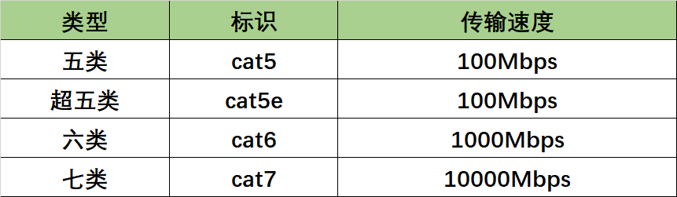
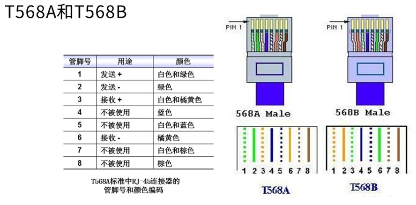
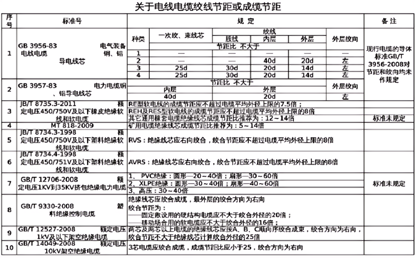
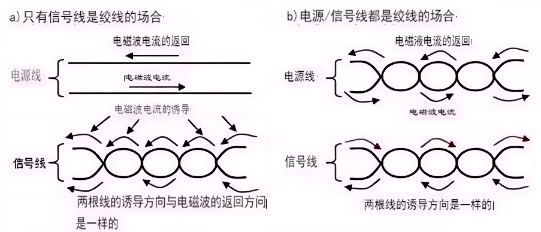

# RJ45双绞线原理，线序，类型及传输速度

**一、**双绞线共八根铜导线，分成4组。根据电在传输过程中的特性，为了削减信号传输过程中的外部干扰，内部的串扰，每两根按一定缠绕松紧度缠绕在一起，

设置合理的绞距，就能达到消除干扰的目的。所以4组线的扭绞松紧不能相同。

**因其构造而得名。分类及速度对应关系如下：** 

**二、**双绞线最早的运用是被用于电话信号的传输，后来才被逐渐引入到数字信号的传输当中，现在广泛运用的都是超五类双绞线及六类双绞线。最大能到达1000Mbps的带宽。双绞线仅有的缺点即是传输间隔较短，只能到达100米（但一般办公或工厂小范围使用足够了）。（注：实际使用中要小于100米，给施工留有余量，CAD图纸上设计距离还要适当缩短，因为施工图纸CAD拉出距离是一个值，但在实际布线中，线缆不可能走直线，一点都不弯）。

**三、**一般五类，超五类双绞线即网线需求运用四对线，即8根芯线（从左往右编号：1,2,3,4,5,6,7,8），双绞线即RJ45网线的线序按照一定的线序来做，这样不会影响数据传输衰减和传输的距离，保证工程的施工质量。需要注意的一点是：一定要把1和 3两芯放在一对双绞线上、2和 6两芯放在一对双绞线上。

100M以下，一般运用1、2、3、6，四根线。以下都标准568B为主标准作参考（标准568A线序实际使用施工中很少用，没必要记了，考试另当别论）。

　　正线线序：（标准568B）：两端线序一样都是568B，线序是：橙白，橙，绿白，蓝，蓝白，绿，棕白，棕。

　　反线线序：一端为568B正线的线序，另一端为568A线标准：绿白，绿，橙白，蓝，蓝白，橙，棕白，棕。

交叉线线序：它在568B标准的基础上，一头是568B，另一头对1号和3号，2号和6号对调即可。（现在一般设备都会自适应，所以只有老旧设备或特种设备会用到）

 

　　具体的为什么用到1,2,3,6四根线呢，那就要了解每根芯的作用是什么：

　　1：输出数据 (+) 　　2：输出数据 (-) 　　3：输入数据 (+)　　   4：保留为电话使用

　　5：保留为电话使用   6：输入数据 (-) 　　7：保留为电话使用     8：保留为电话使用

 **四、**由此可见,虽然双绞线有8根芯线，但在目前广泛使用的百兆网络中，实际上只用到了其中的4根，即第1、第2、第3、第6，它们分别起着收、发信号的作用。4、5，7、8是双向线，保留使用。

　　但是在高于100M的网络运行下,通常八芯就会全用，比如六类超六类的网线不光要用1 ,2, 3 ,6 ，八芯都需要用到，否则网络运行就会不稳定。

**五、**剥开网线我们可发现四对双绞线缠绕的密度并不一样，用来传输数据的橙、绿两对，缠绕圈数明显大于用来接地和其它公共用途的棕、蓝两对，所以建议大家平时做跳线时，严格按照568B的顺序来排列。

**附1：** 其他参考文档（如下为网上收集整理的，FYI）

**附2：** 双绞线的工作机理双绞线的工作机理，主要是利用电流产生的电磁波相互抵消达到抗干扰的作用。

​    如下图所示：在电磁波电流的诱导下，绞线所产生的电流的方向。对于不同的信号，对双绞线绞距数量有着不同的要求，在汽车行业，曲轴位置信号和爆震信号电路的双绞线，1m必须有33个以上的绞距。因为绞距不同，电流经过产生的电磁方向将分布在不同空间方向上，而同一组内的两个线因绞距相同，电路相等产生的电磁方向相反，从而相互抵消。因绞距不同，只能在各自的方向上抵消各自的电磁，不至于影响隔壁的线路。

   一般来讲，绞距越小对于磁场的抗干扰能力越好，但需考虑导线的直径和外皮材质的可弯曲范围，并根据传输距离和信号波长确定最合适的绞合距离。当多根双绞线一起铺设时，不同的信号线最好采用绞距不同的双绞线，以减弱由互感产生的干扰。从这个角度看，如果多根线并行布放，应采用合格的带屏蔽层的双绞线，防止线缆之间相互电磁干扰。

**附3：** 电线之间产生干扰的原因：

一、电磁场的形成

当电流通过电线时，电线周围就会产生一个电磁场，这是由其所携带的电荷和电流引起的。当电流在不同方向上流动时，电磁场的方向也会不同。而这个电磁场会在周围空间中以电磁波的形式传播，这就是所谓的电磁辐射。

二、电线之间的干扰

当两根电线靠近或交叉时，它们之间的电磁场会发生相互作用。由于电线携带的电流和电荷的不同，它们所产生的电磁场的频率和方向也会不同。因此，当两根电线的电磁场发生相互作用时，就会产生一些干扰信号，这些信号会对周围的电子设备造成影响。

三、如何避免电磁干扰

为了避免电线之间的干扰，可以通过以下几种方法来降低电磁辐射或抑制电磁干扰：

1\. 采用屏蔽电缆。屏蔽电缆在电线外套上一层金属网，可以屏蔽或吸收周围的电磁波，降低电磁辐射和干扰。

2\. 增加距离。通过增加电线之间的距离来减少相互作用，从而降低干扰信号的强度。

3\. 增加隔离带。在电线周围增加一层隔离材料，可以降低电磁辐射和干扰。

4\. 优化电线布局。可以通过重新设计电线的布局，减少电线之间的交叉和靠近，从而减少干扰。

两根电线之间的干扰是由它们产生的电磁场相互作用所导致的。只有降低电磁辐射和干扰的程度，才能有效地减少电线之间的干扰，保证电信号的传输质量。

 **附4：** 1.千兆＝1000Mbps，即每秒钟传送1000兆比特百兆＝1000Mbps，即每秒钟传送1000兆比特。

需要注意的是这里的b指的不是字节而是**bit比特**，8比特＝1**Byte字节，**继而引伸出几个标准：1000BASE-TX。  
只能用6类及以上标准的网线才能实现，采用网线的全部4对芯进行传输，其中2对芯全部用来发送（即4根芯的电流向同一方向），2对芯全部用来接收（同上）。  
6类标准的250MHz的带宽下，每对芯可以传输500Mbps的数据，那么接收和发送都可以同时到达1000Mbps。

（千兆网络的RJ45口是可以同时接收和发送的比特，各1000Mbps比特，这是理论值，实际因为编码使用率和其他干扰的问题是达不到这数据的；如果线缆不达标，设备会向下兼容并降速。）

## 原文链接

[做网线那点事：RJ45双绞线原理，线序，类型及传输速度 - 人生不开窍 - 博客园 (cnblogs.com)](https://www.cnblogs.com/gucun-blog/p/14139758.html)