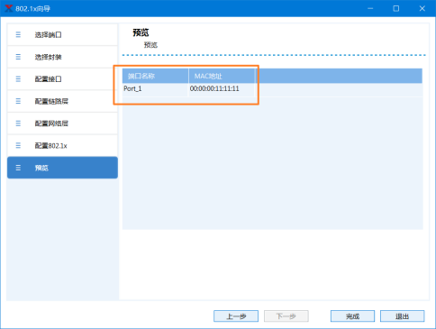

# 802.1X_MD5配置

## 一、测试组网

（1）交换机使用大华的S5720；

（2）服务器采用开源的Freeradius；

（3）测试仪和交换机两个接口相连，并且在同一个VLAN里；

（4）在交换机G0/0/1接口启用DOT1X。

 

## 二、测试思路

（1）测试仪P1向P2发送两条流量：DOT1X-Traffic，Back-Traffic，源MAC分别为0000-0011-1111；

（2）00-0000-0022-2222，初始情况下两条流量都不通；

（3）测试仪P1模拟DOT1X客户端，源MAC地址是0000-0011-1111，和服务器进行 MD5认证；

（4）如果认证通过，流DOT1X-Client能通。

 

## 三、测试仪配置

### 1. 占用端口

端口功能

（1）端口1用来模拟DOT1X和发送流量

（2）端口2用来接收流量

 

 

### 2. 创建DOT1X-Traffic

新建一条流量

（1）源MACs：0000-0011-1111

（2）修改流名称为DOT1X-Traffic

 

 

 

 

### 3. 创建Back-Traffic

新建一条流量

（1）源MAC：0000-0022-2222

（2）修改流名称为Back-Traffic

 

 

### 4. 发送两条流量

在DOT1X认证之前，发送Traffic

两条流量都不通

 

 

### 5. 配置802.1X：选择向导

**选择802.1X配置向导**

 

 

### 6. 配置802.1X：选择接口

**选择接口**

**（1）选择模拟802.1X的接口**

**（2）在Port1上模拟**

 

 

### 7. 配置802.1X：选择封装

**选择封装**

**（1）可选，可以不修改**

**（2）添加VLAN，PPPoE头等**

 

 

### 8.配置802.1X：配置接口

**配置接口**

**可选，保持默认**

 

 

### 9. 配置802.1X：配置链路层

**配置MAC地址**

**（1）接口MAC：0000-0011-11**

**（2）和DOT1X-Traffic的源MAC相同**

 

 

### 10. 配置802.1X：配置网络层

**配置网络层**

**可以忽略，用不到**

 

 

### 11.配置802.1X：认证方式

**认证方式**

**（1）选择MD5**

**（2）填写正确的用户名/密码**

 

 

### 12.配置802.1X：向导预览配置

**配置预览**

**客户端的MAC地址**

 

 

### 13. 配置802.1X：查看配置

**查看配置**

**切换到802.1X协议中核对**

 

 

### 14. 启动802.1X认证

**（1）启动认证**

**选中802.1X，点击启动**

**（2）认证结果**

**成功：Authenticated**

**失败：Failed**

 

 

## 四、查看验证

### 1. 结果查看：RENIX 3个统计项

**查看统计**

**802.1X Block Statistics**

**802.1X Port Statistics**

**802.1X Statistics**

 

 

### 2. 结果查看：RENIX具体统计内容

 ****

 

### 3. 结果验证：发送流量

**发送两条流量，交换机：**

**（1）转发DOT1X-Traffic**

**（2）不转发Back-Traffic**

 

## 修订历史

1. 2024-08-05，22:58，初稿完成一部分。