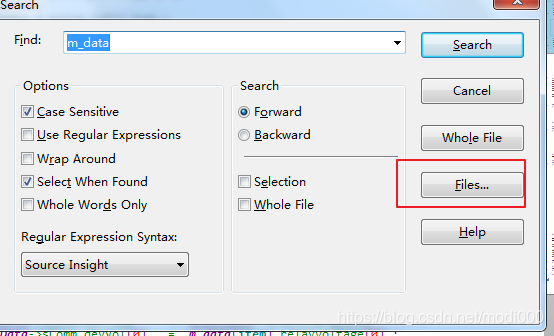
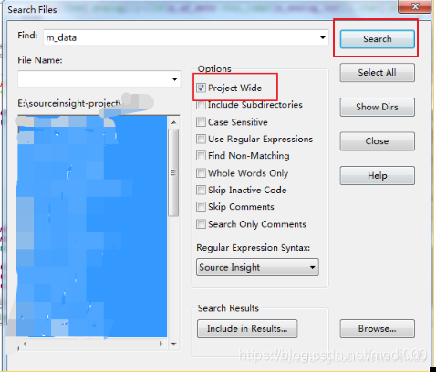

# Source Insight4.0的在整个工程中查找内容

### 1、双击选中要查找的内容

### 2、ctrl  + f   打开查找对话框

### 3、选择Files选项

### 4、勾选Project Wide选项（在工程内查找），点击 search 按钮

###  5、 在上方会有搜索的结果标签页

 

## 原文链接

[source insight的查找功能 - 大秦长剑 - 博客园 (cnblogs.com)](https://www.cnblogs.com/xiaohujian/p/12460508.html)