# github 配置使用 personal access token 认证


一. 问题描述
-------

使用如下命令推送代码到 `github` ：

```shell
git push origin main 
```

根据提示输入用户名和密码，报如下错误：

```shell
remote: Support for password authentication was removed on August 13, 2021. Please use a personal access token instead.
remote: Please see https://github.blog/2020-12-15-token-authentication-requirements-for-git-operations/ for more information.
```

根据提示信息可以知道，`github` 在 `2021.8.13` 移除了密码认证的支持，它建议使用 `personal access token` 代替密码认证。由于提示中给出的地址无法访问，所以查阅相关文档，下面主要记录一下如何解决这个问题。


二. 解决方法
-------

[github docs](https://docs.github.com/en/github/authenticating-to-github/keeping-your-account-and-data-secure/creating-a-personal-access-token) 文档中描述说，在使用命令行或API的时候，应该创建一个个人访问令牌（personal access token）来代替密码，下面详细介绍如何创建 `personal access token`。


### 创建 personal access token

1.  登录 github
2.  在页面右上角点击你的头像，然后点击 `Settings`：  
    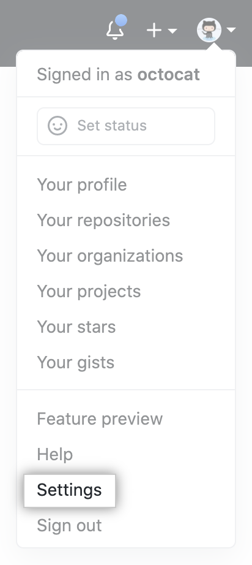
    
3.  在左侧边栏中，点击开发人员设置：  
    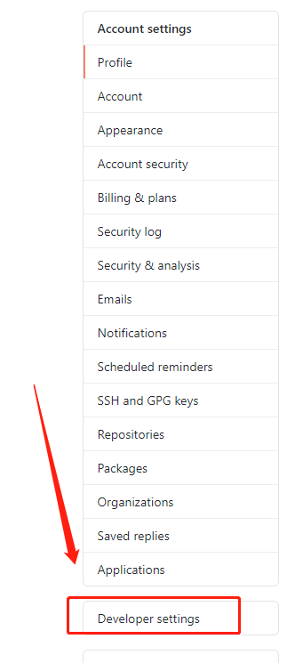
    
4.  在左侧边栏中，单击个人访问令牌：  
    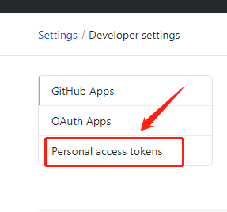
    
5.  单击生成新令牌：  
    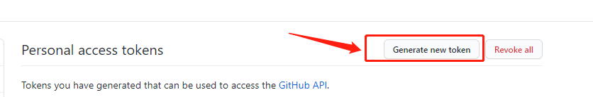
    
6.  为您的令牌指定一个描述性名称：  
    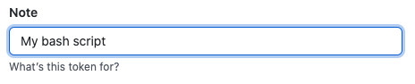
    
7.  要让您的令牌到期，请选择到期下拉菜单，然后单击默认值或使用日历选择器：  
    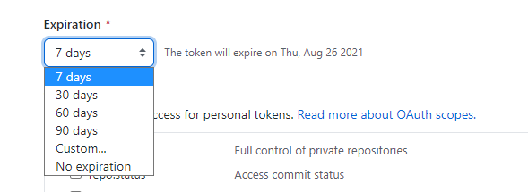
    
8.  选择您要授予此令牌的范围或权限。要使用您的令牌从命令行访问存储库，请选择repo：  
    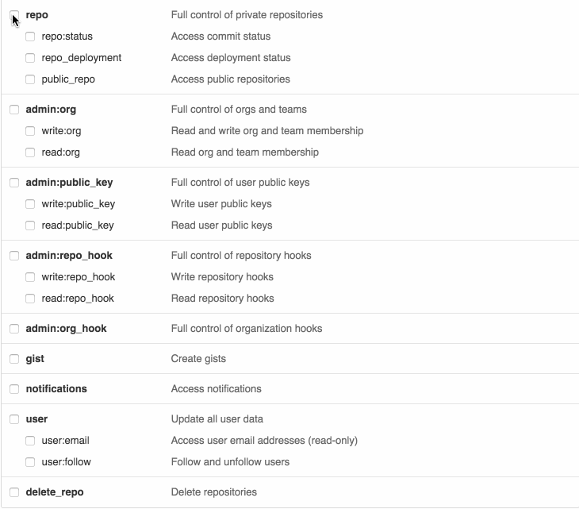
    
9.  单击生成令牌：  
    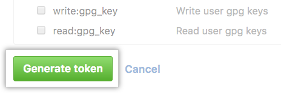
    
    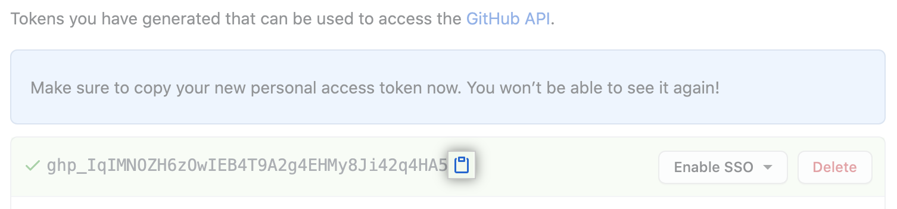
    

> 警告：将您的令牌视为密码并保密。使用 API 时，将令牌用作环境变量，而不是将它们硬编码到您的程序中。


### 在命令行上面使用令牌

获得令牌后，您可以在通过 HTTPS 执行 Git 操作时输入它而不是密码。

例如，在命令行中输入以下内容：

```shell
$ git clone https://github.com/username/repo.git
Username: your_username
Password: your_token` 
```

个人访问令牌只能用于 HTTPS Git 操作。如果您的存储库使用 SSH 远程 URL，则需要[将远程从 SSH 切换到 HTTPS](https://docs.github.com/en/github/getting-started-with-github/managing-remote-repositories/#switching-remote-urls-from-ssh-to-https)。

如果系统未提示您输入用户名和密码，则您的凭据可能已缓存在您的计算机上。您可以[更新钥匙串中的凭据以](https://docs.github.com/en/github/getting-started-with-github/updating-credentials-from-the-macos-keychain)使用令牌替换旧密码。


### 在 windows 中配置[github](https://so.csdn.net/so/search?q=github&spm=1001.2101.3001.7020) 凭据

使用 `https` 的方式拉取或者推送代码，每次都需要手动输入用户名和 `personal access token`，为了方便，可以使用 windows 中的凭据管理器保存相关配置，如下图所示：  
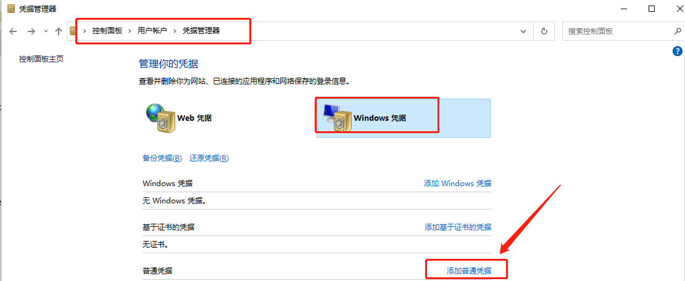

如果 github 的凭据已经存在，原来保存的是用户名和密码，需要将原来的密码修改为 `personal access token`，通常情况下，我们登录过 github 后就会在这里保存相关的凭据，如果没有可用手动创建，如下图所示：  
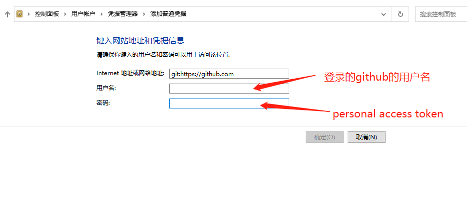

参考文档： 
https://docs.github.com/en/github/authenticating-to-github/keeping-your-account-and-data-secure/creating-a-personal-access-token


## 参考原文

1.[github 配置使用 personal access token 认证_github person token-CSDN博客](https://blog.csdn.net/qq_39218530/article/details/119809170)