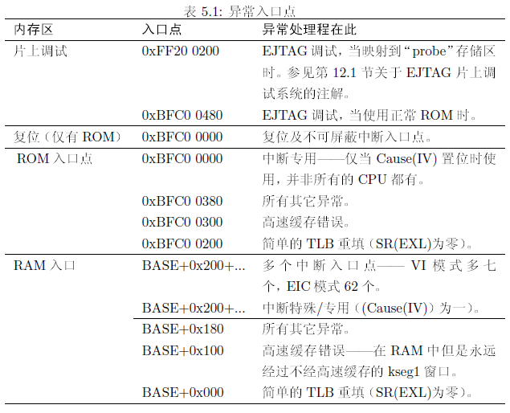

# MIPS架构深入理解6-异常和中断

理解MIPS架构对于异常和中断的定义、基本处理过程以及在中断处理过程中的一些注意事项


MIPS架构中，中断、异常、系统调用以及其它可以中断程序正常执行流的事件统称为`异常（exception）`，统一由异常处理机制进行处理。

> 异常和中断概念在不同架构上的含义区别： 1. MIPS架构将所有可以中断程序执行流的事件称为异常； 2. X86架构将所有可以中断程序执行流的事件称为中断，我们日常所见的狭义上的中断，也就是外部中断，称之为`异步中断`；而狭义上的异常称为`同步中断`； 3. ARM架构将这两个概念合起来使用-`异常中断`类似于MIPS架构的`异常`概念。 在阅读相关书籍的时候，请注意区分这些概念。


MIPS架构所涉及的事件，都有哪些呢？

- 外部事件

  来自CPU核外的外部中断。

- 内存转换异常

  这常常发生在对内存进行访问的时候，比如虚地址到物理地址转换表中无法有效转换时，或者尝试访问一个写保护的页时。

- 其它需要内核修复的非常情况

  这一般不是致命的事件，实际上可能需要软件进行处理。比如，由于浮点指令而导致的浮点异常，在多任务实现中非常有用。再比如，非对齐的加载在一个系统中可能当作错误，但是，在另一个系统中由软件进行处理。

- 程序或硬件检测到的错误

  包括：访问不存在的指令、用户权限下非法的指令、在相应的SR位被禁止时执行协处理器的指令、整数溢出、地址对齐出错、用户态访问内核态地址空间等。

- 数据完整性问题

  CRC校验错误等。

- 系统调用和陷阱

  系统调用，debug时断点等。

在进一步分析异常和中断之前，先来理解一个概念，什么是精确异常？


## 1 精确异常

在MIPS架构的文档中，我们经常看到一个术语”精确异常”，英文称之为`precise exception`。那到底什么是精确异常，什么是非精确异常呢？

在通过流水线获取最佳性能的CPU中，体系结构的顺序执行模型其实是硬件巧妙维护的假象。如果硬件设计不够完美，异常就可能导致该假象暴露。

当异常中断正在执行的线程时，CPU的流水线中肯定还有几条处于不同阶段尚未完成的指令。如果我们想要从异常返回时，继续不受破坏地执行被打断的程序执行流，那么流水线中的每条指令都必须要执行完，从异常返回时，仿佛什么都没有发生才行。

一个CPU体系结构具备精确异常的特性，必须满足任何异常发生时，都必须确定的指向某条指令，这条指令就是产生异常的指令。而在该指令之前的指令必须都执行完，异常指令和后续指令好像都没有发生。所以，当说异常是精确异常时，处理异常的软件就可以忽略CPU实现的时序影响。

MIPS架构的异常基本上都是精确异常。其构成要素满足：

- 明确的罪证

  异常处理完成后，CPU的EPC寄存器指向重新执行的正确地址。大部分情况下，指向异常指令所在的地址。但是，如果异常发生在分支延时槽上的指令时，EPC寄存器指向前面的分支指令：如果指向异常指令，分支指令会被忽略；而指向分支指令，可以重新执行异常。当异常发生在分支延时槽时，Cause寄存器的BD标志位会被设置。

- 异常尽量出现在指令序列中，而不是流水线的某个阶段

  异常可能会发生在流水线的各个阶段，这带来了一个潜在的危险。比如，一个load指令直到流水线的地址转换完成阶段才会发生异常，通常这已经晚了。如果下一条指令在取指时发生地址异常（刚好在流水线的开始阶段），此时，第二条指令的异常首先发生，这与我们的构想不一致。

  为了避免这个问题，异常检测到后不是立即执行，这个事件只是被记录并沿着流水线向下传递。在大多数的CPU设计中，都会标记一个特殊的流水线阶段作为检测异常的地方。如果较久指令后面才检测到的异常到达这个检测点，异常记录就会被立即抛弃。这保证了永远执行最新的异常。对于上面的问题，第二条指令带来的取指问题就会被忽略。反正当我们继续执行时，它还会发生。

- 后续指令无效

  因为流水线的原因，当异常发生时，异常指令后面的指令已经开始执行了。但是硬件保证这些指令产生的效果不会影响寄存器和CPU的状态，从而保证这些指令好像没有执行一样。

MIPS实现精确异常的代价高昂，因为它限制了流水线的作用范围。尤其是FPU硬件单元。我们前面讲过，浮点指令不能遵守MIPS架构的5级流水线，需要更多级的流水线才能完成。所以，浮点单元一般都有自己独立的流水线。这种现状导致跟在MIPS浮点指令后的指令必须在确认浮点指令不会产生异常后才能提交自己的状态。


### 1.1 非精确异常-历史上的MIPS架构CPU的乘法器

早期的MIPS架构乘法和除法指令，因为执行周期不固定。比如，乘法需要4-10个周期，除法占用15-30个周期。读流水线的影响不确定，所以，存在非精确异常的情况。但是符合MIPS32规范的CPU通过规避，已经不存在这个问题了。


## 2 异常发生的时机

既然异常是精确的，那么从程序员的角度看，异常发生的时机就是确定的，没有歧义：异常之前执行的最后一条指令就是一场受害指令的最后一条。如果该异常不是中断，受害指令就是刚刚结束ALU阶段的指令。

但是，需要注意的是，MIPS架构不承诺精确的中断延时，中断信号到达CPU之前可能需要花一个或者几个时钟周期重新同步。


## 3 异常向量表：异常处理开始的地方

我们知道，CPU使用硬件或者软件分析异常，然后根据类型将CPU派发到不同的入口点。这个过程就是中断响应。如果通过硬件，直接根据中断输入信号就能在不同的入口点处理中断，称为向量化中断。比如，常见的ARM架构的Cortex-M系列基本上就是采用向量化中断的方式。历史上，MIPS架构CPU很少使用向量化中断的方式，主要是基于一下几个方面的考虑。

- 首先，向量化中断在实践中并没有我们想象的那么有用。大部分操作系统中，中断处理程序共享代码（为了节约寄存器之类的目的），因此，常见的作法就是硬件或者微代码将CPU派发到不同的入口点，在这儿，OS再跳转到共同处理程序，根据中断编号进行处理。
- 其次，由硬件所做的异常分析，相比软件而言非常有限。而且现在的CPU来说，代码的执行速度也足够快。

总结来说，高端CPU的时钟频率肯定远远快于外设，所以写一个中断通用处理程序完全可以满足性能要求。所以，自从在MIPS32架构上添加了向量化中断之后，几乎没有人使用。

但是，MIPS架构上，并不是所有的异常都是平等的，他们之间也是有优先级区分的，总结如下：

- 用户态地址的TLB重填异常

  对于实现受保护的操作系统而言，地址转换异常会特别频繁。因为TLB表只能保存适量的虚拟地址到物理地址的映射。对于维护着大量映射表的OS来说，必须保证TLB重填异常的执行时间。

  为此，MIPS架构CPU将TLB重填异常作为单独的一个异常入口点，这样经过优化，可以保证13个时钟周期内完成TLB重填过程。保证了系统读取内存的效率。

- 64位地址空间的TLB重填异常

  对于64位地址空间，同上面的原理一样。MIPS引入了XTLB重填异常，保留一个单独的入口点。

- 初始化时的中断向量入口点（不使用Cache访问）

  为了获取良好的异常处理性能，中断入口点应该位于经过Cache的内存区。但是，在系统启动的初始阶段，Cache还未初始化，所以不能使用。所以，MIPS架构保留了一段地址空间，不经过Cache访问，专门用来作为冷启动时的异常入口点。SR(BEV)标志位可以把异常入口点进行平移。

- 奇偶/ECC错误异常

  MIPS32架构CPU的内存数据错误只有在Cache中使用时才会发现，然后产生自陷。所以，不管SR(BEV)的标志位是什么，奇偶/ECC错误异常的入口点总是位于不经过Cache的地址空间。

- 复位

  把复位看作另外一种异常。这是很有道理的，尤其是许多CPU对于冷复位和热启动使用相同入口点的时候。

- 中断

  这个很好理解。但是，MIPS架构可以允许把不同的中断设置为不同的入口点。但是，这样软件也就丧失了调整中断优先级的控制，需要软件、硬件开发工程师协商。


为了效率，所有异常入口点都位于不需要地址映射的内存区域，不经过Cache的kseg1空间，经过cache的kseg0空间。当SR（BEV）等于1时，异常入口地址位于kseg1，且是固定的；当SR(BEV=0)时，就可以对EBase寄存器进行编程来平移所有入口点，比如说，kseg0的某个区域。当使用多处理器系统时，想使各个CPU的异常入口点不同时，这个功能就很用了。

对于32位地址的`0x80000000`和64位地址的`0xFFFFFFFF80000000`而言是一样的。所以，下表只用32位地址表示出异常入口点。

表中的BASE代表设置到EBase寄存器中的异常基址。



最初的异常向量间的距离默认是128字节(0x80)，可能是因为最初的MIPS架构师觉得32条指令足够编写基本的异常处理例程了，不需要浪费太多内存。但是现代系统一般不会这么节省。


**下面是发生异常时，MIPS架构CPU的处理过程：**

1. **设置EPC寄存器指向重新开始的地址；**
2. **设置SR(EXL)标志位，强迫CPU进入内核态并禁止中断；**
3. **设置Cause寄存器，软件可以读取它获知异常原因。地址转换异常时，还要设置BadVaddr寄存器。内存管理系统异常还要设置一些MMU相关寄存器；**
4. **然后CPU开始从异常入口点取指令，之后就取决于软件如何处理了。**


**这时候，异常处理程序运行在异常模式（SR(EXL)标志位被置），而且不会修改SR寄存器的其余部分。对于常规的异常处理程序保存其状态，将控制权交给更为复杂的软件执行。异常模式下，只是保证系统安全地保存关键的状态，包括旧SR值。**

异常处理程序工作在异常模式下，不会再响应外部中断。所以，对于TLB未命中异常处理程序（也就是TLB重填异常处理程序）来说，如果读取TLB表（像Linux内核，一般将映射表保存在kseg2段地址空间中）时，发生页表地址读取异常时，程序会再次返回到异常程序入口点。Cause寄存器和地址异常相关的寄存器（BadAddr，EntryHi，甚至Context和Xcontext）都会被定位到访问页表时的TLB未命中异常相关的信息上。但是EPC寄存器的值仍然指向最初造成TLB未命中的指令处。

这样的话，通用异常程序修复kseg2中的页表未命中问题（也就是将页表的地址合法化），然后，就返回到用户程序。因为我们没有修复任何与第一次地址miss相关的信息，所以，此时用户程序会再次发生地址miss。但是，页表的地址miss问题已经修复，不会再产生二次嵌套地址异常。这时候，TLB异常处理程序就会执行上面的代码，加载页表中的页表映射关系到TLB中。


## 4 异常处理：基本过程

**MIPS异常处理程序的基本步骤：**

1. **保存被中断程序的状态：**

   **在异常处理程序的入口点，需要保存少量的被中断程序的状态。所以，第一步工作就是为保存这些状态提供必要的空间。MIPS架构习惯上保留k0和k1寄存器，用它们指向某段内存，用来保存某些需要保存的寄存器。**

2. **派发异常：**

   **查询Cause寄存器的ExcCode域，获取异常码。通过异常码，允许OS定义不同的函数处理不同的异常。**

3. **构建异常处理程序的运行环境：**

   **复杂的异常处理例程一般使用高级语言（比如，C语言）实现。所以，需要建立一段堆栈空间，保存被中断程序可能使用的任何寄存器，从而允许被调用的C异常处理例程可以修改这些寄存器。**

   **某些操作系统可能在派发异常之前进行这一步的处理。**

4. **执行异常处理（一般使用C语言实现）：**

   **做你想做的任何事情。**

5. **准备返回工作：**

   **需要从C代码返回到派发异常的通用代码中。在这儿，恢复被保存的寄存器，另外，通过修改SR寄存器到刚发生异常时的值，CPU也从异常模式返回到内核态。**

6. **从异常返回：**

   **从异常状态返回时，有可能从内核态向低级别的运行态进行切换。为了系统安全的原因，这步工作必须是一个原子操作。基于这个目的，MIPS架构的CPU提供了一条指令，`eret`，完成从异常的返回：它清除SR(EXL)标志位，返回到EPC寄存器保存的地址处开始执行。**

   

## 5 嵌套异常

嵌套异常概念很好理解，就是异常处理程序中，再次发生异常。就像上面我们描述的TLB未命中异常处理程序中，再次发生读取页表地址miss异常一样。

但是，嵌套异常也分为2种：一种就是上面TLB未命中异常嵌套TLB未命中异常，这种不需要人为干预EPC和SR状态寄存器；另外一种，就需要我们必须保存被中断程序的EPC寄存器和SR寄存器内容。虽然，MIPS架构为异常处理程序保留了通用目的寄存器k0和k1。但是，旧异常程序一旦重启，不能完全信赖这两个寄存器。因为这时候，k0和k1可能被插入进来的异常处理程序使用过。

如果想要异常处理程序能够适合嵌套使用，必须使用某些内存位置保存这些寄存器值。所有这些需要保存的数据组成的数据结构通常被称为`异常帧`；嵌套的多个异常帧通常存储在栈上。

每个这样的异常处理程序都会消耗栈的资源，所以不能任意嵌套异常。通常的处理机制是，异常嵌套的层数和中断优先级的个数相同，高优先级可以嵌套低优先级，同优先级不能嵌套。

在异常处理程序的设计过程中，应该尽量避免所有的异常：中断可以通过SR(IE)标志位进行屏蔽；其它异常可以通过恰当的软件规则避免。比如，内核态（大多数异常处理程序工作在该模式下）不会发生特权违反异常，程序可以避免寻址错误和TLB未命中异常。尤其是处理高优先级的异常时，这样的原则很重要。


## 6 异常处理例程

下面是一个非常简单的异常处理程序，只是在增加计数器的值：

```
    .set noreorder
    .set noat
xcptgen:
    la      k0, xcptcount       # 得到计数器的地址
    lw      k1, 0(k0)           # 加载计数器
    addu    k1, 1               # 增加计数值
    sw      k1, 0(k0)           # 存储计数器
    eret                        # 返回到程序
    .set at
    .set reorder
```

此处的计数器`xcptcount`最好位于kseg0中，这样在读写它时就不会得到TLB未命中异常。


## 7 中断

MIPS架构的异常机制是通用的，但是说实话，有两种异常发生的次数比其他所有的加起来都多。一个就是TLB未命中异常；另一个就是中断。而且中断响应的时间要求很严格。

中断是非常重要的，所以我们单独讲解：

- 中断资源：描述你要用到的东西。
- 实现中断优先级：虽然，MIPS架构中所有中断都是平等的，但是，有时候我们还是需要不同优先级的中断的。
- 临界区、禁止中断、信号量如何实现，如何使用。


### 7.1 MIPS-CPU上的中断资源

MIPS架构的CPU在Cause寄存器中有一组8个独立的中断标志位，其中的2个中断位是软件中断，比如说，计数器和定时器使用。有时侯，计数器/定时器中断也可能和外部中断共享一个中断，但这多半不是一个好主意。

每个时钟周期都会对中断输入信号进行采样，如果使能，就会导致中断发生。

CPU是否响应某个中断，由寄存器SR中的相关位控制，下面是三个相关控制域：

- 全局中断使能位SR(IE)，必须设置为1；否则，不会响应任何中断。
- SR(EXL)（异常级）和SR(ERL)（错误级）如果被设置，则禁止中断（任何异常一旦发生，它们中的一个会被立即置位）。
- 状态寄存器SR中还有8个中断屏蔽位SR(IM)，分别对应Cause寄存器中的8个中断位。中断屏蔽位设置为1，使能相应的中断位；如果设置为0，则禁止相应的中断。

> 软件中断位的作用是什么？ 为什么要在Cause寄存器中提供2个中断标志位，一旦被设置，立即触发一个中断，除非被屏蔽。 根源就在于"`除非被屏蔽`"。我们知道系统中，中断任务也分为高优先级和低优先级。软件中断无疑为处理低优先级中断任务提供了一种比较完美的机制。当高优先级的中断处理完成后，软件将打开中断屏蔽位，挂起的软件中断将会发生。 为什么不使用软件模拟同样的效果呢？既然已经提供了中断处理机制，捎带脚的实现软件中断，减少软件的负荷，岂不是既方便又实惠。


为了查找哪个中断输入信号是有效的，需要查看Cause寄存器。所有的中断优先级都是相同的，较旧的CPU使用通用异常入口点。但是MIPS32/64架构CPU为中断提供了一个可选的不同的异常入口点，这能节省几个时钟周期。通过Cause寄存器的IV标志位进行使能。


**中断处理的正常步骤如下：**

1. **查询Cause寄存器的IP域，并和中断屏蔽位域SR(IM)进行逻辑and操作，以获得有效的、使能的中断请求。中断可能不止一个。**

2. **选择一个合适的中断进行处理。先高优先级，后低优先级。但这一步完全由软件决定。**

3. **保存旧中断屏蔽位SR(IM)。当然你也可能已经在主异常处理程序中保存了整个SR寄存器。**

4. **修改中断屏蔽位SR(IM)，禁止与当前中断具有相同优先级或者比当前中断的优先级更低的所有中断。**

5. **为可能的嵌套异常处理保存状态，比如寄存器等。**

6. **改变CPU的状态，为中断例程的执行提供合适的环境。这儿，允许嵌套中断和异常。**

   **设置全局中断使能标志位SR(IE)，允许高优先级中断被处理。还需要改变CPU的特权级别寄存器SR(KSU)保证你从异常状态改变到内核态。离开异常模式，需要清除SR(EXL)标志位。**

7. **调用中断例程**

8. **在返回的时候，需要再一次禁止中断，恢复中断之前的寄存器并继续中断任务的执行。要这样做，就需要置位SR(EXL)。但实际上，当在恢复异常刚刚发生时的整个SR寄存器时，可能已经隐含的置位了SR(EXL)。**

当对SR寄存器做出改变时，必须小心CP0协处理器的遇险问题。


### 7.2 软件的中断优先级策略

MIPS架构对所有的中断一视同仁，而如果你想实现不同优先级的中断怎么办呢？

首先，为我们的中断系统定义一个策略：

- 系统软件在CPU运行过程中，自始至终维护着一个中断优先级表（IPL）。每个中断源分配到其中一个中断优先级；
- 如果CPU处于最低优先级，所有中断都被允许。这是正常状态下，软件使用的中断行为；
- 如果CPU处于最高优先级，所有中断被阻止。

中断处理程序不仅可以按照分配给具体中断源的优先级IPL运行，它们还允许程序员升高和降低IPL。驱动程序和硬件通信，或者中断处理程序中，经常需要在临界代码段禁止中断，所以，程序员可以通过临时升高IPL，禁止某个设备的中断。

这样设计的一个系统，只要高于IPL设置的中断可以继续响应，而且不会受低IPL中断的影响。这样，我们就可以很好地区分对响应时间严格的中断。类Unix系统一般都是基于这种思想进行设计的，一般使用4到6个IPL优先级。

当然还有其它的方式实现中断系统，但是这样一个简单的策略，具有以下的特点：

- 固定优先级：任何IPL，当前指定的中断以及更低优先级IPL的中断会被禁止。相同IPL优先级的中断通常遵循FIFO-先进先出的原则。
- 任何给定的IPL都有对应的执行代码，是唯一的。
- 简单的嵌套调度(IPL0以上)：除了最低优先级，只有更高优先级没有中断要处理，就会返回到较低优先级进行处理。在最低优先级时，一般情况下，会有一个调度器，负责不同任务间CPU使用权的分配。

MIPS架构的CPU在不同中断级别之间进行转换时，必须修改状态寄存器（SR），因为其包含所有的中断控制位。有一些系统上，中断优先级的切换还会要求修改外部中断控制器，比如X86的高级可编程中断控制器-APIC，还需要维护一些全局变量。但是，这儿我们先不关注这些，先着重理解一下SR中断控制位如何影响IPL。同协处理器的访问一样，SR寄存器同样不能直接访问，所以需要我们编写一段汇编代码对其进行读取、修改：

```c
    mfc0 t0, SR
1:
    or t0, things_to_set
    and t0, ˜(things_to_clear)
2:
    mtc0 t0, SR
    ehb
```

上面的代码，先是从SR寄存器中读取原先的数值，然后通过or或者and操作，修改想要的操作位，最后再写回到SR寄存器中。而最后的ehb指令是遇险屏障指令，保证在运行后面的代码之前，前面的内容安全的写入到寄存器中了。

上面的代码我们不得不考虑一个问题，如果在执行过程中，被打断怎么办？所以，我们需要对SR的修改操作是原子操作。


### 7.3 原子性以及对SR的原子修改

对于原子操作的概念我们之前已经多次提到，故在此不再累述。如果有需要，请看之前的文章。执行原子操作的代码段一般称为临界区。

对于单处理器系统，只要关闭中断，就可以保护临界区代码的执行。这很简单粗暴啊，但是有效就行。

对于多处理器系统而言，禁止中断不能保证RMW（读-修改-写）的步骤是原子操作。所以，MIPS架构必须提供原子性操作。

MIPS架构实现原子性操作的方法：

1. 如果你所使用的CPU是基于MIPS32v2版本架构的，可以使用`di`指令代替`mfc0`。`di`会自动清除SR(IE)标志位，返回SR原始值到一个通用寄存器中。但是，这个功能在此版本上还是一个兼容性功能，所以你需要特别注意你的CPU是否支持这条指令。

2. 一种可能的方法就是在中断代码中保存之前的SR值，在返回之前再恢复SR寄存器的值，就像我们在进程切换时，保存恢复所有的通用寄存器一样。如果是这样，非原子的RMW操作也没关系，即使中断进来，旧SR值也不会被改变。基于MIPS架构的类Unix操作系统一般采用这个方法。

   但是，这种方法还是有缺点。比如，我们想要禁止某个中断的时候，无法实现，因为需要修改SR寄存器，本身我们引出这个话题就是因为修改SR寄存器。再比如，有些系统可能想要在运行过程中修改优先级，以轮转分配中断到CPU，实现中断负载平衡。

3. 再一种方法就是，使用系统调用禁止中断：在系统调用中进行位操作（置位、清除），更新状态寄存器）。这里，利用了系统调用是异常实现的一个隐含特性，异常模式下，它会自动禁止中断。所以，可以安全地进行位操作并更新状态寄存器。当系统调用返回的时候，全局中断会自动使能。

   > ARM和X86架构有专门的禁止中断的指令。

   系统调用看上去负荷还是有点重，虽然执行时间不一定很长。但是，需要编程者在异常派发代码中，将这个系统调用和其它异常处理程序理清楚。

4. 基本上所有系统都会实现的方法：使用`test-and-set`指令构建原子操作，从而满足临界代码区的保护要求，而不必禁止中断。而且，这种机制适用于多核处理器或者硬件多线程系统。细节参考下一节。


### 7.4 允许中断的临界区：MIPS式的信号量

众所周知，信号量是实现临界代码区的一种事实约定（当然扩展的信号量可以做更多事情）。简单的信号量也可以称为互斥锁。信号量实质上是并发运行的进行共享的一个内存位置，通过某种设置，一次只能由一个进程访问。对于信号量的理解，我们之前已经写过文章，请参考《[Linux内核33-信号量](https://tupelo-shen.github.io/2020/04/12/Linux内核33-信号量/)》。

信号量的使用如下代码段所示：

```c
wait(sem);
/* 临界代码区 */
signal(sem);
```

为了叙述方便，我们假设信号量就是0，1两个值，1表示未使用，0表示在使用。那么，wait()函数就是等待值为1。如果等到，进行P操作，信号量的值减1，并返回。道理很简单，唯一的要求是硬件可以实现减1操作的原子性，换句话说，就是硬件必须提供test-and-set这样的原子操作指令。不管是中断，还是多核系统，都不能影响这个原子操作的正确性。

大部分的CPU都有这样特殊的指令：

- X86通过在指令前面添加`lock`前缀锁住总线实现原子操作；
- ARM通过`ldrex`和`strex`独占指令实现原子操作，早期版本的ARM架构使用`swp`指令；

对于支持`X86-多核`的系统而言，使用`test-and-set`过程代价非常大。实际上，其执行过程是：所有共享内存都必须停止，使用信号量的用户获取该值，完成`test-and-set`操作，然后将结果同步到每一份备份中。因为一些偶尔使用的重要数据，而占用了整个总线，这对于大型多核平台，牺牲了很多性能。

如果能够不在每次都必须严格保证原子性的情况下，实现`test-and-set`操作要高效得多。换句话说，就是尝试set操作，如果是原子的，就成功；不是原子的，就重新尝试。完全由软件决定是否set成功，前提是软件能够知道set是否成功。

于是，MIPS架构为支持操作系统的原子操作，特地加了一组指令`ll/sc`。它们这样来使用：

```c
atomic_block:
ll XX1, XXX2
….
sc XX1, XXX2
beq XX1, zero, automic_block
….
```

在ll/sc中间写上你要执行的代码体，这样就能保证写入的代码体是原子执行的（不会被抢占的）。

其实，LL/sc两语句自身并不保证原子执行，但他耍了个花招：

用一个临时寄存器XX1，执行LL后，把XXX2中的值载入XX1中，然后会在CPU内部置一个标志位，我们不可见，并保存XXX2的地址，CPU会监视它。在中间的代码体执行的过程中，如果发现XXX2的内容变了（即是别的线程执行了，或是某个中断发生了），就自动把CPU内部那个标志位清0。执行sc 时，把XX1的内容（可能已经是新值了）存入XXX2中，并返回一个值存入XX1中，如果标志位还为1，那么这个返回的值就为1；如果标志位为0，那么这 个返回值就为0。为1的话，就表明这对指令中间的代码是一次性执行完成的，而不是中间受到了某些中断，那么原子操作就成功了；为0的话，就表明原子操作没 成功，执行后面beq指令时，就会跳转到ll指令重新执行，直到原子操作成功为止。

所以，我们要注意，插在LL/sc指令中间的代码必须短小。

据经验，一般原子操作的循环不会超过3次。

我们再回头分析wait()函数的实现，参考下面的代码。在这儿，sem是一个`0/1`信号量:

```c
wait:
    la  t0, sem
TryAgain:
    ll  t1, 0(t0)
    bne t1, zero, WaitForSem
    li  t1, 1
    sc  t1, 0(t0)
    beq t1, zero, TryAgain
    /* 成功获取锁 */
    jr ra
```

这儿，添加了WaitForSem标签，用来处理如果一直申请锁失败的情况下，需要做的处理。可以用来实现阻塞等待或者非阻塞等待。

`ll/sc`是为多核系统设计的，但是，对于单核系统也非常有价值，因为不涉及关闭中断。避免了上面提出的使用过程中，禁止中断的问题。并可以在处理最坏中断延时的情况下发挥作用，这对于嵌入式系统非常重要。


### 7.5 MIPS32/64架构CPU的中断向量化和EIC中断

MIPS32规范的第二版中，引入了两个新的特性，使中断的处理更为高效。这两个特性就是向量化中断和EIC模式。

向量化中断，发生中断异常时，根据中断的输入信号，从8个入口地址中选择一个开始执行的地址。如果两个中断同时发生，硬件选择中断号高的执行。向量化中断通过IntCtl(VS)设置，对于不同中断入口地址间距给出了几种不同的选择（零值导致所有中断都是用同样的入口点，这就回到了传统的做法。

嵌入式系统常常有大量的中断信号，远远超过传统的MIPS架构CPU的6个硬件输入。在EIC模式下，这6个以前相互独立的信号变成一个6位的二进制数：0代表没有中断，1-63表示不同的中断码。每个非0的中断码都有自己的中断入口点，允许适当设计的中断控制器能够分派给CPU处理的事件多达63个。

向量化中断在复杂的系统没有使用的原因是因为，因为其它一些约束条件，牺牲掉向量化中断省下的几个时钟周期，并不影响系统的整体性能。向量化中断一般只有在嵌入式CPU中使用。


## 参考文章

1. [MIPS架构深入理解6-异常和中断 - 图珀洛的博客 | TUPELO Blog (tupelo-shen.github.io)](https://tupelo-shen.github.io/2020/07/03/MIPS架构深入理解6-异常和中断/)