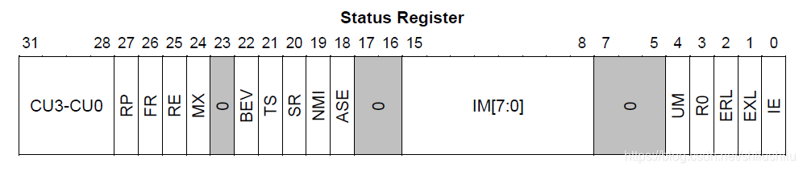
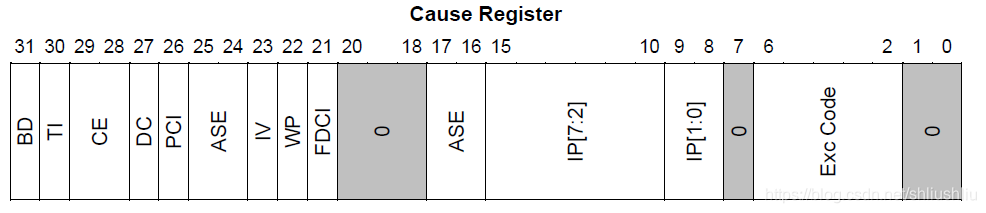
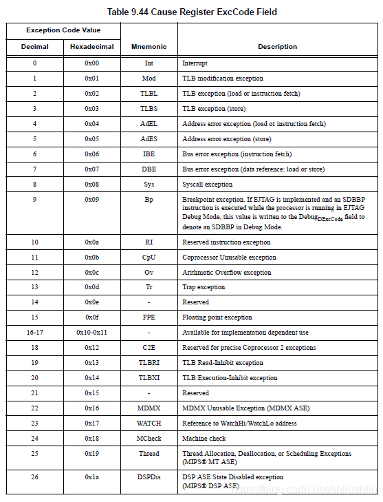
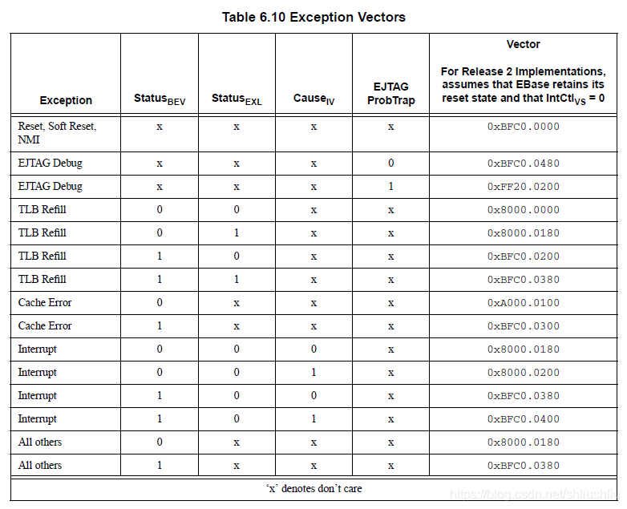
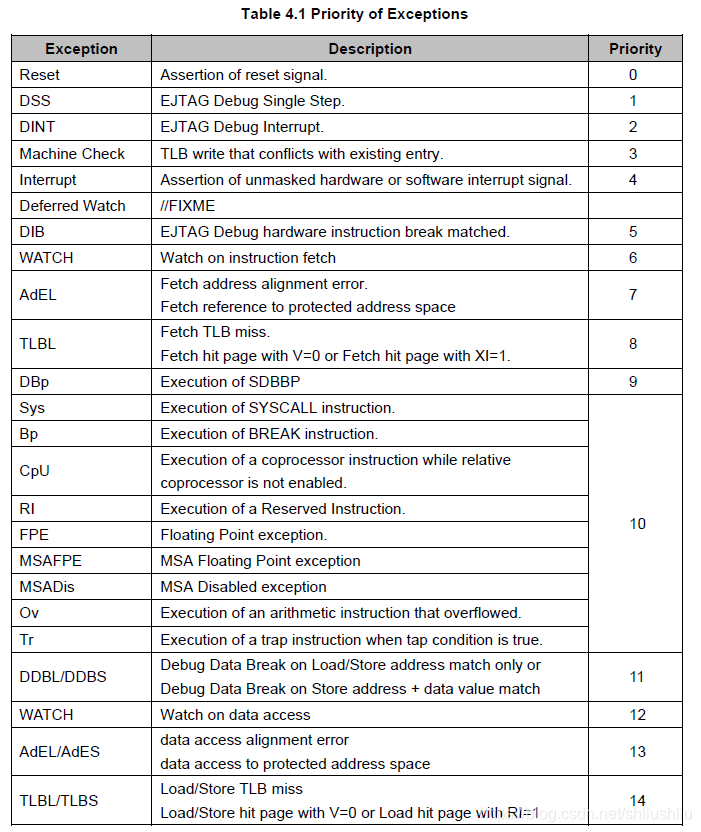
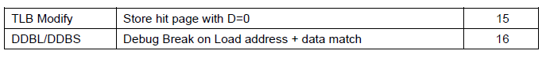
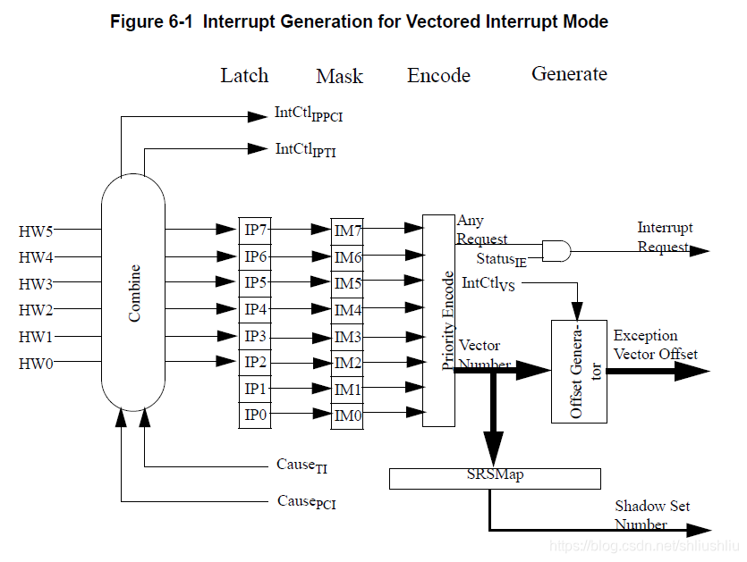

# mips异常和中断

在[mips](https://so.csdn.net/so/search?q=mips&spm=1001.2101.3001.7020)体系结构中，中断、陷阱、系统调用和任何可以中断程序正常执行的情况都称作异常。mips的异常是精确异常，在发生任何异常时都指向一条指令，所有这条异常指令之前的指令都执行完成了，所有这条指令之后的指令都还没开始执行。

异常种类
----

异常相关寄存器：
--------

*   k0,k1 ：通用寄存器，异常处理函数可以将异常返回地址放到这两个中的任何一个，然后使用jr跳转到造成异常的指令处继续执行。
* SR ：cp0状态寄存器(register 12, select 0)  

  

1.  EXL : 异常级别。被异常设置，强制CPU进行内核模式并关掉中断，目的是保持EXL足够长的时间，使软件决定CPU新的特权级别和中断屏蔽位应该如何设置。
    
2.  ERL ：错误级别。
    
3.  IE : 使能全局中断。无论怎么设置，ERL与EXL会禁止所有的中断。
    
4.  BEV ：启动时异常向量。当BEV=1时，CPU用kseg1空间的异常入口;当BEV=0时，CPU用kseg0空间的异常入口。正常运行中的操作系统里，BEV一般设置为0。
    
5.  IM7-0 : 中断屏蔽。决定哪些中断源有请求时可以触发一个异常。8个中断源中的6个是CPU核外面的信号产生的（其中一个可以被浮点部件使用；它虽然在片上，但逻辑上是外部的）；其他两个是cause寄存器中软件可写的中断位。
    

*   CAUSE ：cp0原因寄存器(register 13, select 0)  

1.  BD : 分支延迟。EPC寄存器的作用是存储异常处理完之后应该回到的地址。正常情况下，这指向发生异常的那条指令。但是，如果发生异常的指令是在一条分支指令的延迟槽里，EPC必须指向那条分支指令。重新执行分支指令没有什么害处，假设你从异常返回到了分支延迟指令，分支指令将没法跳转，从而这个异常将破坏程序的执行。cause(BD)只是当发生异常的指令在分支延迟槽时被置位，并且，EPC指向分支指令。如果分析发生异常的指令，只要看看cause(BD)，如果cause(BD)=1，那么该指令的位置是EPC+4。
    
2.  IP7-0 ：中断被挂起。提示哪些中断要发生。cause(IP7-2)随着CPU硬件输入引脚上的信号而变化。cause(IP1-0)是软件中断位，可读可写并存储最后写入的值。当这8位中任何一位被置位，而且对应的SR(IM)位使能时，中断将被触发。
    
3.  IV ：将此位写为1 时，使用一个特殊的中断异常入口。
    
4.  ExcCode ：这5位指示发生了哪种类型异常。  
    
    
    
    
    

*   EPC(register 14, select 0) ：存储异常返回地址的寄存器。通常情况下，EPC存放发生异常的指令地址。如果cause(BD)=1，EPC指向前一条分支指令。
*   Badvaddr (register 8, select 0)：无效虚拟地址寄存器。这个寄存器存储引发异常的地址。在任何MMU相关的异常出现时设置，譬如，一个用户程序试图访问kuseg以外的地址，或者地址没有正确对齐，等等。对于任何其他类型的异常，该寄存器的值是未定义的。注意，总线地址异常并不设置它。

异常相关指令：
-------

*   ei：打开中断。无条件将状态寄存器SR(IE)的全局中断位置1，恢复di指令返回的SR寄存器的值，原子操作。
*   di : 关闭中断。清除状态寄存器SR(IE)的全局中断位，将SR的原始值返回到一个通用寄存器中，原子操作。
*   eret : 异常返回指令。清除SR(EXL)标志位并跳转到存储在EPC寄存器中的地址。

异常处理入口 ：
--------

mips的所有异常入口，都在内存映射中不使用tlb进行地址转换的kseg0(缓存的)和kseg1(非缓存的)中。出于对性能的考虑，访问中断入口地址时都要经过缓存，但是在系统启动期间，上电或者重启时，缓存未经过初始化是不能用的，所以把异常入口放在一个非缓存的区域。当SR(BEV)=1时,使用非缓存(kseg1)的异常入口，当SR(BEV)=0时,使用缓存的(kseg0)异常入口。EBase寄存器可以通过编程一起移动所有的异常入口到其他地址。

每个异常处理例程预留128(0x80)个byte，可以存放32条异常处理指令。  

异常产生：
-----

产生异常时，mips cpu要做如下工作：

1.  设置EPC， 指向重新启动的位置。
    
2.  置SR(EXL)位，迫使CPU进入内核模式(高级特权)并且禁止中断。
    
3.  设置cause寄存器，使得软件能看到异常的原因。地址异常时，也要设置BadVAddr寄存器。存储管理系统异常还要设置一些MMU寄存器。
    
4.  CPU从异常处理入口点取指执行。
    

异常处理流程
------

1.  引导：在异常处理例程入口，准备足够的空间，存储寄存器状态，保证被打断的程序的关键状态不被覆盖。一般用k0,k1索引一块内存区域用来存储其他寄存器。
    
2.  区分不同的异常：通过cause(exccode)判断发生了什么异常。
    
3.  构建异常处理函数：在这里需要提供一块内存区域用作栈，并且不能被其他程序占用。用这个栈存储被打断的程序的一些重要的状态，并调用一些可以改变的子程序。
    
4.  处理异常。
    
5.  准备返回：高级函数通常作为子例程调用，所以，最终要返回到底层的异常处理程序。在此，恢复存储的寄存器，CPU通过修改SR，设置成安全的模式(内核态，禁止异常)，也就是异常发生后的模式。
    
6.  从异常返回：eret(清除SR(EXL)标志位并跳转到存储在EPC寄存器中的地址)。
    

异常嵌套
----

在处理某个异常时，又允许其他的异常发生，这就是异常嵌套。当有异常嵌套时，要用一块内存区域来存储寄存器的值，而不能破坏之前中断保存的EPC，SR，K0, K1等。

异常优先级
-----

中断资源
----

mips异常机制是通用的，发生最多的两个异常是TLB缺失和中断。mips cpu在cause寄存器中有8个独立的中断位。其中，6个外部中断(IP2 ~ IP7)，2个软中断(IP0~IP1)。片上的计数器/定时器会连接到一个硬件中断位上去。  

中断响应
----

每个中断输入引脚上的有效输入每个周期都会被采样，如果没使能，就会引起一个异常。cpu是否响应中断，有以下几个条件决定：

1.  全局中断使能位SR(IE)必须置1，否则没有中断响应。
    
2.  设置SR(EXL)和SR(ERL)位，将阻止中断(任何异常之后会立即设置这二者之一)。
    
3.  状态寄存器里有8个单独的中断屏蔽位SR(IM),每个对应cause寄存器的一个中断位CAUSE(IP)。要使能某个中断，其对应的屏蔽位SR(IM)必须置为1。
    

中断处理流程
------

当收到一个异常并通过cause(ExcCode)发现这个异常是硬件中断后，中断处理就开始了。通过查看cause(IP)，可以知道发生了哪个中断，处理流程如下：

1.  查看cause(IP)，把它和SR(IM)中当前中断屏蔽位做逻辑与，获得一个活跃而且使能的中断请求位图。可能有不止一个是活跃的，任何一个都可能触发中断。
    
2.  选择一个活跃而且使能的中断来处理。大多数OS分配固定的优先级给不同的输入，首先处理最高优先级的中断，这是由软件决的。
    
3.  存储SR(IM)里老的中断屏蔽位(有可能已经在主异常处理例程中存储过整个SR寄存器)。
    
4.  改变SR(IM),以保证禁止当前中断以及所有优先级小于等于本中断的中断。
    
5.  如果在主异常处理例程中没有做，则存储嵌套异常所要求的状态(用户寄存器等)。
    
6.  设置全局中断使能位SR(IE)，以允许处理高优先级中断。改变cpu特权级别SR(KSU)，使cpu处于内核态。清除SR(EXL)，以离开异常模式，并把这些改动反映到状态寄存器中。
    
7.  调用中断处理过程。
    
8.  中断返回，这时要再次禁止中断，恢复中断前的寄存器值，以恢复被中断认为的执行。
    

中断优先级
-----

对于mips CPU来说，所有的中断都是同等的，如果想实现优先级，由软件来完成。

## 参考文章

1. [mips异常和中断_cause的屏蔽位相与-CSDN博客](https://blog.csdn.net/shliushliu/article/details/105906275)