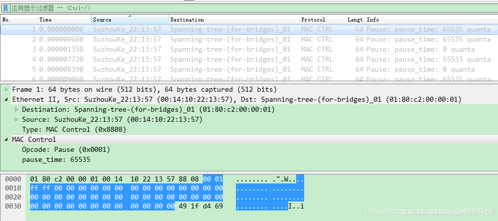
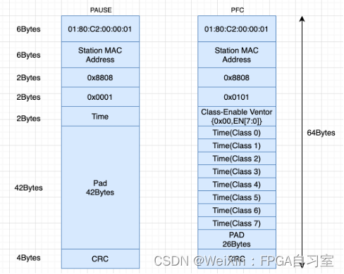
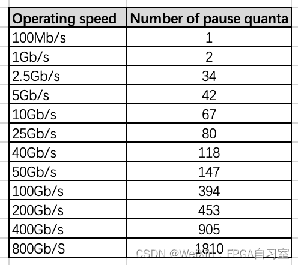
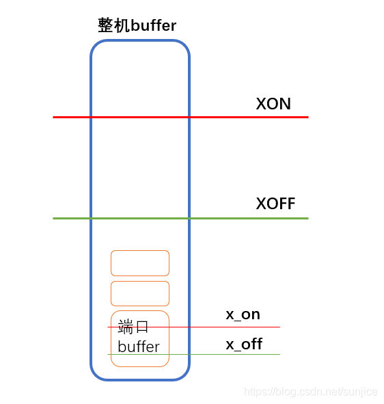
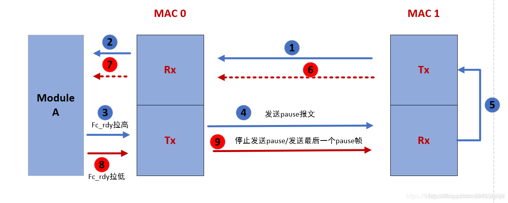

# pause流控


一、以太网的流量控制种类
----------

以太网的流量控制分为两种：

- 一种为**半双工**下的流量控制，一般采用**背压技术**；
- 另一种为**全双工**下的流量控制，即下面要讨论的**pause流控**。


二、pause流控的原理和实现
---------------

### 1. pause流控原理

**IEEE802.3x协议为数据链路层的MAC控制子层提供了一个全双工流量控制结构框架，所以pause流控由MAC控制子层来处理。**

**PAUSE流控是一种简单的停等机制，当本端接收数据过多，导致处理压力大时，可以向对端发送一个pause消息（time不为0，一般为0xFFFF），让对端暂停给本端发送数据。**

**当本端压力消除时，再发送一个pause消息（time为0），让对端继续给本端发送数据。如果本端设备持续拥塞的情况下，本端端口通常会连续发送多个PAUSE帧给对端。只要本端设备的拥塞状态没有解除，相关的端口就会一直发送PAUSE。新的pause报文暂停时间会覆盖上一个暂停时间，当对端接收到新的pause帧后，暂停时间以最新时间为准。**

**如果pause帧指定的暂停时间超出，对端也会从暂停的位置继续发送数据帧。**


### 2. PAUSE帧位于网络协议中的哪一层

PAUSE帧位于网络报文协议中的数据链路层（详细点讲应该是数据链路层中的MAC控制子层）。

IEEE802.3 将数据链路层分为三层：LLC，MAC控制子层（可选）和MAC介质访问控制子层。

MAC控制子层规定了通用的全双工流量控制结构。

交换控制电路要防止缓冲区溢出，可以利用MAC控制子层来控制以太网介质访问控制子层的操作。当已用缓冲区容量达到一个预先设定的阈值时，端口向全双工链路对方发出停止发送数据的请求，这个请求通过MAC控制子层产生的控制帧实现。

同样，端口可以接收由其他站点MAC控制子层产生的控制帧，控制帧夹在客户数据帧流中发送，接收方会根据帧的内容将控制帧分离出来，提交到MAC控制子层中的流量控制模块，流量控制模块解析控制帧的内容，提取帧中的控制参数，根据控制参数决定暂停发送的时间。


### 3. pause消息格式

pause消息属于MAC层的控制帧，wireshark抓到的pause消息： 



**PAUSE帧的帧长为64字节，**PAUSE帧各个字段的定义如下：

```bash
目的地址（组播） 源地址    类型     操作码    操作参数    保留     …   校验序列
 
(6字节)         (6字节)  (2字节)   (2字节)   (2字节)   (42字节)  …  (4字节)
 
0180-C200-0001   xxxx     0x8808   0x0001     时间参数                   CRC
```

**目的地址**：协议规定PAUSE的目的地址为保留的**组播地址0x01-80-C2-00-00-01**。

**源地址**：发送PAUSE帧端口的48位MAC地址。

**协议类型**：**0x8808**，MAC控制帧。

**操作码**：恒为**0x0001**。

**参数-停顿时间**：2字节的暂停时间参数。它是PAUSE发送方请求对方停止发送数据帧的时间长度，通常为0xFFFF，也有不为0xFFFF的，**时间度量单位是以当前传输速率传输512位数据所用的时间**，接收方实际暂停的时间为操作参数字段内容与以当前传输速率传输512位数据所用时间的乘积。




IEEE 802.3 31B.3.7定义了需要等待多少个pause_quanta。一个pause_quanta等于以MAC的数据速率传输一个帧的512位所需要的时间。是发送端来设置的，如下图所示，在不同的运行速度下，需要采取的pause_quanta不一样。**需要注意的是对于10Gb/s,如果是10GBase-T (双绞线传输)协议中quanta值为74，如果不是10Gbase-T，比如10Gbase-R (光纤传输)quanta 值为60，这里取两者的平均值。**此外对于800Gb/s (协议标准是以太网技术联盟制定的)未看quanta 介绍，这里定义400G的两倍，结合25Gb/s以上的速率与quanta值的倍数关系，可以认为1810 对于800G是足够的。




### 4. pause流控处理逻辑

交换机上pause流控的处理逻辑如下图： 


**端口级流控：** 
对于交换机来讲，每个端口有一个rx buffer： 
当本端口接收队列rx buffer中的数据超过某一阈值XON时，即触发pause流控，向对端发送一个pause消息，时间设置为0xFFFF。 
当本端口接收队列rx buffer中的消息经过处理，低于某一阈值XOFF时，即解除pause流控，向对端发送一个pause消息，时间设置为0x0000。


**整机流控：**  
同时，每个端口的rx buffer又是在同一个大buffer中： 
当所有端口的rx buffer总大小，超过设置的阈值XON时，会触发整机流控，此时交换机向所有端口发送pause消息；  
当所有端口的rx buffer总大小，经过处理低于设置的阈值XOFF时，会解除整机流控；

很多交换机并没有做到端口级流控和整机流控的协调，或者干脆一个lan口持续收到pause，就把整个lan端给阻塞了。因为这与总buffer大小、端口buffer大小、总buffer的XON与XOFF、端口buffer的XON与XOFF这些值有很大的关系，需要很长的时间和不断的实践来调校，才能达到一个好的效果。


### 5. pause流控芯片上的实现

如图所示，左侧为本端芯片，右侧为对端芯片。 


MAC0和MAC1都包含发送侧tx和接收侧rx。左侧芯片内部mac上游模块A与mac0发送侧有流控信号fc\_rdy。信号高表示模块A无法及时处理输入数据，需要进行流控。为了方便突出重点，图中省略了PCS以及serdes等模块。

具体流程处理如下：

- 1~2步：对端mac1发送数据给mac0接收侧，进行发送到模块A

- 3步：模块A无法即使处理输入的数据，需要减少数据输入，从而将fc\_rdy拉高。

- 4步：mac0发送侧tx发现流控信号fc\_rdy为高，产生pause帧，发送给mac1接收侧。只要fc\_rdy为高，mac0发送侧tx每隔一段时间发送一个pause帧，间隔时间由配置寄存器控制。间隔时长计算由计数器counting计算。Pause帧内停止发送数据的时间由另外一个配置寄存器控制。只要fc\_rdy为高期间，mac0发送侧不发送正常数据。
- 5步：mac1接收侧rx接受到pause报文后，提取pause帧内包含的暂停时间，控制发送侧tx停止发送数据
- 678步：mac1停止发送数据后，模块A处理完之前的数据后将fc\_rdy拉低，表示mac1可以继续发送数据了。
- 9步：第9步分2种情况。
- 情况1：fc\_rdy拉低，并且counting在计数没有到一个间隔周期，此时发送pause帧，但是帧内暂停时间为0. Mac1接受到pause帧后，控制tx控制立即开始发送数据。
- 情况2：fc\_rdy拉低的同时，counting正好计数到一个间隔周期，此时不发送pause帧。等到上一个pause帧的暂停时间到达后，mac1发送侧tx继续发送数据。 


pause帧处理协议强制要求：

pause的产生发送过程不能中断一个完整的数据报文。即在第4步中，fc\_rdy拉高后，首先mac0 tx侧需要判断当前是否正常数据报文在传输。如果有，则需要在当前数据报文传输完成后才能发送pause帧。也就是说在发送过程中，只能在完整数据报文的间隙插入pause帧。

**新的pause报文暂停时间会覆盖上一个暂停时间。对mac1来说，当mac1接收到新的pause帧后，暂停时间以最新时间为准。**


三、pause流控开关的优缺点对比
----------------

**协议虽然定义了pause流控机制，但是pause机制并不完善，它有一定的作用，也有很大的副作用，关键看厂商的实现和调校。**


### 1. pause流控的作用

pause流控，通过简单的停等处理，可以避免流量尖峰时rx buffer溢出造成的数据丢失。 
所以它的作用是**防止瞬间过载而数据丢失**。两个字概括就是**削峰**：削掉流量尖峰，使数据平稳传输。


### 2. pause流控的副作用

pause流控的出发点是好的，但是实际应用中，有很大的副作用，主要表现在长时间流量过载的时候。 

- 一是造成浪涌：当本端压力大处理不过来时，会触发pause流控，让对端停止给自己发数据；等本端压力消除后，再通知对端继续发送数据；此时由于数据量大又会立即处理不过来，触发pause流控，如此反复。网络表现是卡顿，时好时坏。 
- 二是带来传染：当某一节点处于长期流控状态时，其相邻节点不能给其发送数据，导致数据阻塞在该相邻节点，时间一长则会造成该相邻节点也进入流控状态，这样一传十，十传百，最后会传染至整个网络，导致全网瘫痪。

所以厂商如果没有调校好pause流控的话，会有很大的风险，有些厂商的交换机直接默认是关闭的。


四、pause流控对性能的影响分析
-----------------

### 1. 性能影响

pause流控的打开和关闭，对性能的影响如何呢？ 

我们以100M带宽为例，假设A端真实处理能力为80M/秒，B端真实处理能力为90M/秒，来详细分析其对性能的影响：

- 当A端流控关闭时，那么最大通过性能即为80M，当流量在80M以下时没有任何影响，但当流量超过80M/秒时，性能会崩溃式跨掉，因为A端处理不过来会造成数据丢失，数据丢失又需要重传，而重传又要消耗一定带宽，造成恶性循环，性能就会急巨下降。
- 当A端流控打开时，可能真实的最大通过性能为78M/秒，比关闭时还会稍低，因为pause流控并不是在rx buffer满时才触发，而是在某一阈值（比如80%）时就触发了。当流量超过78M/秒达到85M/秒时，虽然其真正通过性能仍为78M/秒，但是经过流控的处理，由于数据并不会丢失（只是短暂的积累在B端2层），最后所有数据包仍会得到正确传输，所以性能的表象是其高峰处理能力可以达到85M甚至是90M（当然收完所有消息的时间会有所延长），这是其削峰能力的表现。

通过上面的分析可以发现，**pause流控实际上是通过时间和对端的空间来换取本端的空间，保证数据不丢失。所以流控的打开和关闭，并不影响其真正的最大通过性能，而是通过削峰来保障数据的平稳传输。就好比水库蓄洪削弱洪峰一样。**


### 2. 风险评估

**pause流控打开：** 

好处：可以对瞬时流量尖峰进行削峰，保障数据的平稳传输。  

坏处：流量长期超过处理能力时，会造成浪涌和传染，可能导致整网瘫痪。


**pause流控关闭：** 

好处：没有造成整网瘫痪的风险。

坏处：失去了流量削峰的能力，瞬时流量尖峰会导致传输不稳定，网络时好时坏。


### 3. 总结

**对于产品来讲，需要根据自己产品的性能值、对端产品的性能值、以及产品所在的应用场景，来评估是否需要打开和关闭，特殊场景下甚至可以考虑采用半开的方式（即关闭发送pause，但不关闭响应pause）。** 

**所以对于pause流控最好有开关可以手动控制，来满足不同的应用场景。**


## 五、华为FAQ-S3700设备是否可以转发PAUSE帧


### 问题描述

Q:S3700设备PAUSE帧是否可以透传


### 解决方案

A:
PAUSE帧是由转发芯片MAC层发出同时也终结于转发芯片MAC层的帧，用于转发芯片出现拥塞时，控制业务流量。PAUSE帧不能够进行转发。


## 参考文章

1. [【TCP/IP】 以太网流量控制------pause流控_流控 pause 发送时机 计算-CSDN博客](https://blog.csdn.net/sunjice/article/details/115532563)
2. [【TCP/IP详解】【pause】以太网（PAUSE）流量控制原理_pause帧产生的原因-CSDN博客](https://blog.csdn.net/Ivan804638781/article/details/101771054)
3. [以太网中的Pause帧格式-CSDN博客](https://blog.csdn.net/qq_38708943/article/details/136319165)
4. [FAQ-S3700设备PAUSE帧是否可以透传 - 华为 (huawei.com)](https://support.huawei.com/enterprise/zh/knowledge/EKB1000068171)


## 修订历史

1. 2024-08-14，23:43，完成初稿