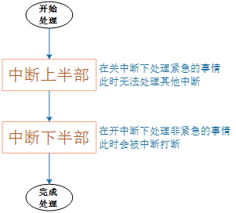

# 异常与中断


## 1 异常与中断的概念及处理流程

### 1.1 中断的引入

#### 1.1.1  妈妈怎么知道孩子醒了

  

妈妈怎么知道卧室里小孩醒了？

① 时不时进房间看一下：查询方式

简单，但是累

② 进去房间陪小孩一起睡觉，小孩醒了会吵醒她：休眠-唤醒

不累，但是妈妈干不了活了

③ 妈妈要干很多活，但是可以陪小孩睡一会，定个闹钟：poll方式

要浪费点时间，但是可以继续干活。

妈妈要么是被小孩吵醒，要么是被闹钟吵醒。

④ 妈妈在客厅干活，小孩醒了他会自己走出房门告诉妈妈：异步通知

妈妈、小孩互不耽误。

 

后面的3种方式，都需要“小孩来中断妈妈”：中断她的睡眠、中断她的工作。

 

实际上，能“中断”妈妈的事情可多了：

① 远处的猫叫：这可以被忽略

② 门铃、小孩哭声：妈妈的应对措施不一样

③ 身体不舒服：那要赶紧休息

④ 有蜘蛛掉下来了：赶紧跑啊，救命

 


妈妈当前正在看书，被“中断”后她会怎么做？流程如下：

① 妈妈正在看书

② 发生了各种声音

可忽略的远处猫叫

快递员按门铃

卧室中小孩哭了

③ 妈妈怎么办？

a. 先在书中放入书签，合上书

b. 去处理

对于不同的情况，处理方法不同：

对于门铃：开门取快递

对于哭声：照顾小孩

c. 回来继续看书


#### 1.1.2  嵌入系统中也有类似的情况


CPU在运行的过程中，也会被各种“异常”打断。这些“异常”有：

① 指令未定义

② 指令、数据访问有问题

③ SWI(软中断)

④ 快中断

⑤ 中断

 

中断也属于一种“异常”，导致中断发生的情况有很多，比如：

① 按键

② 定时器

③ ADC转换完成

④ UART发送完数据、收到数据

⑤ 等等

这些众多的“中断源”，汇集到“中断控制器”，由“中断控制器”选择优先级最高的中断并通知CPU。

 

### 1.2 中断的处理流程

arm对异常(中断)处理过程：

① 初始化：

a. 设置中断源，让它可以产生中断

b. 设置中断控制器(可以屏蔽某个中断，优先级)

c. 设置CPU总开关(使能中断)

② 执行其他程序：正常程序

③ 产生中断：比如按下按键--->中断控制器--->CPU

④ CPU 每执行完一条指令都会检查有无中断/异常产生

⑤ CPU发现有中断/异常产生，开始处理。

对于不同的异常，跳去不同的地址执行程序。

这地址上，只是一条跳转指令，跳去执行某个函数(地址)，这个就是异常向量。

③④⑤都是硬件做的。


⑥ 这些函数做什么事情？

软件做的:

a. 保存现场(各种寄存器)

b. 处理异常(中断):

分辨中断源，再调用不同的处理函数

c. 恢复现场


### 1.3 异常向量表

u-boot或是Linux内核，都有类似如下的代码：

```c
_start: b  reset

  ldr pc, _undefined_instruction

  ldr pc, _software_interrupt

  ldr pc, _prefetch_abort

  ldr pc, _data_abort

  ldr pc, _not_used

  ldr pc, _irq //发生中断时，CPU跳到这个地址执行该指令 **假设地址为0x18**

  ldr pc, _fiq
```

这就是异常向量表，每一条指令对应一种异常。

发生复位时，CPU就去 执行第1条指令：b reset。

发生中断时，CPU就去执行“ldr pc, _irq”这条指令。

这些指令存放的位置是固定的，比如对于ARM9芯片中断向量的地址是0x18。

当发生中断时，CPU就强制跳去执行0x18处的代码。

在向量表里，一般都是放置一条跳转指令，发生该异常时，CPU就会执行向量表中的跳转指令，去调用更复杂的函数。

当然，向量表的位置并不总是从0地址开始，很多芯片可以设置某个vector base寄存器，指定向量表在其他位置，比如设置vector base为0x80000000，指定为DDR的某个地址。但是表中的各个异常向量的偏移地址，是固定的：复位向量偏移地址是0，中断是0x18。

 

### 1.4 参考资料

对于ARM的中断控制器，述语上称之为GIC (Generic Interrupt Controller)，到目前已经更新到v4版本了。

各个版本的差别可以看这里：

https://developer.arm.com/ip-products/system-ip/system-controllers/interrupt-controllers

简单地说，GIC v3/v4用于 ARMv8 架构，即64位ARM芯片。

而GIC v2用于ARMv7和其他更低的架构。


## 2 Linux系统对中断的处理

### 2.1 进程、线程、中断的核心：栈

中断中断，中断谁？

中断当前正在运行的进程、线程。

进程、线程是什么？内核如何切换进程、线程、中断？

要理解这些概念，必须理解栈的作用。


#### 2.1.1 ARM处理器程序运行的过程

ARM芯片属于精简指令集计算机(RISC：Reduced Instruction Set Computing)，它所用的指令比较简单，有如下特点：

① 对内存只有读、写指令

② 对于数据的运算是在CPU内部实现

③ 使用RISC指令的CPU复杂度小一点，易于设计

 

比如对于a=a+b这样的算式，需要经过下面4个步骤才可以实现：


细看这几个步骤，有些疑问：

① 读a，那么a的值读出来后保存在CPU里面哪里？

② 读b，那么b的值读出来后保存在CPU里面哪里？

③ a+b的结果又保存在哪里？

 

我们需要深入ARM处理器的内部。简单概括如下，我们先忽略各种CPU模式(系统模式、用户模式等等)。


 

CPU运行时，先去取得指令，再执行指令：

① 把内存a的值读入CPU寄存器R0

② 把内存b的值读入CPU寄存器R1

③ 把R0、R1累加，存入R0

④ 把R0的值写入内存a

 

#### 2.1.2  程序被中断时，怎么保存现场

从上图可知，CPU内部的寄存器很重要，如果要暂停一个程序，中断一个程序，就需要把这些寄存器的值保存下来：这就称为保存现场。

保存在哪里？内存，这块内存就称之为栈。

程序要继续执行，就先从栈中恢复那些CPU内部寄存器的值。

这个场景并不局限于中断，下图可以概括程序A、B的切换过程，其他情况是类似的：

 

a. 函数调用

在函数A里调用函数B，实际就是中断函数A的执行。

那么需要把函数A调用B之前瞬间的CPU寄存器的值，保存到栈里；

再去执行函数B；

函数B返回之后，就从栈中恢复函数A对应的CPU寄存器值，继续执行。


b. 中断处理

进程A正在执行，这时候发生了中断。

CPU强制跳到中断异常向量地址去执行，

这时就需要保存进程A被中断瞬间的CPU寄存器值，

可以保存在进程A的内核态栈，也可以保存在进程A的内核结构体中。

中断处理完毕，要继续运行进程A之前，恢复这些值。

 

c. 进程切换

在所谓的多任务操作系统中，我们以为多个程序是同时运行的。

如果我们能感知微秒、纳秒级的事件，可以发现操作系统时让这些程序依次执行一小段时间，进程A的时间用完了，就切换到进程B。

怎么切换？

切换过程是发生在内核态里的，跟中断的处理类似。

进程A的被切换瞬间的CPU寄存器值保存在某个地方；

恢复进程B之前保存的CPU寄存器值，这样就可以运行进程B了。

 

所以，在中断处理的过程中，伴存着进程的保存现场、恢复现场。

进程的调度也是使用栈来保存、恢复现场：

 


#### 2.1.3  进程、线程的概念

假设我们写一个音乐播放器，在播放音乐的同时会根据按键选择下一首歌。把事情简化为2件事：发送音频数据、读取按键。那可以这样写程序：

```c
int main(int argc, char **argv)
{
  int key;

  while (1)
  {
    key = read_key();

    if (key != -1)
    {
      switch (key)
      {
        case NEXT:
          select_next_music(); // 在GUI选中下一首歌
          break;
      }
    }
    else
    {
      send_music();
    }
  }
    
  return 0
}
```

这个程序只有一条主线，读按键、播放音乐都是顺序执行。

无论按键是否被按下，read_key函数必须马上返回，否则会使得后续的send_music受到阻滞导致音乐播放不流畅。

读取按键、播放音乐能否分为两个程序进行？可以，但是开销太大：读按键的程序，要把按键通知播放音乐的程序，进程间通信的效率没那么高。

这时可以用多线程之编程，读取按键是一个线程，播放音乐是另一个线程，它们之间可以通过全局变量传递数据，示意代码如下：

```c
int g_key;

void key_thread_fn()
{
  while (1)
  {
    g_key = read_key();
    if (g_key != -1)
    {
      switch (g_key)
      {
        case NEXT:
          select_next_music(); // 在GUI选中下一首歌
          break;
      }
    }
  }
}

void music_fn()
{
  while (1)
  {
    if (g_key == STOP)
      stop_music();
    else
    {
      send_music();
    }
  }
}

int main(int argc, char **argv)
{
  int key;
    
  create_thread(key_thread_fn);
  create_thread(music_fn);

  while (1) 
  {
    sleep(10);
  }
    
  return 0;
}
```

这样，按键的读取及GUI显示、音乐的播放，可以分开来，不必混杂在一起。

按键线程可以使用阻塞方式读取按键，无按键时是休眠的，这可以节省CPU资源。

音乐线程专注于音乐的播放和控制，不用理会按键的具体读取工作。

并且这2个线程通过全局变量g_key传递数据，高效而简单。

 

在Linux中：资源分配的单位是进程，调度的单位是线程。

也就是说，在一个进程里，可能有多个线程，这些线程共用打开的文件句柄、全局变量等等。

而这些线程，之间是互相独立的，“同时运行”，也就是说：每一个线程，都有自己的栈。如下图示：


 


### 2.2 Linux系统对中断处理的演进

从2005年到现在，Linux中断系统的变化并不大。比较重要的就是引入了threaded irq：使用内核线程来处理中断。

Linux系统中有硬件中断，也有软件中断。

对硬件中断的处理有2个原则：不能嵌套，越快越好。


参考资料：https://blog.csdn.net/myarrow/article/details/9287169


#### 2.2.1  Linux对中断的扩展：硬件中断、软件中断

Linux系统把中断的意义扩展了，对于按键中断等硬件产生的中断，称之为“硬件中断”(hard irq)。每个硬件中断都有对应的处理函数，比如按键中断、网卡中断的处理函数肯定不一样。

为方便理解，你可以先认为对硬件中断的处理是用数组来实现的，数组里存放的是函数指针：

 

**注意**：上图是简化的，Linux中这个数组复杂多了。

当发生A中断时，对应的irq_function_A函数被调用。硬件导致该函数被调用。

 

相对的，还可以人为地制造中断：软件中断(soft irq)，如下图所示：

 

**注意**：上图是简化的，Linux中这个数组复杂多了。


问题来了：

a. 软件中断何时生产？

由软件决定，对于X号软件中断，只需要把它的flag设置为1就表示发生了该中断。

b. 软件中断何时处理？

软件中断嘛，并不是那么十万火急，有空再处理它好了。

什么时候有空？不能让它一直等吧？

Linux系统中，各种硬件中断频繁发生，至少定时器中断每10ms发生一次，那取个巧？

在处理完硬件中断后，再去处理软件中断？就这么办！


有哪些软件中断？

查内核源码include/linux/interrupt.h

 

 

怎么触发软件中断？最核心的函数是raise_softirq，简单地理解就是设置softirq_veq[nr]的标记位：

 

 

怎么设置软件中断的处理函数：

 

 

后面讲到的中断下半部tasklet就是使用软件中断实现的。


#### 2.2.2  中断处理原则1：不能嵌套

官方资料：中断处理不能嵌套

https://git.kernel.org/pub/scm/linux/kernel/git/torvalds/linux.git/commit/?id=e58aa3d2d0cc

中断处理函数需要调用C函数，这就需要用到栈。

中断A正在处理的过程中，假设又发生了中断B，那么在栈里要保存A的现场，然后处理B。

在处理B的过程中又发生了中断C，那么在栈里要保存B的现场，然后处理C。

如果中断嵌套突然暴发，那么栈将越来越大，栈终将耗尽。

所以，为了防止这种情况发生，也是为了简单化中断的处理，在Linux系统上中断无法嵌套：即当前中断A没处理完之前，不会响应另一个中断B(即使它的优先级更高)。


#### 2.2.3  中断处理原则2：越快越好

妈妈在家中照顾小孩时，门铃响起，她开门取快递：这就是中断的处理。她取个快递敢花上半天吗？不怕小孩出意外吗？

同理，在Linux系统中，中断的处理也是越快越好。

在单芯片系统中，假设中断处理很慢，那应用程序在这段时间内就无法执行：系统显得很迟顿。

在SMP系统中，假设中断处理很慢，那么正在处理这个中断的CPU上的其他线程也无法执行。

在中断的处理过程中，该CPU是不能进行进程调度的，所以中断的处理要越快越好，尽早让其他中断能被处理──进程调度靠定时器中断来实现。

在Linux系统中使用中断是挺简单的，为某个中断irq注册中断处理函数handler，可以使用request_irq函数：

 

在handler函数中，代码尽可能高效。

 

但是，处理某个中断要做的事情就是很多，没办法加快。比如对于按键中断，我们需要等待几十毫秒消除机械抖动。难道要在handler中等待吗？对于计算机来说，这可是一个段很长的时间。

怎么办？

 

#### 2.2.4  要处理的事情实在太多，拆分为：上半部、下半部

当一个中断要耗费很多时间来处理时，它的坏处是：在这段时间内，其他中断无法被处理。换句话说，在这段时间内，系统是关中断的。

如果某个中断就是要做那么多事，我们能不能把它拆分成两部分：紧急的、不紧急的？

在handler函数里只做紧急的事，然后就重新开中断，让系统得以正常运行；那些不紧急的事，以后再处理，处理时是开中断的。

 

中断下半部的实现有很多种方法，讲2种主要的：tasklet(小任务)、work queue(工作队列)。

 

#### 2.2.5  下半部要做的事情耗时不是太长：tasklet

假设我们把中断分为上半部、下半部。发生中断时，上半部下半部的代码何时、如何被调用？

当下半部比较耗时但是能忍受，并且它的处理比较简单时，可以用tasklet来处理下半部。tasklet是使用软件中断来实现。

 

 

写字太多，不如贴代码，代码一目了然：

 


使用流程图简化一下：

 

假设硬件中断A的上半部函数为irq_top_half_A，下半部为irq_bottom_half_A。

使用情景化的分析，才能理解上述代码的精华。

a. 硬件中断A处理过程中，没有其他中断发生：

一开始，preempt_count = 0；

上述流程图①～⑨依次执行，上半部、下半部的代码各执行一次。

 

b. 硬件中断A处理过程中，又再次发生了中断A：

一开始，preempt_count = 0；

执行到第⑥时，一开中断后，中断A又再次使得CPU跳到中断向量表。

**注意**：这时preempt_count等于1，并且中断下半部的代码并未执行。

CPU又从①开始再次执行中断A的上半部代码：

在第①步preempt_count等于2；

在第③步preempt_count等于1；

在第④步发现preempt_count等于1，所以直接结束当前第2次中断的处理；

**注意**：重点来了，第2次中断发生后，打断了第一次中断的第⑦步处理。当第2次中断处理完毕，CPU会继续去执行第⑦步。

可以看到，发生2次硬件中断A时，它的上半部代码执行了2次，但是下半部代码只执行了一次。

所以，同一个中断的上半部、下半部，在执行时是多对一的关系。

 

c. 硬件中断A处理过程中，又再次发生了中断B：

一开始，preempt_count = 0；

执行到第⑥时，一开中断后，中断B又再次使得CPU跳到中断向量表。

**注意**：这时preempt_count等于1，并且中断A下半部的代码并未执行。

CPU又从①开始再次执行中断B的上半部代码：

在第①步preempt_count等于2；

在第③步preempt_count等于1；

在第④步发现preempt_count等于1，所以直接结束当前第2次中断的处理；

**注意**：重点来了，第2次中断发生后，打断了第一次中断A的第⑦步处理。当第2次中断B处理完毕，CPU会继续去执行第⑦步。

在第⑦步里，它会去执行中断A的下半部，也会去执行中断B的下半部。

所以，多个中断的下半部，是汇集在一起处理的。

 

**总结**：

a. 中断的处理可以分为上半部，下半部

b. 中断上半部，用来处理紧急的事，它是在关中断的状态下执行的

c. 中断下半部，用来处理耗时的、不那么紧急的事，它是在开中断的状态下执行的

d. 中断下半部执行时，有可能会被多次打断，有可能会再次发生同一个中断

e. 中断上半部执行完后，触发中断下半部的处理

f. 中断上半部、下半部的执行过程中，不能休眠：中断休眠的话，以后谁来调度进程啊？

 

#### 2.2.6  下半部要做的事情太多并且很复杂：工作队列

在中断下半部的执行过程中，虽然是开中断的，期间可以处理各类中断。但是毕竟整个中断的处理还没走完，这期间APP是无法执行的。

假设下半部要执行1、2分钟，在这1、2分钟里APP都是无法响应的。

这谁受得了？

所以，如果中断要做的事情实在太耗时，那就不能用软件中断来做，而应该用内核线程来做：在中断上半部唤醒内核线程。内核线程和APP都一样竞争执行，APP有机会执行，系统不会卡顿。

这个内核线程是系统帮我们创建的，一般是kworker线程，内核中有很多这样的线程：

 

 

kworker线程要去“工作队列”(work queue)上取出一个一个“工作”(work)，来执行它里面的函数。

那我们怎么使用work、work queue呢？

a. 创建work：

你得先写出一个函数，然后用这个函数填充一个work结构体。比如：

 

 

b. 要执行这个函数时，把work提交给work queue就可以了：

 

上述函数会把work提供给系统默认的work queue：system_wq，它是一个队列。

 

c. 谁来执行work中的函数？

不用我们管，schedule_work函数不仅仅是把work放入队列，还会把kworker线程唤醒。此线程抢到时间运行时，它就会从队列中取出work，执行里面的函数。


d. 谁把work提交给work queue？

在中断场景中，可以在中断上半部调用schedule_work函数。

 

**总结**：

a. 很耗时的中断处理，应该放到线程里去

b. 可以使用work、work queue

c. 在中断上半部调用schedule_work函数，触发work的处理

d. 既然是在线程中运行，那对应的函数可以休眠。

 

#### 2.2.7  新技术：threaded irq

使用线程来处理中断，并不是什么新鲜事。使用work就可以实现，但是需要定义work、调用schedule_work，好麻烦啊。

太懒了太懒了，就这2步你们都不愿意做。

好，内核是为懒人服务的，再杀出一个函数：

 

你可以只提供thread_fn，系统会为这个函数创建一个内核线程。发生中断时，内核线程就会执行这个函数。

 

说你懒是开玩笑，内核开发者也不会那么在乎懒人。

以前用work来线程化地处理中断，一个worker线程只能由一个CPU执行，多个中断的work都由同一个worker线程来处理，在单CPU系统中也只能忍着了。但是在SMP系统中，明明有那么多CPU空着，你偏偏让多个中断挤在这个CPU上？

新技术threaded irq，为每一个中断都创建一个内核线程；多个中断的内核线程可以分配到多个CPU上执行，这提高了效率。


## 3 mips架构异常向量表：异常处理开始的地方

为了效率，所有异常入口点都位于不需要地址映射的内存区域，不经过Cache的kseg1空间，经过cache的kseg0空间。当SR（BEV）等于1时，异常入口地址位于kseg1，且是固定的；当SR(BEV=0)时，就可以对EBase寄存器进行编程来平移所有入口点，比如说，kseg0的某个区域。当使用多处理器系统时，想使各个CPU的异常入口点不同时，这个功能就很用了。

对于32位地址的`0x80000000`和64位地址的`0xFFFFFFFF80000000`而言是一样的。所以，下表只用32位地址表示出异常入口点。

表中的BASE代表设置到EBase寄存器中的异常基址。


最初的异常向量间的距离默认是128字节(0x80)，可能是因为最初的MIPS架构师觉得32条指令足够编写基本的异常处理例程了，不需要浪费太多内存。但是现代系统一般不会这么节省。


**下面是发生异常时，MIPS架构CPU的处理过程：**

1. **设置EPC寄存器指向重新开始的地址；**
2. **设置SR(EXL)标志位，强迫CPU进入内核态并禁止中断；**
3. **设置Cause寄存器，软件可以读取它获知异常原因。地址转换异常时，还要设置BadVaddr寄存器。内存管理系统异常还要设置一些MMU相关寄存器；**
4. **然后CPU开始从异常入口点取指令，之后就取决于软件如何处理了。**


**这时候，异常处理程序运行在异常模式（SR(EXL)标志位被置），而且不会修改SR寄存器的其余部分。对于常规的异常处理程序保存其状态，将控制权交给更为复杂的软件执行。异常模式下，只是保证系统安全地保存关键的状态，包括旧SR值。**

异常处理程序工作在异常模式下，不会再响应外部中断。所以，对于TLB未命中异常处理程序（也就是TLB重填异常处理程序）来说，如果读取TLB表（像Linux内核，一般将映射表保存在kseg2段地址空间中）时，发生页表地址读取异常时，程序会再次返回到异常程序入口点。Cause寄存器和地址异常相关的寄存器（BadAddr，EntryHi，甚至Context和Xcontext）都会被定位到访问页表时的TLB未命中异常相关的信息上。但是EPC寄存器的值仍然指向最初造成TLB未命中的指令处。

这样的话，通用异常程序修复kseg2中的页表未命中问题（也就是将页表的地址合法化），然后，就返回到用户程序。因为我们没有修复任何与第一次地址miss相关的信息，所以，此时用户程序会再次发生地址miss。但是，页表的地址miss问题已经修复，不会再产生二次嵌套地址异常。这时候，TLB异常处理程序就会执行上面的代码，加载页表中的页表映射关系到TLB中。

 

## 4 mips架构异常处理：基本过程

**MIPS异常处理程序的基本步骤：**

1. **保存被中断程序的状态：**

   **在异常处理程序的入口点，需要保存少量的被中断程序的状态。所以，第一步工作就是为保存这些状态提供必要的空间。MIPS架构习惯上保留k0和k1寄存器，用它们指向某段内存，用来保存某些需要保存的寄存器。**

2. **派发异常：**

   **查询Cause寄存器的ExcCode域，获取异常码。通过异常码，允许OS定义不同的函数处理不同的异常。**

3. **构建异常处理程序的运行环境：**

   **复杂的异常处理例程一般使用高级语言（比如，C语言）实现。所以，需要建立一段堆栈空间，保存被中断程序可能使用的任何寄存器，从而允许被调用的C异常处理例程可以修改这些寄存器。**

   **某些操作系统可能在派发异常之前进行这一步的处理。**

4. **执行异常处理（一般使用C语言实现）：**

   **做你想做的任何事情。**

5. **准备返回工作：**

   **需要从C代码返回到派发异常的通用代码中。在这儿，恢复被保存的寄存器，另外，通过修改SR寄存器到刚发生异常时的值，CPU也从异常模式返回到内核态。**

6. **从异常返回：**

   **从异常状态返回时，有可能从内核态向低级别的运行态进行切换。为了系统安全的原因，这步工作必须是一个原子操作。基于这个目的，MIPS架构的CPU提供了一条指令，`eret`，完成从异常的返回：它清除SR(EXL)标志位，返回到EPC寄存器保存的地址处开始执行。**


5 异常种类
----


6 异常相关寄存器
--------

* k0,k1 ：通用寄存器，异常处理函数可以将异常返回地址放到这两个中的任何一个，然后使用jr跳转到造成异常的指令处继续执行。

* SR ：cp0状态寄存器(register 12, select 0)  

  

1.  EXL : 异常级别。被异常设置，强制CPU进行内核模式并关掉中断，目的是保持EXL足够长的时间，使软件决定CPU新的特权级别和中断屏蔽位应该如何设置。

2.  ERL ：错误级别。

3.  IE : 使能全局中断。无论怎么设置，ERL与EXL会禁止所有的中断。

4.  BEV ：启动时异常向量。当BEV=1时，CPU用kseg1空间的异常入口;当BEV=0时，CPU用kseg0空间的异常入口。正常运行中的操作系统里，BEV一般设置为0。

5.  IM7-0 : 中断屏蔽。决定哪些中断源有请求时可以触发一个异常。8个中断源中的6个是CPU核外面的信号产生的（其中一个可以被浮点部件使用；它虽然在片上，但逻辑上是外部的）；其他两个是cause寄存器中软件可写的中断位。

*   CAUSE ：cp0原因寄存器(register 13, select 0)  

1. BD : 分支延迟。EPC寄存器的作用是存储异常处理完之后应该回到的地址。正常情况下，这指向发生异常的那条指令。但是，如果发生异常的指令是在一条分支指令的延迟槽里，EPC必须指向那条分支指令。重新执行分支指令没有什么害处，假设你从异常返回到了分支延迟指令，分支指令将没法跳转，从而这个异常将破坏程序的执行。cause(BD)只是当发生异常的指令在分支延迟槽时被置位，并且，EPC指向分支指令。如果分析发生异常的指令，只要看看cause(BD)，如果cause(BD)=1，那么该指令的位置是EPC+4。

2. IP7-0 ：中断被挂起。提示哪些中断要发生。cause(IP7-2)随着CPU硬件输入引脚上的信号而变化。cause(IP1-0)是软件中断位，可读可写并存储最后写入的值。当这8位中任何一位被置位，而且对应的SR(IM)位使能时，中断将被触发。

3. IV ：将此位写为1 时，使用一个特殊的中断异常入口。

4. ExcCode ：这5位指示发生了哪种类型异常。  

   

   

*   EPC(register 14, select 0) ：存储异常返回地址的寄存器。通常情况下，EPC存放发生异常的指令地址。如果cause(BD)=1，EPC指向前一条分支指令。
*   Badvaddr (register 8, select 0)：无效虚拟地址寄存器。这个寄存器存储引发异常的地址。在任何MMU相关的异常出现时设置，譬如，一个用户程序试图访问kuseg以外的地址，或者地址没有正确对齐，等等。对于任何其他类型的异常，该寄存器的值是未定义的。注意，总线地址异常并不设置它。