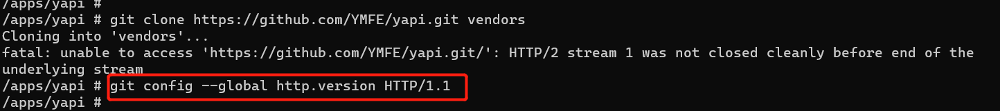

# 【Git】unable to access https://github.com/xxx/xxx: HTTP/2 stream 1 was not closed cleanly before


Alpine里尝试安装[Yapi](https://so.csdn.net/so/search?q=Yapi&spm=1001.2101.3001.7020)，当安装好git 拉取代码时报错，详细如下


报错内容
----

```shell
Cloning into 'vendors'...
fatal: unable to access 'https://github.com/YMFE/yapi.git/': HTTP/2 stream 1 was not closed cleanly before end of the underlying stream` 
```


原因：
---

git默认使用http/2.0协议，而github还是http/1.1 。


解决方案：
-----

```shell
git config --global http.version HTTP/1.1
```


现场
--




## 参考原文

[【Git】unable to access https://github.com/xxx/xxx: HTTP/2 stream 1 was not closed cleanly before-CSDN博客](https://blog.csdn.net/m0_47406832/article/details/123044722)