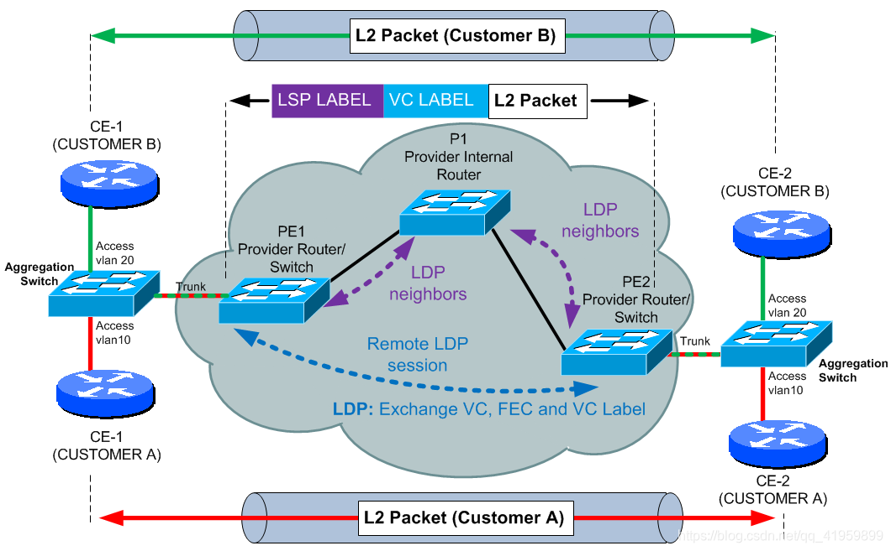

# 在网络架构中，P、PE、CE、CR等分别代表什么意思？

与运营商接入时，存在一些通信的名词，如纯P设备、PE设备、CE设备等，下面将对这些名词做一个完整的解释与说明

### 一 P、PE、CE

 P（Provider）、PE（Provider Edge）、CE（Customer Edge）属于mpls vpn里的概念。在VPN概念中，把整个网络中的路由器如下三类：

**第一类，运营商骨干路由器（P）**

**第二类，运营商边缘路由器（PE）**

 PE充当IP VPN接入路由器，即Provide的边缘设备。服务提供商骨干网的边缘路由器，它相当于标签边缘路由器（LER）。PE路由器连接CE路由器和P路由器，是最重要的网络节点。用户的流量通过PE路由器流入用户网络，或者通过PE路由器流到MPLS骨干网。

**第三类，用户边缘路由器（CE）**

 服务提供商所连接的用户端路由器，CE路由器通过连接一个或多个PE路由器，为用户提供服务接入。CE路由器通常是一台IP路由器，它与连接的PE路由器建立邻接关系(若需要建立BGP邻居，则为EBGP；若需建立OSPF邻居，则为VPN-instance的OSPF邻居)。

> **用户站点：**  用户端网络的总称，一个用户站点可以通过一条或多条链路连接服务提供商的骨干网络。

### 二 CR、AR、BR、SR

CR（Core Router，核心路由器）

AR（Access Router，接入路由器）

BR（Broadband Router，汇聚路由器）

SR（Service Router，业务路由器）

 一般的ip网络中，根据其拓扑结构，可以把路由器分为边缘路由器BR，接入路由器AR，核心路由器CR。

PE或者AR基本是一个概念，某些运营商称为PE比如联通，某些运营商称为AR比如移动，叫做接入路由器，是CE的直接上级路由器。 所有的软交换站点接入CE都上联到PE或者AR，然后PE或者AR接入运营商的IP骨干网。

### 三 总结

 三大运营商不同的叫法，实质上是同一个设备作用：

**运营商骨干（核心）路由器—运营商边缘（接入）路由器—用户边缘路由器**

**P（CR）-PE（AR)-CE（BR）**

AR\\BR\\CR\\SR都可以做PE\\CE\\P设备，一般CR\\BR是不会做PE设备的，只做P设备，AR作为PE设备；除非网络完全建设开，CR\\BR在做P设备时兼做PE设备，SR为业务路由器，一般做PE设备。

## 原文链接

[在网络架构中，P、PE、CE、CR等分别代表什么意思？_p pe ce-CSDN博客](https://blog.csdn.net/qq_41959899/article/details/107594000)